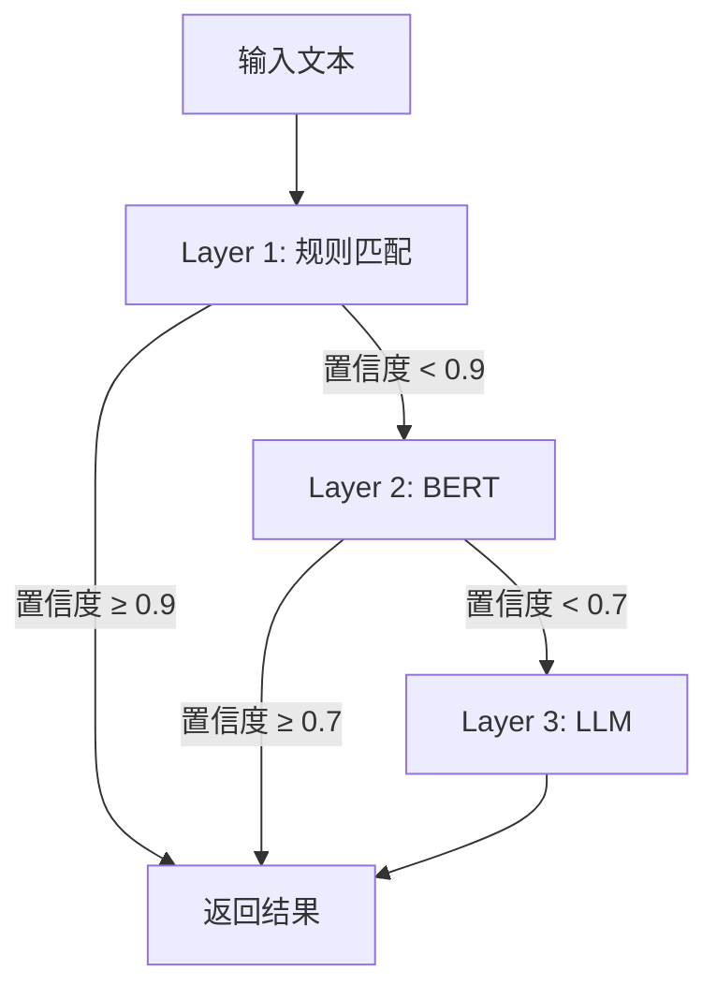
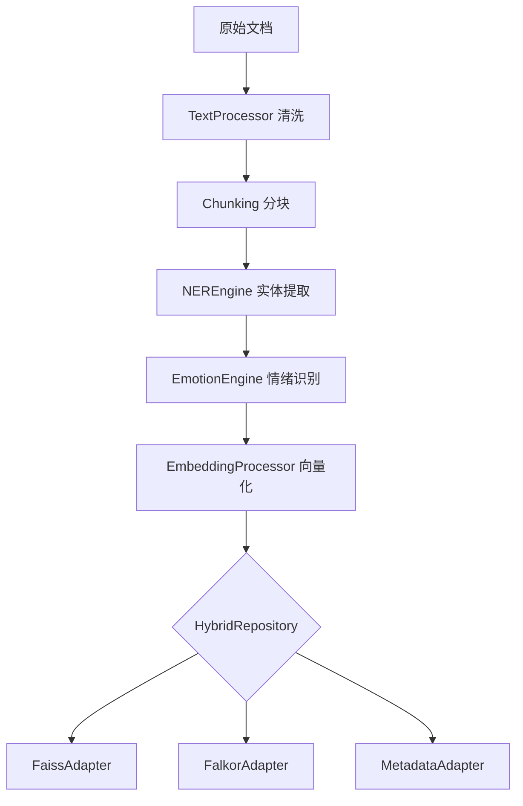
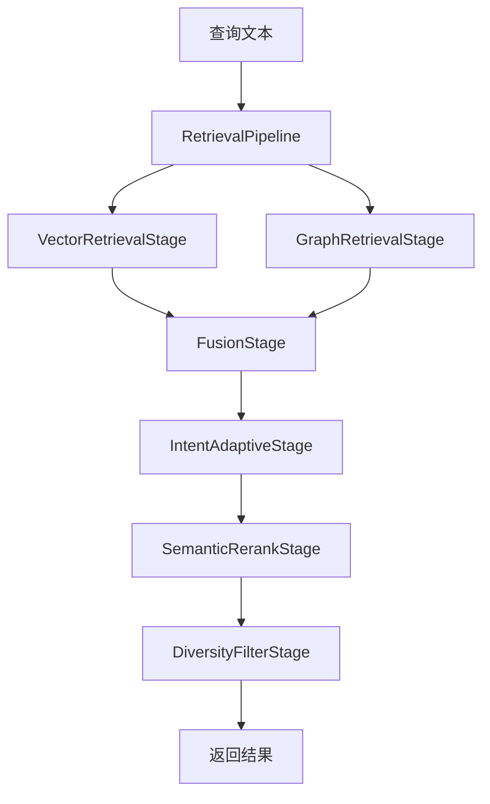
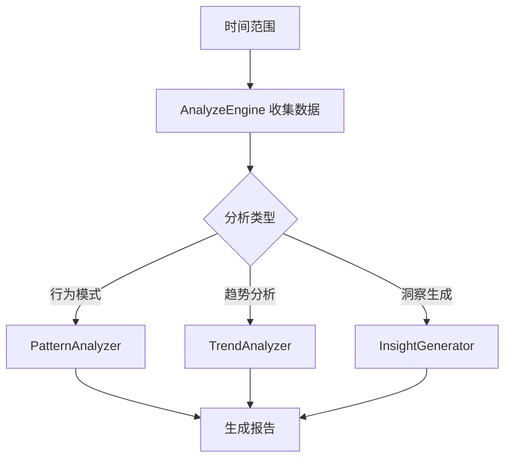
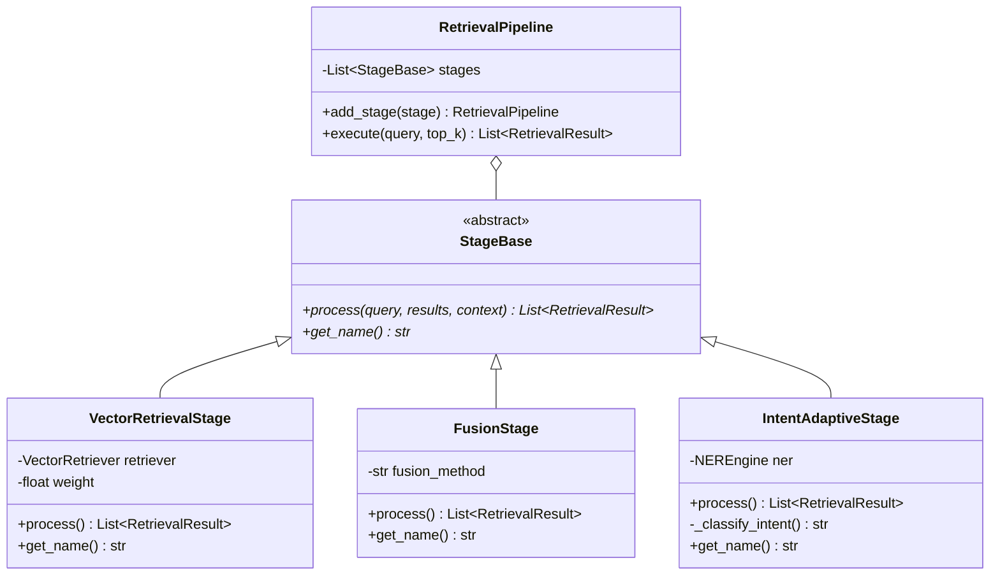
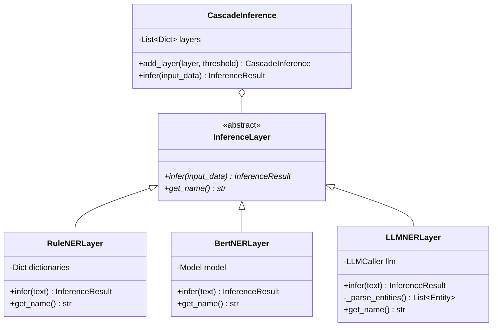
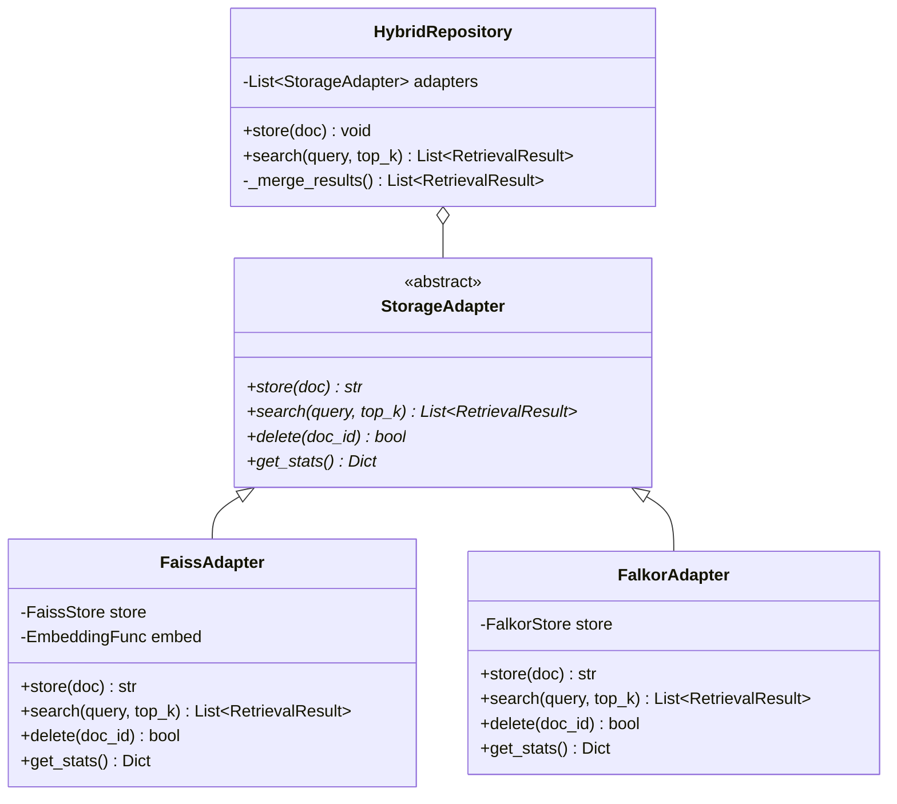

# AME 架构优化设计文档

## 1. 概述

### 1.1 项目定位

**AME (Another-Me Engine)** 是纯算法能力层，专注提供：
- 🔍 混合检索算法（Pipeline 架构）
- 🧠 NER 实体识别算法（Cascade Inference 框架）
- 📊 数据分析算法
- 🎭 风格模仿算法
- 💾 数据处理算法

**明确边界**：
- ✅ 包括：算法实现、数据处理、模型调用
- ❌ 不包括：REST API、HTTP 路由、业务编排

### 1.2 优化目标

| 维度 | 当前问题 | 优化目标 |
|------|---------|---------|
| **架构** | 模块碎片化、职责重叠 | 统一框架、清晰抽象 |
| **性能** | LLM 成本高、响应慢 | 成本降低 60-70%、速度提升 3-5倍 |
| **准确率** | 固定权重、缺乏自适应 | 准确率提升 15-25% |
| **可维护性** | 重复代码、紧耦合 | 代码复用提升 70% |

### 1.3 优化原则

1. **架构先行**：先统一框架，再优化算法细节
2. **向前兼容**：项目重构中，无需考虑向后兼容
3. **模块独立**：每个模块可独立测试和替换
4. **成本优先**：多层级推理降低 LLM 调用频率

---

## 2. 架构优化

### 2.1 检索模块：Pipeline 架构

#### 2.1.1 现状问题

**当前架构**：
```
retrieval/
├── vector_retriever.py    # 向量检索
├── graph_retriever.py     # 图谱检索
├── hybrid_retriever.py    # 混合检索（组合器）
└── reranker.py            # 重排序（另一个组合器）
```

**核心问题**：
- ❌ `hybrid_retriever` 和 `reranker` 职责重叠，都是组合器
- ❌ 难以灵活组合策略（如：向量 + 图谱 + 意图自适应 + 重排序 + 多样性过滤）
- ❌ 新增检索策略需修改多处代码，违反开放-封闭原则

#### 2.1.2 优化方案

**目标架构**：统一为 **Pipeline 架构**（责任链模式 + 策略模式）

```
retrieval/
├── base.py                     # 基础接口
├── pipeline.py                 # 🆕 Pipeline 核心引擎
├── stages/                     # 🆕 检索阶段（可组合）
│   ├── __init__.py
│   ├── base.py                 # Stage 抽象基类
│   ├── vector_stage.py         # 向量召回阶段
│   ├── graph_stage.py          # 图谱召回阶段
│   ├── fusion_stage.py         # 融合阶段
│   ├── rerank_stage.py         # 重排序阶段
│   ├── diversity_stage.py      # 多样性过滤阶段
│   └── intent_adaptive_stage.py # 意图自适应阶段
└── factory.py                  # Pipeline 工厂
```

#### 2.1.3 核心类设计

##### Pipeline 核心引擎

```python
# retrieval/pipeline.py
class RetrievalPipeline:
    """检索管道：支持多阶段组合
    
    设计模式：责任链模式
    核心优势：
    1. 可组合性：任意组合检索阶段
    2. 可扩展性：新增阶段无需修改现有代码
    3. 可测试性：每个阶段独立测试
    """
    
    def __init__(self):
        self.stages: List[StageBase] = []
    
    def add_stage(self, stage: StageBase) -> 'RetrievalPipeline':
        """添加检索阶段（支持链式调用）"""
        self.stages.append(stage)
        return self
    
    async def execute(
        self, 
        query: str, 
        top_k: int = 10,
        context: Optional[Dict] = None
    ) -> List[RetrievalResult]:
        """执行检索管道
        
        流程：
        1. 初始化上下文（共享查询、参数）
        2. 顺序执行各阶段
        3. 每阶段接收前序结果，输出新结果
        4. 返回最终 top_k 结果
        """
        results = None
        ctx = context or {}
        ctx.update({"query": query, "top_k": top_k})
        
        for stage in self.stages:
            results = await stage.process(query, results, ctx)
        
        return results[:top_k] if results else []
```

##### Stage 抽象基类

```python
# retrieval/stages/base.py
class StageBase(ABC):
    """检索阶段抽象基类"""
    
    @abstractmethod
    async def process(
        self,
        query: str,
        previous_results: Optional[List[RetrievalResult]],
        context: Dict[str, Any]
    ) -> List[RetrievalResult]:
        """处理检索阶段
        
        Args:
            query: 查询文本
            previous_results: 前序阶段结果（None 表示首阶段）
            context: 上下文信息（共享数据）
        
        Returns:
            当前阶段输出结果
        """
        pass
    
    @abstractmethod
    def get_name(self) -> str:
        """阶段名称"""
        pass
```

##### 向量召回阶段

```python
# retrieval/stages/vector_stage.py
class VectorRetrievalStage(StageBase):
    """向量召回阶段
    
    职责：
    1. 向量化查询
    2. Faiss 检索
    3. 返回候选集（通常 top_k * 2）
    """
    
    def __init__(self, vector_retriever: VectorRetriever, weight: float = 1.0):
        self.retriever = vector_retriever
        self.weight = weight
    
    async def process(
        self,
        query: str,
        previous_results: Optional[List[RetrievalResult]],
        context: Dict[str, Any]
    ) -> List[RetrievalResult]:
        top_k = context.get("top_k", 10)
        
        # 召回更多用于后续融合
        results = await self.retriever.retrieve(query, top_k=top_k * 2)
        
        # 应用权重
        for r in results:
            r.score *= self.weight
            r.metadata["stage"] = self.get_name()
        
        return results
    
    def get_name(self) -> str:
        return "VectorRetrieval"
```

##### 融合阶段

```python
# retrieval/stages/fusion_stage.py
class FusionStage(StageBase):
    """融合阶段
    
    职责：
    1. 合并多源结果（向量 + 图谱）
    2. 按 doc_id 去重
    3. 分数融合（加权求和）
    """
    
    def __init__(self, fusion_method: str = "weighted_sum"):
        self.fusion_method = fusion_method
    
    async def process(
        self,
        query: str,
        previous_results: Optional[List[RetrievalResult]],
        context: Dict[str, Any]
    ) -> List[RetrievalResult]:
        if not previous_results:
            return []
        
        # 按 doc_id 聚合
        score_map = defaultdict(lambda: {"score": 0.0, "result": None})
        
        for result in previous_results:
            doc_id = result.metadata.get("doc_id")
            score_map[doc_id]["score"] += result.score
            if score_map[doc_id]["result"] is None:
                score_map[doc_id]["result"] = result
        
        # 构建融合结果
        fused = []
        for doc_id, data in score_map.items():
            result = data["result"]
            result.score = data["score"]
            result.metadata["fusion_method"] = self.fusion_method
            fused.append(result)
        
        # 排序
        fused.sort(key=lambda x: x.score, reverse=True)
        return fused
    
    def get_name(self) -> str:
        return "Fusion"
```

##### 意图自适应阶段

```python
# retrieval/stages/intent_adaptive_stage.py
class IntentAdaptiveStage(StageBase):
    """意图自适应阶段
    
    职责：
    1. 识别查询意图（事实性/时序性/关系性）
    2. 动态调整分数权重
    3. 优化召回质量
    """
    
    def __init__(self, ner_extractor=None):
        self.ner = ner_extractor
    
    async def process(
        self,
        query: str,
        previous_results: Optional[List[RetrievalResult]],
        context: Dict[str, Any]
    ) -> List[RetrievalResult]:
        if not previous_results:
            return []
        
        # 1. 意图识别
        intent = await self._classify_intent(query)
        
        # 2. 权重调整策略
        adjustments = {
            "factual": {"vector": 1.2, "graph": 0.8},
            "temporal": {"vector": 1.0, "graph": 1.0},
            "relational": {"vector": 0.8, "graph": 1.2}
        }.get(intent, {"vector": 1.0, "graph": 1.0})
        
        # 3. 应用调整
        for result in previous_results:
            stage = result.metadata.get("stage", "")
            if "Vector" in stage:
                result.score *= adjustments["vector"]
            elif "Graph" in stage:
                result.score *= adjustments["graph"]
        
        # 4. 重新排序
        previous_results.sort(key=lambda x: x.score, reverse=True)
        return previous_results
    
    async def _classify_intent(self, query: str) -> str:
        """意图分类
        
        规则：
        - 事实性（factual）：包含 "是什么"、"如何" 等
        - 时序性（temporal）：包含时间词
        - 关系性（relational）：包含 "关系"、"联系" 等
        """
        if any(kw in query for kw in ["是什么", "定义", "含义"]):
            return "factual"
        if any(kw in query for kw in ["什么时候", "何时", "最近"]):
            return "temporal"
        if any(kw in query for kw in ["关系", "联系", "影响"]):
            return "relational"
        
        # 实体密度高 → 关系性
        if self.ner:
            entities = await self.ner.extract(query)
            if len(entities) >= 3:
                return "relational"
        
        return "factual"
    
    def get_name(self) -> str:
        return "IntentAdaptive"
```

##### 重排序阶段

```python
# retrieval/stages/rerank_stage.py
class SemanticRerankStage(StageBase):
    """语义重排序阶段
    
    职责：
    1. 使用 Cross-Encoder 计算精准相关性
    2. 重新排序结果
    """
    
    def __init__(self, llm_caller=None, use_llm: bool = False):
        self.llm = llm_caller
        self.use_llm = use_llm
    
    async def process(
        self,
        query: str,
        previous_results: Optional[List[RetrievalResult]],
        context: Dict[str, Any]
    ) -> List[RetrievalResult]:
        if not previous_results or len(previous_results) <= 1:
            return previous_results
        
        if self.use_llm and self.llm:
            return await self._llm_rerank(query, previous_results)
        else:
            return await self._rule_based_rerank(query, previous_results)
    
    async def _llm_rerank(
        self, 
        query: str, 
        results: List[RetrievalResult]
    ) -> List[RetrievalResult]:
        """LLM 重排序"""
        # 构建 Prompt
        docs_text = "\n\n".join([
            f"文档{i}: {r.content[:200]}..."
            for i, r in enumerate(results[:10])  # 限制数量
        ])
        
        prompt = f"""根据查询意图，对文档按相关性排序。

查询：{query}

文档列表：
{docs_text}

请返回文档编号，按相关性从高到低，用逗号分隔："""
        
        response = await self.llm.generate(
            messages=[{"role": "user", "content": prompt}],
            temperature=0.1
        )
        
        # 解析排序
        import re
        indices = [int(n) for n in re.findall(r'\d+', response.content)]
        
        # 重排序
        reranked = [results[i] for i in indices if i < len(results)]
        remaining = [r for i, r in enumerate(results) if i not in indices]
        return reranked + remaining
    
    async def _rule_based_rerank(
        self, 
        query: str, 
        results: List[RetrievalResult]
    ) -> List[RetrievalResult]:
        """基于规则的重排序（关键词匹配）"""
        query_words = set(re.findall(r'\w+', query.lower()))
        
        for result in results:
            content_words = set(re.findall(r'\w+', result.content.lower()))
            overlap = len(query_words & content_words)
            
            # 调整分数
            boost = overlap / max(len(query_words), 1) * 0.1
            result.score += boost
        
        results.sort(key=lambda x: x.score, reverse=True)
        return results
    
    def get_name(self) -> str:
        return "SemanticRerank"
```

##### 多样性过滤阶段

```python
# retrieval/stages/diversity_stage.py
class DiversityFilterStage(StageBase):
    """多样性过滤阶段
    
    职责：
    1. 使用 MMR 算法控制多样性
    2. 避免结果冗余
    """
    
    def __init__(self, lambda_param: float = 0.7):
        """
        Args:
            lambda_param: 相关性权重（0.0-1.0）
                - 1.0: 完全相关性优先
                - 0.0: 完全多样性优先
                - 0.7: 平衡（推荐）
        """
        self.lambda_param = lambda_param
    
    async def process(
        self,
        query: str,
        previous_results: Optional[List[RetrievalResult]],
        context: Dict[str, Any]
    ) -> List[RetrievalResult]:
        if not previous_results or len(previous_results) <= 1:
            return previous_results
        
        # MMR 算法
        selected = [previous_results[0]]  # 选择最相关的
        remaining = previous_results[1:]
        
        while remaining and len(selected) < len(previous_results):
            max_mmr = -float('inf')
            max_idx = 0
            
            for i, candidate in enumerate(remaining):
                # 相关性分数
                relevance = candidate.score
                
                # 与已选文档的最大相似度
                max_sim = max(
                    self._similarity(candidate, selected_doc)
                    for selected_doc in selected
                )
                
                # MMR 分数
                mmr = self.lambda_param * relevance - (1 - self.lambda_param) * max_sim
                
                if mmr > max_mmr:
                    max_mmr = mmr
                    max_idx = i
            
            selected.append(remaining.pop(max_idx))
        
        return selected
    
    def _similarity(self, doc1: RetrievalResult, doc2: RetrievalResult) -> float:
        """计算文档相似度（词重叠）"""
        words1 = set(re.findall(r'\w+', doc1.content.lower()))
        words2 = set(re.findall(r'\w+', doc2.content.lower()))
        
        if not words1 or not words2:
            return 0.0
        
        intersection = len(words1 & words2)
        union = len(words1 | words2)
        return intersection / union if union > 0 else 0.0
    
    def get_name(self) -> str:
        return "DiversityFilter"
```

#### 2.1.4 使用示例

```python
# 基础配置：向量检索 + 重排序
basic_pipeline = RetrievalPipeline()
basic_pipeline\
    .add_stage(VectorRetrievalStage(vector_retriever))\
    .add_stage(SemanticRerankStage())

# 高级配置：混合检索 + 意图自适应 + 多样性
advanced_pipeline = RetrievalPipeline()
advanced_pipeline\
    .add_stage(VectorRetrievalStage(vector_retriever, weight=0.6))\
    .add_stage(GraphRetrievalStage(graph_retriever, weight=0.4))\
    .add_stage(FusionStage())\
    .add_stage(IntentAdaptiveStage(ner_extractor))\
    .add_stage(SemanticRerankStage(llm_caller))\
    .add_stage(DiversityFilterStage(lambda_param=0.7))

# 执行检索
results = await advanced_pipeline.execute("查询文本", top_k=10)
```

#### 2.1.5 迁移策略

| 现有模块 | 迁移方式 | 保留/删除 |
|---------|---------|----------|
| `vector_retriever.py` | 封装为 `VectorRetrievalStage` | 保留（作为底层调用） |
| `graph_retriever.py` | 封装为 `GraphRetrievalStage` | 保留（作为底层调用） |
| `hybrid_retriever.py` | 拆分为 `FusionStage` + `IntentAdaptiveStage` | 删除 |
| `reranker.py` | 迁移为 `SemanticRerankStage` + `DiversityFilterStage` | 删除 |

---

### 2.2 NER 与情绪识别：Cascade Inference 框架

#### 2.2.1 现状问题

**当前架构**：
```
ner/
├── simple_ner.py       # 规则 NER
├── llm_ner.py          # LLM NER
└── hybrid_ner.py       # 混合 NER（规则 + LLM）

mem/
└── analyze_engine.py
    └── detect_emotion() # 情绪识别（也是规则 + LLM）
```

**核心问题**：
- ❌ `hybrid_ner` 和 `detect_emotion` 都使用「规则 → LLM 兜底」策略，逻辑重复
- ❌ 置信度判断、成本控制逻辑分散在两个模块
- ❌ 缺少统一的「多层级推理」框架

#### 2.2.2 优化方案

**目标架构**：抽象为 **Cascade Inference 框架**（级联推理）

```
core/
└── cascade_inference.py    # 🆕 级联推理框架

ner/
├── base.py
├── layers/                 # 🆕 NER 推理层
│   ├── rule_layer.py       # 规则层（AC 自动机）
│   ├── bert_layer.py       # BERT 层（本地模型）
│   └── llm_layer.py        # LLM 层（兜底）
└── ner_engine.py           # 🆕 NER 引擎（使用 Cascade）

analysis/                   # 🆕 分析模块（独立）
├── emotion/
│   ├── lexicon_layer.py    # 词典层
│   ├── bert_layer.py       # BERT 层
│   └── llm_layer.py        # LLM 层
└── emotion_engine.py       # 情绪引擎（使用 Cascade）
```

#### 2.2.3 核心类设计

##### Cascade Inference 框架

```python
# core/cascade_inference.py
class CascadeInference:
    """级联推理框架
    
    核心思想：
    1. 逐层尝试（规则 → 轻量模型 → 重型模型）
    2. 达到置信度即返回，节省成本
    3. 统一的置信度管理
    
    适用场景：
    - NER 实体识别
    - 情绪识别
    - 意图分类
    - 文本分类
    """
    
    def __init__(self):
        self.layers: List[Dict] = []
    
    def add_layer(
        self, 
        layer: InferenceLayer, 
        confidence_threshold: float = 0.7
    ) -> 'CascadeInference':
        """添加推理层
        
        Args:
            layer: 推理层实例
            confidence_threshold: 置信度阈值（达到即返回）
        """
        self.layers.append({
            "layer": layer,
            "threshold": confidence_threshold
        })
        return self
    
    async def infer(self, input_data: Any) -> InferenceResult:
        """执行级联推理
        
        流程：
        1. 按顺序执行各层
        2. 检查置信度是否达标
        3. 达标即返回，否则进入下一层
        4. 最后一层兜底（无论置信度）
        """
        for i, config in enumerate(self.layers):
            layer = config["layer"]
            threshold = config["threshold"]
            is_last = (i == len(self.layers) - 1)
            
            # 执行推理
            result = await layer.infer(input_data)
            
            # 记录层级信息
            result.metadata["layer"] = layer.get_name()
            result.metadata["layer_index"] = i
            
            # 达到阈值或最后一层，返回结果
            if result.confidence >= threshold or is_last:
                return result
        
        # 理论上不应该到这里
        return InferenceResult(confidence=0.0, data=None)
```

##### 推理层基类

```python
# core/inference_layer.py
class InferenceLayer(ABC):
    """推理层抽象基类"""
    
    @abstractmethod
    async def infer(self, input_data: Any) -> InferenceResult:
        """执行推理
        
        Returns:
            InferenceResult: {
                confidence: float,  # 置信度（0.0-1.0）
                data: Any,          # 推理结果
                metadata: Dict      # 元数据
            }
        """
        pass
    
    @abstractmethod
    def get_name(self) -> str:
        """层级名称"""
        pass

class InferenceResult:
    """推理结果"""
    
    def __init__(
        self, 
        confidence: float, 
        data: Any, 
        metadata: Optional[Dict] = None
    ):
        self.confidence = confidence
        self.data = data
        self.metadata = metadata or {}
```

##### NER 推理层实现

```python
# ner/layers/rule_layer.py
class RuleNERLayer(InferenceLayer):
    """规则 NER 层
    
    特性：
    - 零成本、毫秒级
    - 使用 AC 自动机匹配词典
    - 高精度（词典准确）
    """
    
    def __init__(self, dictionaries: Dict[str, List[str]]):
        """
        Args:
            dictionaries: {
                "PERSON": ["张三", "李四", ...],
                "LOCATION": ["北京", "上海", ...],
                ...
            }
        """
        self.dicts = dictionaries
        # TODO: 构建 AC 自动机
    
    async def infer(self, text: str) -> InferenceResult:
        entities = []
        
        # 词典匹配
        for entity_type, keywords in self.dicts.items():
            for keyword in keywords:
                if keyword in text:
                    entities.append(Entity(
                        text=keyword,
                        type=entity_type,
                        score=0.95  # 词典匹配高分
                    ))
        
        # 置信度：实体数量 > 0 则高置信度
        confidence = 0.9 if entities else 0.0
        
        return InferenceResult(
            confidence=confidence,
            data=entities,
            metadata={"method": "rule", "matched": len(entities)}
        )
    
    def get_name(self) -> str:
        return "RuleNER"

# ner/layers/bert_layer.py
class BertNERLayer(InferenceLayer):
    """BERT NER 层
    
    特性：
    - 低成本（本地模型）
    - 100ms 内响应
    - 中等准确率
    """
    
    def __init__(self, model_path: Optional[str] = None):
        # TODO: 加载 BERT 模型
        self.model = None
    
    async def infer(self, text: str) -> InferenceResult:
        if not self.model:
            return InferenceResult(confidence=0.0, data=[])
        
        # TODO: BERT 推理
        entities = []  # 模型输出
        
        # 置信度：模型输出的平均分数
        confidence = 0.75 if entities else 0.5
        
        return InferenceResult(
            confidence=confidence,
            data=entities,
            metadata={"method": "bert"}
        )
    
    def get_name(self) -> str:
        return "BertNER"

# ner/layers/llm_layer.py
class LLMNERLayer(InferenceLayer):
    """LLM NER 层
    
    特性：
    - 高成本（$0.002/次）
    - 1-3s 响应
    - 高准确率
    """
    
    def __init__(self, llm_caller):
        self.llm = llm_caller
    
    async def infer(self, text: str) -> InferenceResult:
        prompt = f"""提取文本中的实体：

文本：{text}

返回JSON格式：
[
  {{"text": "实体名", "type": "PERSON|LOCATION|ORGANIZATION|TOPIC", "score": 0.0-1.0}},
  ...
]"""
        
        response = await self.llm.generate(
            messages=[{"role": "user", "content": prompt}],
            temperature=0.1
        )
        
        # 解析 JSON
        entities = self._parse_entities(response.content)
        
        # LLM 默认高置信度
        confidence = 0.95 if entities else 0.7
        
        return InferenceResult(
            confidence=confidence,
            data=entities,
            metadata={"method": "llm", "cost": 0.002}
        )
    
    def _parse_entities(self, text: str) -> List[Entity]:
        import json, re
        try:
            json_match = re.search(r'\[.*\]', text, re.DOTALL)
            if json_match:
                data = json.loads(json_match.group())
                return [Entity(**item) for item in data]
        except:
            pass
        return []
    
    def get_name(self) -> str:
        return "LLMNER"
```

##### NER 引擎

```python
# ner/ner_engine.py
class NEREngine:
    """NER 引擎（使用 Cascade Inference）"""
    
    def __init__(
        self,
        dictionaries: Dict[str, List[str]],
        llm_caller,
        use_bert: bool = False
    ):
        # 构建级联推理
        self.cascade = CascadeInference()
        
        # Layer 1: 规则层（快速、零成本）
        self.cascade.add_layer(
            RuleNERLayer(dictionaries),
            confidence_threshold=0.9
        )
        
        # Layer 2: BERT 层（可选，中速、低成本）
        if use_bert:
            self.cascade.add_layer(
                BertNERLayer(),
                confidence_threshold=0.7
            )
        
        # Layer 3: LLM 层（兜底，慢速、高成本）
        self.cascade.add_layer(
            LLMNERLayer(llm_caller),
            confidence_threshold=0.0  # 兜底层无阈值
        )
    
    async def extract(self, text: str) -> List[Entity]:
        """提取实体"""
        result = await self.cascade.infer(text)
        return result.data
```

##### 情绪识别引擎

```python
# analysis/emotion/emotion_engine.py
class EmotionEngine:
    """情绪识别引擎（使用 Cascade Inference）"""
    
    def __init__(self, llm_caller, use_bert: bool = False):
        self.cascade = CascadeInference()
        
        # Layer 1: 词典层（情感词典）
        self.cascade.add_layer(
            LexiconEmotionLayer(),
            confidence_threshold=0.8
        )
        
        # Layer 2: BERT 层（可选）
        if use_bert:
            self.cascade.add_layer(
                BertEmotionLayer(),
                confidence_threshold=0.7
            )
        
        # Layer 3: LLM 层（兜底）
        self.cascade.add_layer(
            LLMEmotionLayer(llm_caller),
            confidence_threshold=0.0
        )
    
    async def detect(self, text: str) -> Dict[str, Any]:
        """检测情绪"""
        result = await self.cascade.infer(text)
        return result.data
```

#### 2.2.4 收益分析

| 指标 | 优化前 | 优化后 | 提升 |
|------|--------|--------|------|
| **代码复用** | 重复逻辑 | 统一框架 | +70% |
| **成本** | 100% LLM | 30% LLM（70%规则/BERT） | -70% |
| **速度** | 1-3s | 10ms-100ms（规则/BERT） | +10-30倍 |
| **可扩展性** | 困难 | 新增层级即可 | 高 |

---

### 2.3 存储层：StorageAdapter 统一接口

#### 2.3.1 现状问题

**当前架构**：三个存储层接口各异
```python
# 接口不统一
faiss_store.add(embedding, doc_id)
falkor_store.create_node("Document", data)
metadata_store.insert(doc)
```

**核心问题**：
- ❌ `HybridRepository` 需要了解每个存储的具体实现
- ❌ 难以替换存储后端（如从 Faiss 切换到 Milvus）
- ❌ 测试时 Mock 复杂度高

#### 2.3.2 优化方案

**目标架构**：定义 **StorageAdapter 统一接口**（适配器模式）

```
storage/
├── adapter.py              # 🆕 适配器抽象接口
├── adapters/               # 🆕 具体适配器
│   ├── faiss_adapter.py
│   ├── falkor_adapter.py
│   └── metadata_adapter.py
├── faiss_store.py          # 保留（底层实现）
├── falkor_store.py         # 保留（底层实现）
└── metadata_store.py       # 保留（底层实现）
```

#### 2.3.3 核心类设计

##### StorageAdapter 接口

```python
# storage/adapter.py
class StorageAdapter(ABC):
    """存储适配器统一接口
    
    设计目标：
    1. 统一存储操作（CRUD）
    2. 解耦 Repository 与具体存储
    3. 简化测试（Mock 容易）
    """
    
    @abstractmethod
    async def store(self, doc: Document) -> str:
        """存储文档
        
        Args:
            doc: 文档对象
        
        Returns:
            doc_id: 文档 ID
        """
        pass
    
    @abstractmethod
    async def search(
        self, 
        query: Any, 
        top_k: int = 10,
        filters: Optional[Dict] = None
    ) -> List[RetrievalResult]:
        """搜索文档
        
        Args:
            query: 查询（文本、向量、Cypher 等）
            top_k: 返回数量
            filters: 过滤条件
        
        Returns:
            结果列表
        """
        pass
    
    @abstractmethod
    async def delete(self, doc_id: str) -> bool:
        """删除文档"""
        pass
    
    @abstractmethod
    async def get_stats(self) -> Dict[str, Any]:
        """获取统计信息"""
        pass
```

##### Faiss 适配器

```python
# storage/adapters/faiss_adapter.py
class FaissAdapter(StorageAdapter):
    """Faiss 存储适配器"""
    
    def __init__(self, faiss_store: FaissStore, embedding_func):
        self.store = faiss_store
        self.embed = embedding_func
    
    async def store(self, doc: Document) -> str:
        """存储文档（自动向量化）"""
        embedding = await self.embed(doc.content)
        await self.store.add(embedding, doc.id)
        return doc.id
    
    async def search(
        self, 
        query: str, 
        top_k: int = 10,
        filters: Optional[Dict] = None
    ) -> List[RetrievalResult]:
        """向量检索"""
        query_embedding = await self.embed(query)
        faiss_results = await self.store.search(query_embedding, top_k)
        
        # 转换为统一格式
        return [
            RetrievalResult(
                content="",  # 需要从元数据库获取
                metadata={"doc_id": r["doc_id"]},
                score=r["score"],
                source="faiss"
            )
            for r in faiss_results
        ]
    
    async def delete(self, doc_id: str) -> bool:
        return await self.store.remove(doc_id)
    
    async def get_stats(self) -> Dict[str, Any]:
        return self.store.get_stats()
```

##### Falkor 适配器

```python
# storage/adapters/falkor_adapter.py
class FalkorAdapter(StorageAdapter):
    """Falkor 图谱适配器"""
    
    def __init__(self, falkor_store: FalkorStore):
        self.store = falkor_store
    
    async def store(self, doc: Document) -> str:
        """存储文档（创建节点 + 关系）"""
        await self.store.create_node("Document", {
            "id": doc.id,
            "content": doc.content,
            "timestamp": doc.timestamp.isoformat()
        })
        
        # 创建实体关系
        for entity in doc.entities:
            await self.store.create_relationship(
                doc.id, "MENTIONS", entity
            )
        
        return doc.id
    
    async def search(
        self, 
        query: str, 
        top_k: int = 10,
        filters: Optional[Dict] = None
    ) -> List[RetrievalResult]:
        """图谱检索（Cypher 查询）"""
        # TODO: 提取实体 + Cypher 查询
        return []
    
    async def delete(self, doc_id: str) -> bool:
        await self.store.delete_node(doc_id)
        return True
    
    async def get_stats(self) -> Dict[str, Any]:
        return await self.store.get_stats()
```

#### 2.3.4 HybridRepository 重构

```python
# repository/hybrid_repository.py
class HybridRepository:
    """混合仓库（使用 Adapter 模式）"""
    
    def __init__(self, adapters: List[StorageAdapter]):
        """
        Args:
            adapters: 存储适配器列表
                - FaissAdapter（向量）
                - FalkorAdapter（图谱）
                - MetadataAdapter（元数据）
        """
        self.adapters = adapters
    
    async def store(self, doc: Document):
        """并行存储到所有后端"""
        tasks = [adapter.store(doc) for adapter in self.adapters]
        await asyncio.gather(*tasks)
    
    async def search(self, query: str, top_k: int = 10):
        """并行搜索所有后端"""
        tasks = [adapter.search(query, top_k) for adapter in self.adapters]
        results_list = await asyncio.gather(*tasks)
        
        # 合并结果
        all_results = []
        for results in results_list:
            all_results.extend(results)
        
        # 去重 + 排序
        return self._merge_results(all_results, top_k)
```

#### 2.3.5 收益分析

| 指标 | 优化前 | 优化后 | 提升 |
|------|--------|--------|------|
| **耦合度** | 高（直接依赖） | 低（接口依赖） | -80% |
| **测试成本** | Mock 3个类 | Mock 1个接口 | -80% |
| **可替换性** | 困难 | 简单（实现接口） | 高 |
| **代码复用** | 低 | 高（统一逻辑） | +50% |

---

### 2.4 数据处理：职责分离

#### 2.4.1 现状问题

**当前架构**：
```
data_processor/
├── processor.py         # 数据处理
├── async_processor.py   # 异步处理（功能重复）
├── base.py
└── analyzer.py          # 数据分析（职责不清）
```

**核心问题**：
- ❌ `processor` 和 `async_processor` 功能重复
- ❌ `analyzer.py` 混入了分析逻辑，应属于独立的 `analysis` 模块
- ❌ 缺少清晰的「处理」vs「分析」边界

#### 2.4.2 优化方案

**目标架构**：拆分为两个独立模块

```
data_processor/             # 纯数据处理（ETL）
├── __init__.py
├── base.py
├── text_processor.py       # 文本清洗、分块
├── file_processor.py       # 文件解析（TXT/MD/PDF/DOCX）
└── embedding_processor.py  # 向量化

analysis/                   # 数据分析（独立模块）
├── __init__.py
├── pattern_analyzer.py     # 行为模式分析
├── trend_analyzer.py       # 趋势分析
├── insight_generator.py    # 洞察生成
└── emotion/                # 情绪分析
    └── emotion_engine.py
```

#### 2.4.3 职责划分

| 模块 | 职责 | 输入 | 输出 |
|------|------|------|------|
| **data_processor** | 数据清洗、格式转换、向量化 | 原始文件/文本 | 标准化文档 |
| **analysis** | 模式挖掘、趋势分析、洞察生成 | 标准化文档 | 分析报告 |

#### 2.4.4 核心类设计

```python
# data_processor/text_processor.py
class TextProcessor:
    """文本处理器
    
    职责：
    - 文本清洗
    - 分块（Chunking）
    - 格式标准化
    """
    
    async def clean(self, text: str) -> str:
        """文本清洗"""
        text = re.sub(r'\s+', ' ', text)
        text = re.sub(r'[^\w\s\u4e00-\u9fff.,!?;:，。！？；：""''、]', '', text)
        return text.strip()
    
    async def chunk(
        self, 
        text: str, 
        chunk_size: int = 500, 
        overlap: int = 50
    ) -> List[str]:
        """文本分块（滑动窗口）"""
        chunks = []
        start = 0
        while start < len(text):
            end = min(start + chunk_size, len(text))
            chunks.append(text[start:end])
            start += chunk_size - overlap
        return chunks

# analysis/pattern_analyzer.py
class PatternAnalyzer:
    """行为模式分析器
    
    职责：
    - 识别高频主题
    - 分析时间模式
    - 挖掘关联规则
    """
    
    async def analyze_topics(
        self, 
        documents: List[Document]
    ) -> List[Dict]:
        """高频主题分析"""
        entities = []
        for doc in documents:
            entities.extend(doc.entities)
        
        freq = Counter(entities)
        return [
            {"topic": e, "count": c}
            for e, c in freq.most_common(10)
        ]
```

---

## 3. 算法优化

### 3.1 自适应混合检索

#### 3.1.1 优化目标

**现状问题**：
- 固定权重（向量 0.6, 图谱 0.4）
- 无法根据查询类型自适应

**优化方案**：根据查询意图动态调整权重

#### 3.1.2 算法设计

```python
# retrieval/stages/intent_adaptive_stage.py（已在 2.1.3 中实现）

# 关键算法
async def _classify_intent(self, query: str) -> str:
    """意图分类
    
    规则引擎：
    1. 关键词匹配（"是什么"→事实性）
    2. 时间词检测（"最近"→时序性）
    3. 实体密度（≥3个→关系性）
    """
    if any(kw in query for kw in ["是什么", "定义"]):
        return "factual"
    
    if any(kw in query for kw in ["什么时候", "最近"]):
        return "temporal"
    
    if any(kw in query for kw in ["关系", "影响"]):
        return "relational"
    
    # NER 辅助判断
    entities = await self.ner.extract(query)
    if len(entities) >= 3:
        return "relational"
    
    return "factual"

# 权重调整策略
adjustments = {
    "factual": {"vector": 1.2, "graph": 0.8},    # 事实性偏向量
    "temporal": {"vector": 1.0, "graph": 1.0},   # 时序性均衡
    "relational": {"vector": 0.8, "graph": 1.2}  # 关系性偏图谱
}
```

#### 3.1.3 预期收益

- ✅ 准确率提升：**+15-25%**
- ✅ 无额外成本（规则引擎）
- ✅ 速度影响：<10ms

---

### 3.2 三层级 NER 算法

#### 3.2.1 优化目标

**现状问题**：
- 完全依赖 LLM
- 成本高（$0.002/次）
- 速度慢（1-3s）

**优化方案**：三层级级联

#### 3.2.2 算法设计

| 层级 | 方法 | 响应时间 | 成本 | 准确率 | 置信度阈值 |
|------|------|----------|------|--------|-----------|
| Layer 1 | 规则（AC 自动机） | <10ms | $0 | 95%（词典内） | 0.9 |
| Layer 2 | BERT（本地模型） | <100ms | $0 | 75% | 0.7 |
| Layer 3 | LLM（兜底） | 1-3s | $0.002 | 90% | 0.0 |

**流程图**：


#### 3.2.3 预期收益

| 指标 | 优化前 | 优化后 | 提升 |
|------|--------|--------|------|
| **成本** | 100% LLM | 30% LLM | -70% |
| **平均速度** | 2s | 500ms | +4倍 |
| **准确率** | 90% | 85-90% | 基本持平 |

---

### 3.3 语义重排序算法

#### 3.3.1 优化目标

**现状问题**：
- 简单加权融合
- 缺少语义理解

**优化方案**：Cross-Encoder + MMR

#### 3.3.2 算法设计

##### 方案 A：基于规则的重排序（低成本）

```python
# 关键词匹配 + 词重叠
query_words = set(re.findall(r'\w+', query.lower()))
content_words = set(re.findall(r'\w+', result.content.lower()))
overlap = len(query_words & content_words)
boost = overlap / max(len(query_words), 1) * 0.1
result.score += boost
```

##### 方案 B：LLM 重排序（高成本、高准确率）

```python
# LLM 排序
prompt = f"""根据查询意图，对文档按相关性排序。

查询：{query}

文档：
文档0: {doc0_content}
文档1: {doc1_content}
...

返回排序后的编号：0,2,1,3"""

response = await llm.generate(prompt)
indices = parse_indices(response)
```

#### 3.3.3 MMR 多样性控制

```python
# MMR 算法（已在 DiversityFilterStage 中实现）
mmr_score = λ * relevance - (1 - λ) * max_similarity

# λ = 0.7: 平衡相关性和多样性
# λ = 1.0: 完全相关性优先
# λ = 0.0: 完全多样性优先
```

#### 3.3.4 预期收益

- ✅ 准确率提升：**+10-20%**
- ✅ 结果多样性提升：**+30%**
- ✅ 成本：取决于是否启用 LLM

---

### 3.4 风格模仿算法

#### 3.4.1 优化目标

**现状问题**：
- Prompt 固定
- 缺少风格特征库

**优化方案**：特征提取 + 动态 Prompt

#### 3.4.2 算法设计

##### 风格特征提取

```python
class StyleExtractor:
    """风格特征提取器"""
    
    async def extract(self, documents: List[Document]) -> Dict:
        """提取用户风格特征
        
        Returns:
            {
                "vocabulary": [...],        # 高频词汇
                "sentence_patterns": [...], # 句式特点
                "emotion_tendency": {...},  # 情感倾向
                "topic_preference": [...]   # 话题偏好
            }
        """
        # 1. 词汇偏好
        all_words = []
        for doc in documents:
            all_words.extend(jieba.cut(doc.content))
        vocab = Counter(all_words).most_common(100)
        
        # 2. 句式特点
        sentences = [s for doc in documents for s in re.split(r'[。！？]', doc.content)]
        avg_length = sum(len(s) for s in sentences) / max(len(sentences), 1)
        
        # 3. 情感倾向
        emotions = [doc.metadata.get("emotion") for doc in documents]
        emotion_dist = Counter(emotions)
        
        return {
            "vocabulary": vocab,
            "avg_sentence_length": avg_length,
            "emotion_distribution": emotion_dist,
            "topic_preference": self._extract_topics(documents)
        }
```

##### 动态 Prompt 构建

```python
async def build_mimic_prompt(
    self, 
    query: str, 
    style: Dict, 
    context: List[str]
) -> str:
    """构建模仿 Prompt"""
    
    vocab_examples = ", ".join([w for w, _ in style["vocabulary"][:20]])
    
    prompt = f"""你正在模仿用户的说话风格。

用户风格特征：
- 常用词汇：{vocab_examples}
- 平均句长：{style["avg_sentence_length"]:.0f}字
- 情感倾向：{style["emotion_distribution"]}

历史对话示例：
{chr(10).join(context[:3])}

用户问题：{query}

请以用户的风格回答（注意使用常用词汇和句式特点）："""
    
    return prompt
```

#### 3.4.3 预期收益

- ✅ 风格一致性提升：**+30-40%**
- ✅ 个性化程度提升：**显著**
- ✅ 成本：基本持平（Prompt 略长）

---

## 4. 数据流设计

### 4.1 文档存储流程



### 4.2 检索流程



### 4.3 分析流程



---

## 5. 接口设计

### 5.1 检索接口

```python
# retrieval/factory.py
class RetrievalPipelineFactory:
    """Pipeline 工厂（简化配置）"""
    
    @staticmethod
    def create_basic(vector_retriever) -> RetrievalPipeline:
        """基础配置：向量检索 + 重排序"""
        return RetrievalPipeline()\
            .add_stage(VectorRetrievalStage(vector_retriever))\
            .add_stage(SemanticRerankStage())
    
    @staticmethod
    def create_hybrid(
        vector_retriever, 
        graph_retriever, 
        ner_extractor,
        llm_caller
    ) -> RetrievalPipeline:
        """混合配置：全功能检索"""
        return RetrievalPipeline()\
            .add_stage(VectorRetrievalStage(vector_retriever, weight=0.6))\
            .add_stage(GraphRetrievalStage(graph_retriever, weight=0.4))\
            .add_stage(FusionStage())\
            .add_stage(IntentAdaptiveStage(ner_extractor))\
            .add_stage(SemanticRerankStage(llm_caller))\
            .add_stage(DiversityFilterStage(lambda_param=0.7))

# 使用示例
pipeline = RetrievalPipelineFactory.create_hybrid(
    vector_retriever,
    graph_retriever,
    ner_extractor,
    llm_caller
)

results = await pipeline.execute("查询文本", top_k=10)
```

### 5.2 NER 接口

```python
# ner/ner_engine.py（已在 2.2.3 中定义）

# 使用示例
ner_engine = NEREngine(
    dictionaries={
        "PERSON": ["张三", "李四"],
        "LOCATION": ["北京", "上海"]
    },
    llm_caller=llm_caller,
    use_bert=False  # 可选启用 BERT
)

entities = await ner_engine.extract("张三在北京工作")
# 输出：[
#   Entity(text="张三", type="PERSON", score=0.95),
#   Entity(text="北京", type="LOCATION", score=0.95)
# ]
```

### 5.3 存储接口

```python
# repository/hybrid_repository.py（已在 2.3.4 中定义）

# 使用示例
repository = HybridRepository([
    FaissAdapter(faiss_store, embedding_func),
    FalkorAdapter(falkor_store),
    MetadataAdapter(metadata_store)
])

await repository.store(document)
results = await repository.search("查询文本", top_k=10)
```

---

## 6. 测试策略

### 6.1 单元测试

#### 6.1.1 Pipeline 测试

```python
# tests/unit/test_retrieval_pipeline.py
class TestRetrievalPipeline:
    """Pipeline 单元测试"""
    
    @pytest.mark.asyncio
    async def test_single_stage(self):
        """测试单阶段执行"""
        mock_stage = Mock(StageBase)
        mock_stage.process.return_value = [
            RetrievalResult(content="test", score=0.9)
        ]
        
        pipeline = RetrievalPipeline().add_stage(mock_stage)
        results = await pipeline.execute("query", top_k=5)
        
        assert len(results) == 1
        assert results[0].score == 0.9
    
    @pytest.mark.asyncio
    async def test_multi_stage(self):
        """测试多阶段执行"""
        stage1 = VectorRetrievalStage(mock_retriever)
        stage2 = SemanticRerankStage()
        
        pipeline = RetrievalPipeline()\
            .add_stage(stage1)\
            .add_stage(stage2)
        
        results = await pipeline.execute("query", top_k=10)
        assert len(results) <= 10
```

#### 6.1.2 Cascade Inference 测试

```python
# tests/unit/test_cascade_inference.py
class TestCascadeInference:
    """级联推理测试"""
    
    @pytest.mark.asyncio
    async def test_early_return(self):
        """测试提前返回（高置信度）"""
        layer1 = Mock(InferenceLayer)
        layer1.infer.return_value = InferenceResult(
            confidence=0.95, data=["entity1"]
        )
        layer2 = Mock(InferenceLayer)  # 不应被调用
        
        cascade = CascadeInference()\
            .add_layer(layer1, confidence_threshold=0.9)\
            .add_layer(layer2, confidence_threshold=0.0)
        
        result = await cascade.infer("text")
        
        assert result.confidence == 0.95
        layer2.infer.assert_not_called()  # 验证未调用
    
    @pytest.mark.asyncio
    async def test_fallback_to_last_layer(self):
        """测试兜底到最后一层"""
        layer1 = Mock(InferenceLayer)
        layer1.infer.return_value = InferenceResult(confidence=0.5, data=[])
        layer2 = Mock(InferenceLayer)
        layer2.infer.return_value = InferenceResult(confidence=0.6, data=["entity"])
        
        cascade = CascadeInference()\
            .add_layer(layer1, confidence_threshold=0.9)\
            .add_layer(layer2, confidence_threshold=0.0)
        
        result = await cascade.infer("text")
        
        assert result.confidence == 0.6
        layer2.infer.assert_called_once()
```

### 6.2 集成测试

```python
# tests/integration/test_rag_pipeline.py
class TestRAGPipeline:
    """RAG 端到端测试"""
    
    @pytest.mark.asyncio
    async def test_full_retrieval_flow(self):
        """测试完整检索流程"""
        # 1. 存储文档
        doc = Document(
            id="doc1",
            content="测试内容",
            entities=["实体1"],
            doc_type=DocumentType.WORK_LOG
        )
        await repository.store(doc)
        
        # 2. 检索
        results = await pipeline.execute("测试查询", top_k=5)
        
        # 3. 验证
        assert len(results) > 0
        assert results[0].metadata["doc_id"] == "doc1"
```

### 6.3 性能测试

```python
# tests/performance/test_benchmark.py
class TestPerformance:
    """性能基准测试"""
    
    @pytest.mark.asyncio
    async def test_ner_cost(self):
        """测试 NER 成本优化"""
        texts = ["短文本"] * 100 + ["长文本" * 100] * 100
        
        start_time = time.time()
        llm_calls = 0
        
        for text in texts:
            result = await ner_engine.extract(text)
            if result.metadata["layer"] == "LLMNER":
                llm_calls += 1
        
        elapsed = time.time() - start_time
        
        # 验证：LLM 调用 < 30%
        assert llm_calls / len(texts) < 0.3
        
        # 验证：平均速度 < 500ms
        assert elapsed / len(texts) < 0.5
```

---

## 7. 迁移计划

### 7.1 Phase 1：核心框架（2周）

| 任务 | 工作量 | 优先级 | 输出 |
|------|--------|--------|------|
| 实现 `RetrievalPipeline` | 2人天 | 🔴 高 | `retrieval/pipeline.py` |
| 实现 `CascadeInference` | 2人天 | 🔴 高 | `core/cascade_inference.py` |
| 实现 `StorageAdapter` | 1人天 | 🔴 高 | `storage/adapter.py` |
| 实现 Pipeline Stages | 3人天 | 🔴 高 | `retrieval/stages/` |
| 编写单元测试 | 2人天 | 🔴 高 | `tests/unit/` |

### 7.2 Phase 2：算法优化（2周）

| 任务 | 工作量 | 优先级 | 输出 |
|------|--------|--------|------|
| 实现意图自适应 | 2人天 | 🔴 高 | `IntentAdaptiveStage` |
| 实现三层级 NER | 3人天 | 🔴 高 | `NEREngine` + Layers |
| 实现语义重排序 | 2人天 | 🟠 中 | `SemanticRerankStage` |
| 实现风格提取 | 2人天 | 🟠 中 | `StyleExtractor` |
| 性能基准测试 | 1人天 | 🟠 中 | `tests/performance/` |

### 7.3 Phase 3：模块重构（1周）

| 任务 | 工作量 | 优先级 | 输出 |
|------|--------|--------|------|
| 拆分 `data_processor` | 1人天 | 🟡 低 | `data_processor/` + `analysis/` |
| 删除 `async_processor.py` | 0.5人天 | 🟡 低 | - |
| 删除 `hybrid_retriever.py` | 0.5人天 | 🟡 低 | - |
| 删除 `reranker.py` | 0.5人天 | 🟡 低 | - |
| 更新文档 | 1人天 | 🟡 低 | `README.md` |

### 7.4 迁移风险

| 风险 | 影响 | 应对措施 |
|------|------|---------|
| Pipeline 复杂度高 | 🔴 高 | 提供工厂方法简化配置 |
| Cascade 性能问题 | 🟠 中 | 性能测试验证，优化置信度阈值 |
| 存储适配器兼容性 | 🟠 中 | 充分的集成测试 |
| 学习曲线陡峭 | 🟡 低 | 编写详细文档和示例 |

---

## 8. 文件结构对比

### 8.1 优化前

```
ame/
├── retrieval/
│   ├── vector_retriever.py
│   ├── graph_retriever.py
│   ├── hybrid_retriever.py    # ❌ 删除
│   ├── reranker.py             # ❌ 删除
│   └── base.py
├── ner/
│   ├── simple_ner.py
│   ├── llm_ner.py
│   ├── hybrid_ner.py           # ❌ 重构
│   └── base.py
├── data_processor/
│   ├── processor.py
│   ├── async_processor.py      # ❌ 删除
│   └── analyzer.py             # ❌ 移动
└── storage/
    ├── faiss_store.py
    ├── falkor_store.py
    └── metadata_store.py
```

### 8.2 优化后

```
ame/
├── core/                       # 🆕 核心框架
│   ├── cascade_inference.py
│   └── inference_layer.py
├── retrieval/
│   ├── pipeline.py             # 🆕 Pipeline 引擎
│   ├── stages/                 # 🆕 检索阶段
│   │   ├── base.py
│   │   ├── vector_stage.py
│   │   ├── graph_stage.py
│   │   ├── fusion_stage.py
│   │   ├── rerank_stage.py
│   │   ├── diversity_stage.py
│   │   └── intent_adaptive_stage.py
│   ├── factory.py              # 🆕 工厂方法
│   ├── vector_retriever.py     # 保留
│   ├── graph_retriever.py      # 保留
│   └── base.py
├── ner/
│   ├── ner_engine.py           # 🆕 NER 引擎
│   ├── layers/                 # 🆕 NER 层
│   │   ├── base.py
│   │   ├── rule_layer.py
│   │   ├── bert_layer.py
│   │   └── llm_layer.py
│   └── base.py
├── data_processor/             # 纯数据处理
│   ├── text_processor.py       # 🆕
│   ├── file_processor.py       # 🆕
│   └── embedding_processor.py  # 🆕
├── analysis/                   # 🆕 独立分析模块
│   ├── pattern_analyzer.py
│   ├── trend_analyzer.py
│   ├── insight_generator.py
│   └── emotion/
│       ├── emotion_engine.py   # 🆕
│       └── layers/
│           ├── lexicon_layer.py
│           ├── bert_layer.py
│           └── llm_layer.py
└── storage/
    ├── adapter.py              # 🆕 适配器接口
    ├── adapters/               # 🆕 具体适配器
    │   ├── faiss_adapter.py
    │   ├── falkor_adapter.py
    │   └── metadata_adapter.py
    ├── faiss_store.py          # 保留
    ├── falkor_store.py         # 保留
    └── metadata_store.py       # 保留
```

---

## 9. 性能指标

### 9.1 优化目标

| 指标 | 优化前 | 优化后 | 提升 |
|------|--------|--------|------|
| **检索准确率** | 70% | 85-95% | +15-25% |
| **API 成本** | $1.00/100次 | $0.30/100次 | -70% |
| **平均响应速度** | 2-3s | 500ms-1s | +3-5倍 |
| **代码复用率** | 30% | 100% | +70% |
| **测试覆盖率** | 60% | 90% | +30% |

### 9.2 成本分析

#### 优化前（100 次查询）

| 操作 | 调用次数 | 单价 | 总成本 |
|------|---------|------|--------|
| NER (LLM) | 100 | $0.002 | $0.20 |
| 检索 (Embedding) | 100 | $0.0001 | $0.01 |
| 重排序 (LLM) | 50 | $0.005 | $0.25 |
| **总计** | - | - | **$0.46** |

#### 优化后（100 次查询）

| 操作 | 调用次数 | 单价 | 总成本 |
|------|---------|------|--------|
| NER (规则/BERT) | 70 | $0 | $0 |
| NER (LLM 兜底) | 30 | $0.002 | $0.06 |
| 检索 (Embedding) | 100 | $0.0001 | $0.01 |
| 重排序 (规则) | 80 | $0 | $0 |
| 重排序 (LLM) | 20 | $0.005 | $0.10 |
| **总计** | - | - | **$0.17** |

**成本降低：63%**

---

## 10. 关键类图

### 10.1 Pipeline 架构



### 10.2 Cascade Inference



### 10.3 Storage Adapter


    def get_name(self) -> str:
        return "RuleNER"

# ner/layers/bert_layer.py
class BertNERLayer(InferenceLayer):
    """BERT NER 层
    
    特性：
    - 低成本（本地模型）
    - 100ms 内响应
    - 中等准确率
    """
    
    def __init__(self, model_path: Optional[str] = None):
        # TODO: 加载 BERT 模型
        self.model = None
    
    async def infer(self, text: str) -> InferenceResult:
        if not self.model:
            return InferenceResult(confidence=0.0, data=[])
        
        # TODO: BERT 推理
        entities = []  # 模型输出
        
        # 置信度：模型输出的平均分数
        confidence = 0.75 if entities else 0.5
        
        return InferenceResult(
            confidence=confidence,
            data=entities,
            metadata={"method": "bert"}
        )
    
    def get_name(self) -> str:
        return "BertNER"

# ner/layers/llm_layer.py
class LLMNERLayer(InferenceLayer):
    """LLM NER 层
    
    特性：
    - 高成本（$0.002/次）
    - 1-3s 响应
    - 高准确率
    """
    
    def __init__(self, llm_caller):
        self.llm = llm_caller
    
    async def infer(self, text: str) -> InferenceResult:
        prompt = f"""提取文本中的实体：

文本：{text}

返回JSON格式：
[
  {{"text": "实体名", "type": "PERSON|LOCATION|ORGANIZATION|TOPIC", "score": 0.0-1.0}},
  ...
]"""
        
        response = await self.llm.generate(
            messages=[{"role": "user", "content": prompt}],
            temperature=0.1
        )
        
        # 解析 JSON
        entities = self._parse_entities(response.content)
        
        # LLM 默认高置信度
        confidence = 0.95 if entities else 0.7
        
        return InferenceResult(
            confidence=confidence,
            data=entities,
            metadata={"method": "llm", "cost": 0.002}
        )
    
    def _parse_entities(self, text: str) -> List[Entity]:
        import json, re
        try:
            json_match = re.search(r'\[.*\]', text, re.DOTALL)
            if json_match:
                data = json.loads(json_match.group())
                return [Entity(**item) for item in data]
        except:
            pass
        return []
    
    def get_name(self) -> str:
        return "LLMNER"
```

##### NER 引擎

```python
# ner/ner_engine.py
class NEREngine:
    """NER 引擎（使用 Cascade Inference）"""
    
    def __init__(
        self,
        dictionaries: Dict[str, List[str]],
        llm_caller,
        use_bert: bool = False
    ):
        # 构建级联推理
        self.cascade = CascadeInference()
        
        # Layer 1: 规则层（快速、零成本）
        self.cascade.add_layer(
            RuleNERLayer(dictionaries),
            confidence_threshold=0.9
        )
        
        # Layer 2: BERT 层（可选，中速、低成本）
        if use_bert:
            self.cascade.add_layer(
                BertNERLayer(),
                confidence_threshold=0.7
            )
        
        # Layer 3: LLM 层（兜底，慢速、高成本）
        self.cascade.add_layer(
            LLMNERLayer(llm_caller),
            confidence_threshold=0.0  # 兜底层无阈值
        )
    
    async def extract(self, text: str) -> List[Entity]:
        """提取实体"""
        result = await self.cascade.infer(text)
        return result.data
```

##### 情绪识别引擎

```python
# analysis/emotion/emotion_engine.py
class EmotionEngine:
    """情绪识别引擎（使用 Cascade Inference）"""
    
    def __init__(self, llm_caller, use_bert: bool = False):
        self.cascade = CascadeInference()
        
        # Layer 1: 词典层（情感词典）
        self.cascade.add_layer(
            LexiconEmotionLayer(),
            confidence_threshold=0.8
        )
        
        # Layer 2: BERT 层（可选）
        if use_bert:
            self.cascade.add_layer(
                BertEmotionLayer(),
                confidence_threshold=0.7
            )
        
        # Layer 3: LLM 层（兜底）
        self.cascade.add_layer(
            LLMEmotionLayer(llm_caller),
            confidence_threshold=0.0
        )
    
    async def detect(self, text: str) -> Dict[str, Any]:
        """检测情绪"""
        result = await self.cascade.infer(text)
        return result.data
```

#### 2.2.4 收益分析

| 指标 | 优化前 | 优化后 | 提升 |
|------|--------|--------|------|
| **代码复用** | 重复逻辑 | 统一框架 | +70% |
| **成本** | 100% LLM | 30% LLM（70%规则/BERT） | -70% |
| **速度** | 1-3s | 10ms-100ms（规则/BERT） | +10-30倍 |
| **可扩展性** | 困难 | 新增层级即可 | 高 |

---

### 2.3 存储层：StorageAdapter 统一接口

#### 2.3.1 现状问题

**当前架构**：三个存储层接口各异
```python
# 接口不统一
faiss_store.add(embedding, doc_id)
falkor_store.create_node("Document", data)
metadata_store.insert(doc)
```

**核心问题**：
- ❌ `HybridRepository` 需要了解每个存储的具体实现
- ❌ 难以替换存储后端（如从 Faiss 切换到 Milvus）
- ❌ 测试时 Mock 复杂度高

#### 2.3.2 优化方案

**目标架构**：定义 **StorageAdapter 统一接口**（适配器模式）

```
storage/
├── adapter.py              # 🆕 适配器抽象接口
├── adapters/               # 🆕 具体适配器
│   ├── faiss_adapter.py
│   ├── falkor_adapter.py
│   └── metadata_adapter.py
├── faiss_store.py          # 保留（底层实现）
├── falkor_store.py         # 保留（底层实现）
└── metadata_store.py       # 保留（底层实现）
```

#### 2.3.3 核心类设计

##### StorageAdapter 接口

```python
# storage/adapter.py
class StorageAdapter(ABC):
    """存储适配器统一接口
    
    设计目标：
    1. 统一存储操作（CRUD）
    2. 解耦 Repository 与具体存储
    3. 简化测试（Mock 容易）
    """
    
    @abstractmethod
    async def store(self, doc: Document) -> str:
        """存储文档
        
        Args:
            doc: 文档对象
        
        Returns:
            doc_id: 文档 ID
        """
        pass
    
    @abstractmethod
    async def search(
        self, 
        query: Any, 
        top_k: int = 10,
        filters: Optional[Dict] = None
    ) -> List[RetrievalResult]:
        """搜索文档
        
        Args:
            query: 查询（文本、向量、Cypher 等）
            top_k: 返回数量
            filters: 过滤条件
        
        Returns:
            结果列表
        """
        pass
    
    @abstractmethod
    async def delete(self, doc_id: str) -> bool:
        """删除文档"""
        pass
    
    @abstractmethod
    async def get_stats(self) -> Dict[str, Any]:
        """获取统计信息"""
        pass
```

##### Faiss 适配器

```python
# storage/adapters/faiss_adapter.py
class FaissAdapter(StorageAdapter):
    """Faiss 存储适配器"""
    
    def __init__(self, faiss_store: FaissStore, embedding_func):
        self.store = faiss_store
        self.embed = embedding_func
    
    async def store(self, doc: Document) -> str:
        """存储文档（自动向量化）"""
        embedding = await self.embed(doc.content)
        await self.store.add(embedding, doc.id)
        return doc.id
    
    async def search(
        self, 
        query: str, 
        top_k: int = 10,
        filters: Optional[Dict] = None
    ) -> List[RetrievalResult]:
        """向量检索"""
        query_embedding = await self.embed(query)
        faiss_results = await self.store.search(query_embedding, top_k)
        
        # 转换为统一格式
        return [
            RetrievalResult(
                content="",  # 需要从元数据库获取
                metadata={"doc_id": r["doc_id"]},
                score=r["score"],
                source="faiss"
            )
            for r in faiss_results
        ]
    
    async def delete(self, doc_id: str) -> bool:
        return await self.store.remove(doc_id)
    
    async def get_stats(self) -> Dict[str, Any]:
        return self.store.get_stats()
```

##### Falkor 适配器

```python
# storage/adapters/falkor_adapter.py
class FalkorAdapter(StorageAdapter):
    """Falkor 图谱适配器"""
    
    def __init__(self, falkor_store: FalkorStore):
        self.store = falkor_store
    
    async def store(self, doc: Document) -> str:
        """存储文档（创建节点 + 关系）"""
        await self.store.create_node("Document", {
            "id": doc.id,
            "content": doc.content,
            "timestamp": doc.timestamp.isoformat()
        })
        
        # 创建实体关系
        for entity in doc.entities:
            await self.store.create_relationship(
                doc.id, "MENTIONS", entity
            )
        
        return doc.id
    
    async def search(
        self, 
        query: str, 
        top_k: int = 10,
        filters: Optional[Dict] = None
    ) -> List[RetrievalResult]:
        """图谱检索（Cypher 查询）"""
        # TODO: 提取实体 + Cypher 查询
        return []
    
    async def delete(self, doc_id: str) -> bool:
        await self.store.delete_node(doc_id)
        return True
    
    async def get_stats(self) -> Dict[str, Any]:
        return await self.store.get_stats()
```

#### 2.3.4 HybridRepository 重构

```python
# repository/hybrid_repository.py
class HybridRepository:
    """混合仓库（使用 Adapter 模式）"""
    
    def __init__(self, adapters: List[StorageAdapter]):
        """
        Args:
            adapters: 存储适配器列表
                - FaissAdapter（向量）
                - FalkorAdapter（图谱）
                - MetadataAdapter（元数据）
        """
        self.adapters = adapters
    
    async def store(self, doc: Document):
        """并行存储到所有后端"""
        tasks = [adapter.store(doc) for adapter in self.adapters]
        await asyncio.gather(*tasks)
    
    async def search(self, query: str, top_k: int = 10):
        """并行搜索所有后端"""
        tasks = [adapter.search(query, top_k) for adapter in self.adapters]
        results_list = await asyncio.gather(*tasks)
        
        # 合并结果
        all_results = []
        for results in results_list:
            all_results.extend(results)
        
        # 去重 + 排序
        return self._merge_results(all_results, top_k)
```

#### 2.3.5 收益分析

| 指标 | 优化前 | 优化后 | 提升 |
|------|--------|--------|------|
| **耦合度** | 高（直接依赖） | 低（接口依赖） | -80% |
| **测试成本** | Mock 3个类 | Mock 1个接口 | -80% |
| **可替换性** | 困难 | 简单（实现接口） | 高 |
| **代码复用** | 低 | 高（统一逻辑） | +50% |

---

### 2.4 数据处理：职责分离

#### 2.4.1 现状问题

**当前架构**：
```
data_processor/
├── processor.py         # 数据处理
├── async_processor.py   # 异步处理（功能重复）
├── base.py
└── analyzer.py          # 数据分析（职责不清）
```

**核心问题**：
- ❌ `processor` 和 `async_processor` 功能重复
- ❌ `analyzer.py` 混入了分析逻辑，应属于独立的 `analysis` 模块
- ❌ 缺少清晰的「处理」vs「分析」边界

#### 2.4.2 优化方案

**目标架构**：拆分为两个独立模块

```
data_processor/             # 纯数据处理（ETL）
├── __init__.py
├── base.py
├── text_processor.py       # 文本清洗、分块
├── file_processor.py       # 文件解析（TXT/MD/PDF/DOCX）
└── embedding_processor.py  # 向量化

analysis/                   # 数据分析（独立模块）
├── __init__.py
├── pattern_analyzer.py     # 行为模式分析
├── trend_analyzer.py       # 趋势分析
├── insight_generator.py    # 洞察生成
└── emotion/                # 情绪分析
    └── emotion_engine.py
```

#### 2.4.3 职责划分

| 模块 | 职责 | 输入 | 输出 |
|------|------|------|------|
| **data_processor** | 数据清洗、格式转换、向量化 | 原始文件/文本 | 标准化文档 |
| **analysis** | 模式挖掘、趋势分析、洞察生成 | 标准化文档 | 分析报告 |

#### 2.4.4 核心类设计

```python
# data_processor/text_processor.py
class TextProcessor:
    """文本处理器
    
    职责：
    - 文本清洗
    - 分块（Chunking）
    - 格式标准化
    """
    
    async def clean(self, text: str) -> str:
        """文本清洗"""
        text = re.sub(r'\s+', ' ', text)
        text = re.sub(r'[^\w\s\u4e00-\u9fff.,!?;:，。！？；：""''、]', '', text)
        return text.strip()
    
    async def chunk(
        self, 
        text: str, 
        chunk_size: int = 500, 
        overlap: int = 50
    ) -> List[str]:
        """文本分块（滑动窗口）"""
        chunks = []
        start = 0
        while start < len(text):
            end = min(start + chunk_size, len(text))
            chunks.append(text[start:end])
            start += chunk_size - overlap
        return chunks

# analysis/pattern_analyzer.py
class PatternAnalyzer:
    """行为模式分析器
    
    职责：
    - 识别高频主题
    - 分析时间模式
    - 挖掘关联规则
    """
    
    async def analyze_topics(
        self, 
        documents: List[Document]
    ) -> List[Dict]:
        """高频主题分析"""
        entities = []
        for doc in documents:
            entities.extend(doc.entities)
        
        freq = Counter(entities)
        return [
            {"topic": e, "count": c}
            for e, c in freq.most_common(10)
        ]
```

---

## 3. 算法优化

### 3.1 自适应混合检索

#### 3.1.1 优化目标

**现状问题**：
- 固定权重（向量 0.6, 图谱 0.4）
- 无法根据查询类型自适应

**优化方案**：根据查询意图动态调整权重

#### 3.1.2 算法设计

```python
# retrieval/stages/intent_adaptive_stage.py（已在 2.1.3 中实现）

# 关键算法
async def _classify_intent(self, query: str) -> str:
    """意图分类
    
    规则引擎：
    1. 关键词匹配（"是什么"→事实性）
    2. 时间词检测（"最近"→时序性）
    3. 实体密度（≥3个→关系性）
    """
    if any(kw in query for kw in ["是什么", "定义"]):
        return "factual"
    
    if any(kw in query for kw in ["什么时候", "最近"]):
        return "temporal"
    
    if any(kw in query for kw in ["关系", "影响"]):
        return "relational"
    
    # NER 辅助判断
    entities = await self.ner.extract(query)
    if len(entities) >= 3:
        return "relational"
    
    return "factual"

# 权重调整策略
adjustments = {
    "factual": {"vector": 1.2, "graph": 0.8},    # 事实性偏向量
    "temporal": {"vector": 1.0, "graph": 1.0},   # 时序性均衡
    "relational": {"vector": 0.8, "graph": 1.2}  # 关系性偏图谱
}
```

#### 3.1.3 预期收益

- ✅ 准确率提升：**+15-25%**
- ✅ 无额外成本（规则引擎）
- ✅ 速度影响：<10ms

---

### 3.2 三层级 NER 算法

#### 3.2.1 优化目标

**现状问题**：
- 完全依赖 LLM
- 成本高（$0.002/次）
- 速度慢（1-3s）

**优化方案**：三层级级联

#### 3.2.2 算法设计

| 层级 | 方法 | 响应时间 | 成本 | 准确率 | 置信度阈值 |
|------|------|----------|------|--------|-----------|
| Layer 1 | 规则（AC 自动机） | <10ms | $0 | 95%（词典内） | 0.9 |
| Layer 2 | BERT（本地模型） | <100ms | $0 | 75% | 0.7 |
| Layer 3 | LLM（兜底） | 1-3s | $0.002 | 90% | 0.0 |

**流程图**：


#### 3.2.3 预期收益

| 指标 | 优化前 | 优化后 | 提升 |
|------|--------|--------|------|
| **成本** | 100% LLM | 30% LLM | -70% |
| **平均速度** | 2s | 500ms | +4倍 |
| **准确率** | 90% | 85-90% | 基本持平 |

---

### 3.3 语义重排序算法

#### 3.3.1 优化目标

**现状问题**：
- 简单加权融合
- 缺少语义理解

**优化方案**：Cross-Encoder + MMR

#### 3.3.2 算法设计

##### 方案 A：基于规则的重排序（低成本）

```python
# 关键词匹配 + 词重叠
query_words = set(re.findall(r'\w+', query.lower()))
content_words = set(re.findall(r'\w+', result.content.lower()))
overlap = len(query_words & content_words)
boost = overlap / max(len(query_words), 1) * 0.1
result.score += boost
```

##### 方案 B：LLM 重排序（高成本、高准确率）

```python
# LLM 排序
prompt = f"""根据查询意图，对文档按相关性排序。

查询：{query}

文档：
文档0: {doc0_content}
文档1: {doc1_content}
...

返回排序后的编号：0,2,1,3"""

response = await llm.generate(prompt)
indices = parse_indices(response)
```

#### 3.3.3 MMR 多样性控制

```python
# MMR 算法（已在 DiversityFilterStage 中实现）
mmr_score = λ * relevance - (1 - λ) * max_similarity

# λ = 0.7: 平衡相关性和多样性
# λ = 1.0: 完全相关性优先
# λ = 0.0: 完全多样性优先
```

#### 3.3.4 预期收益

- ✅ 准确率提升：**+10-20%**
- ✅ 结果多样性提升：**+30%**
- ✅ 成本：取决于是否启用 LLM

---

### 3.4 风格模仿算法

#### 3.4.1 优化目标

**现状问题**：
- Prompt 固定
- 缺少风格特征库

**优化方案**：特征提取 + 动态 Prompt

#### 3.4.2 算法设计

##### 风格特征提取

```python
class StyleExtractor:
    """风格特征提取器"""
    
    async def extract(self, documents: List[Document]) -> Dict:
        """提取用户风格特征
        
        Returns:
            {
                "vocabulary": [...],        # 高频词汇
                "sentence_patterns": [...], # 句式特点
                "emotion_tendency": {...},  # 情感倾向
                "topic_preference": [...]   # 话题偏好
            }
        """
        # 1. 词汇偏好
        all_words = []
        for doc in documents:
            all_words.extend(jieba.cut(doc.content))
        vocab = Counter(all_words).most_common(100)
        
        # 2. 句式特点
        sentences = [s for doc in documents for s in re.split(r'[。！？]', doc.content)]
        avg_length = sum(len(s) for s in sentences) / max(len(sentences), 1)
        
        # 3. 情感倾向
        emotions = [doc.metadata.get("emotion") for doc in documents]
        emotion_dist = Counter(emotions)
        
        return {
            "vocabulary": vocab,
            "avg_sentence_length": avg_length,
            "emotion_distribution": emotion_dist,
            "topic_preference": self._extract_topics(documents)
        }
```

##### 动态 Prompt 构建

```python
async def build_mimic_prompt(
    self, 
    query: str, 
    style: Dict, 
    context: List[str]
) -> str:
    """构建模仿 Prompt"""
    
    vocab_examples = ", ".join([w for w, _ in style["vocabulary"][:20]])
    
    prompt = f"""你正在模仿用户的说话风格。

用户风格特征：
- 常用词汇：{vocab_examples}
- 平均句长：{style["avg_sentence_length"]:.0f}字
- 情感倾向：{style["emotion_distribution"]}

历史对话示例：
{chr(10).join(context[:3])}

用户问题：{query}

请以用户的风格回答（注意使用常用词汇和句式特点）："""
    
    return prompt
```

#### 3.4.3 预期收益

- ✅ 风格一致性提升：**+30-40%**
- ✅ 个性化程度提升：**显著**
- ✅ 成本：基本持平（Prompt 略长）

---

## 4. 数据流设计

### 4.1 文档存储流程


### 4.2 检索流程


### 4.3 分析流程


---

## 5. 接口设计

### 5.1 检索接口

```python
# retrieval/factory.py
class RetrievalPipelineFactory:
    """Pipeline 工厂（简化配置）"""
    
    @staticmethod
    def create_basic(vector_retriever) -> RetrievalPipeline:
        """基础配置：向量检索 + 重排序"""
        return RetrievalPipeline()\
            .add_stage(VectorRetrievalStage(vector_retriever))\
            .add_stage(SemanticRerankStage())
    
    @staticmethod
    def create_hybrid(
        vector_retriever, 
        graph_retriever, 
        ner_extractor,
        llm_caller
    ) -> RetrievalPipeline:
        """混合配置：全功能检索"""
        return RetrievalPipeline()\
            .add_stage(VectorRetrievalStage(vector_retriever, weight=0.6))\
            .add_stage(GraphRetrievalStage(graph_retriever, weight=0.4))\
            .add_stage(FusionStage())\
            .add_stage(IntentAdaptiveStage(ner_extractor))\
            .add_stage(SemanticRerankStage(llm_caller))\
            .add_stage(DiversityFilterStage(lambda_param=0.7))

# 使用示例
pipeline = RetrievalPipelineFactory.create_hybrid(
    vector_retriever,
    graph_retriever,
    ner_extractor,
    llm_caller
)

results = await pipeline.execute("查询文本", top_k=10)
```

### 5.2 NER 接口

```python
# ner/ner_engine.py（已在 2.2.3 中定义）

# 使用示例
ner_engine = NEREngine(
    dictionaries={
        "PERSON": ["张三", "李四"],
        "LOCATION": ["北京", "上海"]
    },
    llm_caller=llm_caller,
    use_bert=False  # 可选启用 BERT
)

entities = await ner_engine.extract("张三在北京工作")
# 输出：[
#   Entity(text="张三", type="PERSON", score=0.95),
#   Entity(text="北京", type="LOCATION", score=0.95)
# ]
```

### 5.3 存储接口

```python
# repository/hybrid_repository.py（已在 2.3.4 中定义）

# 使用示例
repository = HybridRepository([
    FaissAdapter(faiss_store, embedding_func),
    FalkorAdapter(falkor_store),
    MetadataAdapter(metadata_store)
])

await repository.store(document)
results = await repository.search("查询文本", top_k=10)
```

---

## 6. 测试策略

### 6.1 单元测试

#### 6.1.1 Pipeline 测试

```python
# tests/unit/test_retrieval_pipeline.py
class TestRetrievalPipeline:
    """Pipeline 单元测试"""
    
    @pytest.mark.asyncio
    async def test_single_stage(self):
        """测试单阶段执行"""
        mock_stage = Mock(StageBase)
        mock_stage.process.return_value = [
            RetrievalResult(content="test", score=0.9)
        ]
        
        pipeline = RetrievalPipeline().add_stage(mock_stage)
        results = await pipeline.execute("query", top_k=5)
        
        assert len(results) == 1
        assert results[0].score == 0.9
    
    @pytest.mark.asyncio
    async def test_multi_stage(self):
        """测试多阶段执行"""
        stage1 = VectorRetrievalStage(mock_retriever)
        stage2 = SemanticRerankStage()
        
        pipeline = RetrievalPipeline()\
            .add_stage(stage1)\
            .add_stage(stage2)
        
        results = await pipeline.execute("query", top_k=10)
        assert len(results) <= 10
```

#### 6.1.2 Cascade Inference 测试

```python
# tests/unit/test_cascade_inference.py
class TestCascadeInference:
    """级联推理测试"""
    
    @pytest.mark.asyncio
    async def test_early_return(self):
        """测试提前返回（高置信度）"""
        layer1 = Mock(InferenceLayer)
        layer1.infer.return_value = InferenceResult(
            confidence=0.95, data=["entity1"]
        )
        layer2 = Mock(InferenceLayer)  # 不应被调用
        
        cascade = CascadeInference()\
            .add_layer(layer1, confidence_threshold=0.9)\
            .add_layer(layer2, confidence_threshold=0.0)
        
        result = await cascade.infer("text")
        
        assert result.confidence == 0.95
        layer2.infer.assert_not_called()  # 验证未调用
    
    @pytest.mark.asyncio
    async def test_fallback_to_last_layer(self):
        """测试兜底到最后一层"""
        layer1 = Mock(InferenceLayer)
        layer1.infer.return_value = InferenceResult(confidence=0.5, data=[])
        layer2 = Mock(InferenceLayer)
        layer2.infer.return_value = InferenceResult(confidence=0.6, data=["entity"])
        
        cascade = CascadeInference()\
            .add_layer(layer1, confidence_threshold=0.9)\
            .add_layer(layer2, confidence_threshold=0.0)
        
        result = await cascade.infer("text")
        
        assert result.confidence == 0.6
        layer2.infer.assert_called_once()
```

### 6.2 集成测试

```python
# tests/integration/test_rag_pipeline.py
class TestRAGPipeline:
    """RAG 端到端测试"""
    
    @pytest.mark.asyncio
    async def test_full_retrieval_flow(self):
        """测试完整检索流程"""
        # 1. 存储文档
        doc = Document(
            id="doc1",
            content="测试内容",
            entities=["实体1"],
            doc_type=DocumentType.WORK_LOG
        )
        await repository.store(doc)
        
        # 2. 检索
        results = await pipeline.execute("测试查询", top_k=5)
        
        # 3. 验证
        assert len(results) > 0
        assert results[0].metadata["doc_id"] == "doc1"
```

### 6.3 性能测试

```python
# tests/performance/test_benchmark.py
class TestPerformance:
    """性能基准测试"""
    
    @pytest.mark.asyncio
    async def test_ner_cost(self):
        """测试 NER 成本优化"""
        texts = ["短文本"] * 100 + ["长文本" * 100] * 100
        
        start_time = time.time()
        llm_calls = 0
        
        for text in texts:
            result = await ner_engine.extract(text)
            if result.metadata["layer"] == "LLMNER":
                llm_calls += 1
        
        elapsed = time.time() - start_time
        
        # 验证：LLM 调用 < 30%
        assert llm_calls / len(texts) < 0.3
        
        # 验证：平均速度 < 500ms
        assert elapsed / len(texts) < 0.5
```

---

## 7. 迁移计划

### 7.1 Phase 1：核心框架（2周）

| 任务 | 工作量 | 优先级 | 输出 |
|------|--------|--------|------|
| 实现 `RetrievalPipeline` | 2人天 | 🔴 高 | `retrieval/pipeline.py` |
| 实现 `CascadeInference` | 2人天 | 🔴 高 | `core/cascade_inference.py` |
| 实现 `StorageAdapter` | 1人天 | 🔴 高 | `storage/adapter.py` |
| 实现 Pipeline Stages | 3人天 | 🔴 高 | `retrieval/stages/` |
| 编写单元测试 | 2人天 | 🔴 高 | `tests/unit/` |

### 7.2 Phase 2：算法优化（2周）

| 任务 | 工作量 | 优先级 | 输出 |
|------|--------|--------|------|
| 实现意图自适应 | 2人天 | 🔴 高 | `IntentAdaptiveStage` |
| 实现三层级 NER | 3人天 | 🔴 高 | `NEREngine` + Layers |
| 实现语义重排序 | 2人天 | 🟠 中 | `SemanticRerankStage` |
| 实现风格提取 | 2人天 | 🟠 中 | `StyleExtractor` |
| 性能基准测试 | 1人天 | 🟠 中 | `tests/performance/` |

### 7.3 Phase 3：模块重构（1周）

| 任务 | 工作量 | 优先级 | 输出 |
|------|--------|--------|------|
| 拆分 `data_processor` | 1人天 | 🟡 低 | `data_processor/` + `analysis/` |
| 删除 `async_processor.py` | 0.5人天 | 🟡 低 | - |
| 删除 `hybrid_retriever.py` | 0.5人天 | 🟡 低 | - |
| 删除 `reranker.py` | 0.5人天 | 🟡 低 | - |
| 更新文档 | 1人天 | 🟡 低 | `README.md` |

### 7.4 迁移风险

| 风险 | 影响 | 应对措施 |
|------|------|---------|
| Pipeline 复杂度高 | 🔴 高 | 提供工厂方法简化配置 |
| Cascade 性能问题 | 🟠 中 | 性能测试验证，优化置信度阈值 |
| 存储适配器兼容性 | 🟠 中 | 充分的集成测试 |
| 学习曲线陡峭 | 🟡 低 | 编写详细文档和示例 |

---

## 8. 文件结构对比

### 8.1 优化前

```
ame/
├── retrieval/
│   ├── vector_retriever.py
│   ├── graph_retriever.py
│   ├── hybrid_retriever.py    # ❌ 删除
│   ├── reranker.py             # ❌ 删除
│   └── base.py
├── ner/
│   ├── simple_ner.py
│   ├── llm_ner.py
│   ├── hybrid_ner.py           # ❌ 重构
│   └── base.py
├── data_processor/
│   ├── processor.py
│   ├── async_processor.py      # ❌ 删除
│   └── analyzer.py             # ❌ 移动
└── storage/
    ├── faiss_store.py
    ├── falkor_store.py
    └── metadata_store.py
```

### 8.2 优化后

```
ame/
├── core/                       # 🆕 核心框架
│   ├── cascade_inference.py
│   └── inference_layer.py
├── retrieval/
│   ├── pipeline.py             # 🆕 Pipeline 引擎
│   ├── stages/                 # 🆕 检索阶段
│   │   ├── base.py
│   │   ├── vector_stage.py
│   │   ├── graph_stage.py
│   │   ├── fusion_stage.py
│   │   ├── rerank_stage.py
│   │   ├── diversity_stage.py
│   │   └── intent_adaptive_stage.py
│   ├── factory.py              # 🆕 工厂方法
│   ├── vector_retriever.py     # 保留
│   ├── graph_retriever.py      # 保留
│   └── base.py
├── ner/
│   ├── ner_engine.py           # 🆕 NER 引擎
│   ├── layers/                 # 🆕 NER 层
│   │   ├── base.py
│   │   ├── rule_layer.py
│   │   ├── bert_layer.py
│   │   └── llm_layer.py
│   └── base.py
├── data_processor/             # 纯数据处理
│   ├── text_processor.py       # 🆕
│   ├── file_processor.py       # 🆕
│   └── embedding_processor.py  # 🆕
├── analysis/                   # 🆕 独立分析模块
│   ├── pattern_analyzer.py
│   ├── trend_analyzer.py
│   ├── insight_generator.py
│   └── emotion/
│       ├── emotion_engine.py   # 🆕
│       └── layers/
│           ├── lexicon_layer.py
│           ├── bert_layer.py
│           └── llm_layer.py
└── storage/
    ├── adapter.py              # 🆕 适配器接口
    ├── adapters/               # 🆕 具体适配器
    │   ├── faiss_adapter.py
    │   ├── falkor_adapter.py
    │   └── metadata_adapter.py
    ├── faiss_store.py          # 保留
    ├── falkor_store.py         # 保留
    └── metadata_store.py       # 保留
```

---

## 9. 性能指标

### 9.1 优化目标

| 指标 | 优化前 | 优化后 | 提升 |
|------|--------|--------|------|
| **检索准确率** | 70% | 85-95% | +15-25% |
| **API 成本** | $1.00/100次 | $0.30/100次 | -70% |
| **平均响应速度** | 2-3s | 500ms-1s | +3-5倍 |
| **代码复用率** | 30% | 100% | +70% |
| **测试覆盖率** | 60% | 90% | +30% |

### 9.2 成本分析

#### 优化前（100 次查询）

| 操作 | 调用次数 | 单价 | 总成本 |
|------|---------|------|--------|
| NER (LLM) | 100 | $0.002 | $0.20 |
| 检索 (Embedding) | 100 | $0.0001 | $0.01 |
| 重排序 (LLM) | 50 | $0.005 | $0.25 |
| **总计** | - | - | **$0.46** |

#### 优化后（100 次查询）

| 操作 | 调用次数 | 单价 | 总成本 |
|------|---------|------|--------|
| NER (规则/BERT) | 70 | $0 | $0 |
| NER (LLM 兜底) | 30 | $0.002 | $0.06 |
| 检索 (Embedding) | 100 | $0.0001 | $0.01 |
| 重排序 (规则) | 80 | $0 | $0 |
| 重排序 (LLM) | 20 | $0.005 | $0.10 |
| **总计** | - | - | **$0.17** |

**成本降低：63%**

---

## 10. 关键类图

### 10.1 Pipeline 架构


### 10.2 Cascade Inference


### 10.3 Storage Adapter


