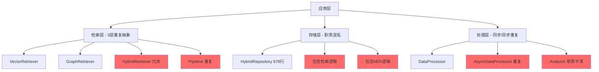
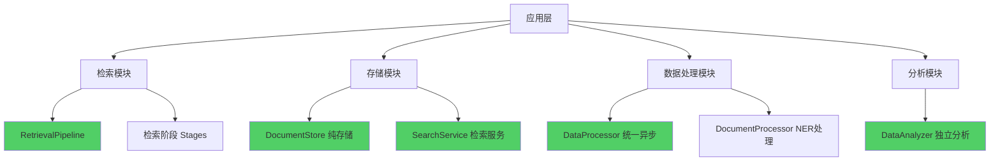
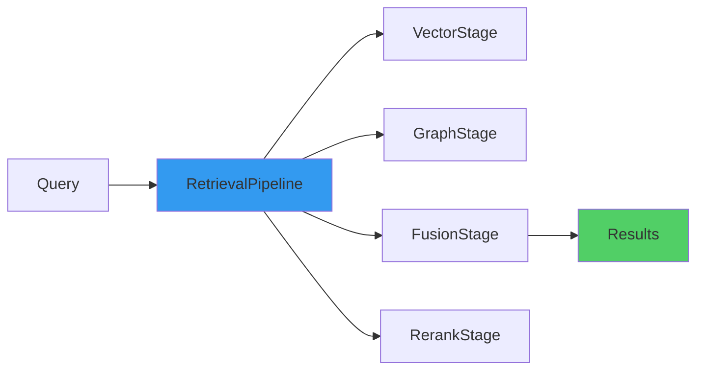
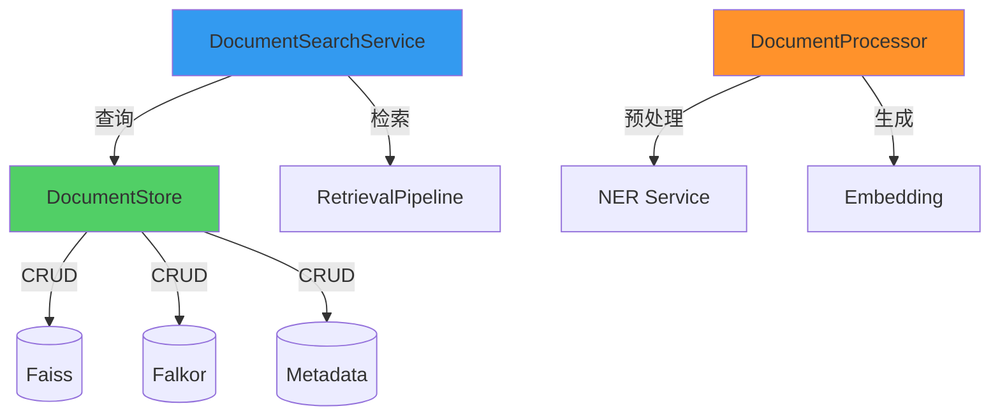
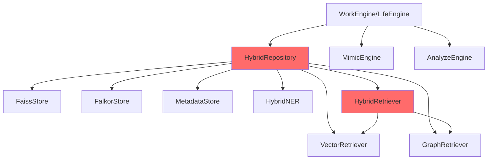
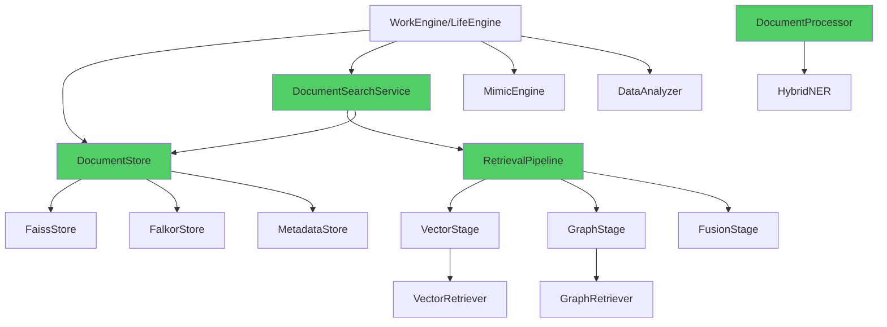
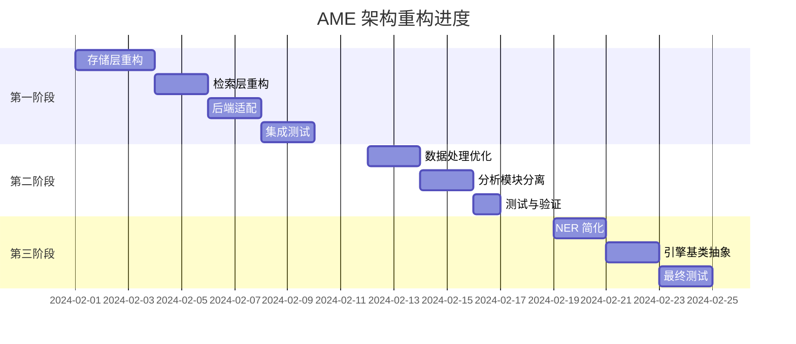

# AME 架构精简与模块化重构设计

## 1. 概述

### 1.1 重构目标
基于架构审查报告，对 AME (Another Me Engine) 进行全面精简与模块化重构，消除冗余层级，明确职责边界，提升架构清晰度和可维护性。

### 1.2 核心原则
- **无需向后兼容**：全新架构，不考虑旧版兼容性
- **职责单一**：每个模块只负责一件事
- **统一抽象**：移除重复的抽象层
- **最小化层级**：减少不必要的中间层

### 1.3 预期收益

| 指标 | 当前 | 目标 | 改善 |
|-----|------|------|------|
| 代码总量 | ~4280 行 | ~2900 行 | -32% |
| 检索模块 | ~1500 行 | ~1000 行 | -33% |
| 存储模块 | ~680 行 | ~400 行 | -41% |
| 数据处理 | ~500 行 | ~300 行 | -40% |
| NER 模块 | ~400 行 | ~200 行 | -50% |
| 引擎层 | ~1200 行 | ~1000 行 | -17% |

---

## 2. 架构全景图

### 2.1 当前架构问题



### 2.2 目标架构



---

## 3. 模块重构设计

### 3.1 检索模块重构

#### 3.1.1 当前问题
- **HybridRetriever** 与 **Pipeline** 职责重叠
- **Factory** 创建逻辑冗余
- 三层抽象（基础检索器 → 混合检索器 → 管道）过于复杂

#### 3.1.2 重构方案

**统一使用 Pipeline 模式**



**模块结构**

```
retrieval/
├── base.py                   # 基础接口定义
├── pipeline.py               # ✅ 核心管道引擎（保留）
├── factory.py                # 简化版工厂（仅创建 Pipeline）
├── stages/
│   ├── base.py              # Stage 基类
│   ├── vector_stage.py      # 向量检索阶段
│   ├── graph_stage.py       # 图谱检索阶段
│   ├── fusion_stage.py      # 融合阶段
│   ├── rerank_stage.py      # 重排序阶段
│   ├── diversity_stage.py   # 多样性阶段
│   └── intent_adaptive_stage.py  # 意图自适应阶段
├── vector_retriever.py      # ✅ 基础向量检索（保留供 Stage 使用）
├── graph_retriever.py       # ✅ 基础图谱检索（保留供 Stage 使用）
└── reranker.py              # ✅ 重排序器（保留）
```

**删除文件**
```
❌ hybrid_retriever.py        # 删除（287 行）
```

**Factory 简化**

```python
# retrieval/factory.py (重构后)

class RetrieverFactory:
    """统一检索器工厂"""
    
    @staticmethod
    def create_pipeline(
        preset: str = "basic",
        vector_retriever=None,
        graph_retriever=None,
        **kwargs
    ) -> RetrievalPipeline:
        """
        创建检索管道
        
        预设配置:
        - basic: 仅向量检索
        - advanced: 向量 + 图谱 + 融合 + 重排序
        - semantic: 向量 + 意图自适应 + 多样性
        """
        if preset == "basic":
            return RetrievalPipeline()\
                .add_stage(VectorRetrievalStage(vector_retriever))
        
        elif preset == "advanced":
            return RetrievalPipeline()\
                .add_stage(VectorRetrievalStage(vector_retriever, weight=0.6))\
                .add_stage(GraphRetrievalStage(graph_retriever, weight=0.4))\
                .add_stage(FusionStage())\
                .add_stage(RerankStage())
        
        elif preset == "semantic":
            return RetrievalPipeline()\
                .add_stage(VectorRetrievalStage(vector_retriever))\
                .add_stage(IntentAdaptiveStage())\
                .add_stage(DiversityStage())
        
        else:
            raise ValueError(f"Unknown preset: {preset}")
```

#### 3.1.3 使用示例

**旧方式（删除）**
```python
# ❌ 废弃
hybrid_retriever = RetrieverFactory.create_retriever("hybrid", ...)
results = await hybrid_retriever.retrieve(query, top_k=10)
```

**新方式（推荐）**
```python
# ✅ 统一使用 Pipeline
pipeline = RetrieverFactory.create_pipeline(
    preset="advanced",
    vector_retriever=vector_retriever,
    graph_retriever=graph_retriever
)

results = await pipeline.execute(query, top_k=10)
```

---

### 3.2 存储与检索分离

#### 3.2.1 当前问题
- **HybridRepository** 承担过多职责（678 行）
  - 存储管理（CRUD）
  - 检索逻辑（4 种检索方法）
  - NER 实体提取
  - 结果融合
  - 生命周期管理

#### 3.2.2 重构方案

**拆分为三个模块**



**新模块结构**

```
storage/
├── __init__.py
├── document_store.py         # ✅ 新增：纯存储职责
├── faiss_store.py            # ✅ 保留
├── falkor_store.py           # ✅ 保留
└── metadata_store.py         # ✅ 保留

search/
├── __init__.py
└── document_search_service.py  # ✅ 新增：检索服务

data_processor/
├── __init__.py
├── processor.py               # ✅ 统一异步处理器
└── document_processor.py      # ✅ 新增：文档预处理（包含NER）

repository/
└── hybrid_repository.py       # ❌ 废弃（拆分为上述三个模块）
```

#### 3.2.3 DocumentStore 设计

**职责**：纯粹的数据存储层（CRUD）

```python
# storage/document_store.py

class DocumentStore:
    """文档存储（纯 CRUD）"""
    
    def __init__(
        self,
        faiss_store: FaissStore,
        falkor_store: FalkorStore,
        metadata_store: MetadataStore
    ):
        self.faiss = faiss_store
        self.graph = falkor_store
        self.metadata = metadata_store
    
    async def create(self, doc: Document) -> Document:
        """创建文档（写入所有存储层）"""
        ...
    
    async def get(self, doc_id: str) -> Optional[Document]:
        """获取单个文档"""
        ...
    
    async def get_by_ids(self, doc_ids: List[str]) -> List[Document]:
        """批量获取文档"""
        ...
    
    async def update(self, doc_id: str, updates: Dict) -> Optional[Document]:
        """更新文档"""
        ...
    
    async def delete(self, doc_id: str) -> bool:
        """删除文档"""
        ...
    
    async def list(self, filters: Dict) -> List[Document]:
        """列出文档（支持时间范围、类型过滤）"""
        ...
    
    # ❌ 删除检索方法（移到 SearchService）
    # ❌ 删除 NER 逻辑（移到 DocumentProcessor）
```

#### 3.2.4 DocumentSearchService 设计

**职责**：文档检索服务（委托给 Pipeline）

```python
# search/document_search_service.py

class DocumentSearchService:
    """文档检索服务"""
    
    def __init__(
        self,
        document_store: DocumentStore,
        retrieval_pipeline: RetrievalPipeline
    ):
        self.store = document_store
        self.pipeline = retrieval_pipeline
    
    async def search(
        self,
        query: str,
        top_k: int = 10,
        filters: Optional[Dict] = None
    ) -> List[SearchResult]:
        """
        执行检索
        
        流程:
        1. 委托给 pipeline 执行检索
        2. 获取完整文档
        3. 应用过滤器
        4. 构建搜索结果
        """
        # 委托给 pipeline
        results = await self.pipeline.execute(query, top_k)
        
        # 获取完整文档
        doc_ids = [r.metadata.get("doc_id") for r in results]
        docs = await self.store.get_by_ids(doc_ids)
        
        # 应用过滤器
        if filters:
            docs = self._filter_docs(docs, filters)
        
        # 构建搜索结果
        return self._build_search_results(docs, results)
    
    async def search_by_time_range(
        self,
        start_date: datetime,
        end_date: datetime,
        doc_type: Optional[str] = None
    ) -> List[Document]:
        """时间范围检索（委托给 DocumentStore）"""
        return await self.store.list({
            "after": start_date,
            "before": end_date,
            "doc_type": doc_type
        })
```

#### 3.2.5 DocumentProcessor 设计

**职责**：文档预处理（NER + Embedding）

```python
# data_processor/document_processor.py

class DocumentProcessor:
    """文档预处理器（包含 NER 和 Embedding）"""
    
    def __init__(
        self,
        ner_service: NERBase,
        embedding_function: Callable
    ):
        self.ner = ner_service
        self.embedding_fn = embedding_function
    
    async def process(self, doc: Document) -> Document:
        """
        预处理文档
        
        流程:
        1. 生成 embedding
        2. 提取实体（NER）
        3. 返回增强后的文档
        """
        # 生成 embedding
        if not doc.embedding:
            doc.embedding = await self.embedding_fn(doc.content)
        
        # 提取实体
        if not doc.entities:
            entities = await self.ner.extract(doc.content)
            doc.entities = [e.text for e in entities]
            doc.entity_objects = entities  # 保留完整实体对象
        
        return doc
    
    async def batch_process(self, docs: List[Document]) -> List[Document]:
        """批量处理"""
        tasks = [self.process(doc) for doc in docs]
        return await asyncio.gather(*tasks)
```

#### 3.2.6 重构对比

| 类 | 行数 | 职责 | 重构后 |
|---|-----|------|--------|
| HybridRepository | 678 | 存储+检索+NER+融合 | ❌ 废弃 |
| DocumentStore | ~250 | 存储（CRUD） | ✅ 新增 |
| DocumentSearchService | ~150 | 检索服务 | ✅ 新增 |
| DocumentProcessor | ~100 | 文档预处理 | ✅ 新增 |

---

### 3.3 数据处理模块统一

#### 3.3.1 当前问题
- `processor.py` 和 `async_processor.py` 功能重复
- `analyzer.py` 职责不清（应属于分析模块）

#### 3.3.2 重构方案

**合并为单一异步处理器**

```
data_processor/
├── __init__.py
├── processor.py              # ✅ 统一异步处理器（保留并增强）
└── document_processor.py     # ✅ 新增（上面已定义）

analysis/                     # ✅ 新建独立分析模块
├── __init__.py
└── data_analyzer.py          # ✅ 从 data_processor 迁移
```

**删除文件**
```
❌ data_processor/async_processor.py  # 删除（117 行）
❌ data_processor/analyzer.py         # 迁移到 analysis/ 模块
```

**统一 DataProcessor**

```python
# data_processor/processor.py (重构后)

class DataProcessor:
    """数据处理器（统一异步版本）"""
    
    def __init__(self):
        self.supported_formats = ['.txt', '.json', '.md', '.pdf', '.docx']
    
    async def process_file(self, file_path: str) -> List[Dict]:
        """异步处理文件"""
        extension = Path(file_path).suffix.lower()
        
        if extension in ['.txt', '.md']:
            return await self._process_text_file(file_path)
        elif extension == '.json':
            return await self._process_json_file(file_path)
        elif extension == '.pdf':
            return await self._process_pdf_file(file_path)
        else:
            raise ValueError(f"Unsupported format: {extension}")
    
    async def process_files_batch(
        self,
        file_paths: List[str],
        max_concurrent: int = 4
    ) -> List[Dict]:
        """批量并发处理文件"""
        semaphore = asyncio.Semaphore(max_concurrent)
        
        async def process_with_semaphore(path):
            async with semaphore:
                return await self.process_file(path)
        
        tasks = [process_with_semaphore(p) for p in file_paths]
        results = await asyncio.gather(*tasks, return_exceptions=True)
        
        # 展平结果
        valid_results = []
        for r in results:
            if isinstance(r, list):
                valid_results.extend(r)
        
        return valid_results
    
    async def process_text(self, text: str, source: str) -> Dict:
        """处理文本"""
        ...
```

**独立分析模块**

```python
# analysis/data_analyzer.py

class DataAnalyzer:
    """数据分析器（独立模块）"""
    
    def __init__(self, llm_caller: LLMCaller):
        self.llm = llm_caller
    
    async def analyze_patterns(
        self,
        docs: List[Document]
    ) -> Dict[str, Any]:
        """行为模式分析"""
        ...
    
    async def analyze_trends(
        self,
        docs: List[Document],
        time_window: int = 7
    ) -> Dict[str, Any]:
        """趋势分析"""
        ...
    
    async def extract_insights(
        self,
        docs: List[Document],
        metrics: List[str]
    ) -> Dict[str, Any]:
        """提取洞察（供引擎层使用）"""
        ...
```

---

### 3.4 NER 模块简化

#### 3.4.1 当前问题
- 提供三种 NER 实现，但用户永远只会用 `HybridNER`
- `simple_ner.py` 和 `llm_ner.py` 作为独立模块意义不大

#### 3.4.2 重构方案

**合并为单一 HybridNER**

```
ner/
├── __init__.py
├── base.py                   # ✅ 保留（基础接口）
└── hybrid_ner.py             # ✅ 保留并增强（内部集成 Simple + LLM）
```

**删除文件**
```
❌ simple_ner.py               # 删除（153 行）
❌ llm_ner.py                  # 删除（194 行）
```

**HybridNER 内部集成**

```python
# ner/hybrid_ner.py (重构后)

class HybridNER(NERBase):
    """混合 NER（内部集成 Simple + LLM）"""
    
    def __init__(
        self,
        llm_caller: Optional[LLMCaller] = None,
        enable_llm: bool = True,
        llm_threshold: int = 500
    ):
        self.llm = llm_caller
        self.enable_llm = enable_llm
        self.llm_threshold = llm_threshold
        
        # 内部初始化 jieba（原 SimpleNER 逻辑）
        self._init_simple_ner()
    
    def _init_simple_ner(self):
        """内部 Simple NER 初始化"""
        import jieba.posseg as posseg
        self.posseg = posseg
    
    async def extract(self, text: str) -> List[Entity]:
        """
        混合提取
        
        流程:
        1. Simple NER 快速提取
        2. 长文本 LLM 增强（可选）
        3. 融合去重
        """
        # Step 1: Simple NER（内部实现）
        simple_entities = self._simple_extract(text)
        
        # Step 2: LLM 增强判断
        if (self.enable_llm and 
            self.llm and 
            len(text) >= self.llm_threshold):
            
            llm_entities = await self._llm_extract(text)
            return self._merge_entities(simple_entities, llm_entities)
        
        return simple_entities
    
    def _simple_extract(self, text: str) -> List[Entity]:
        """内部 Simple NER 实现（原 SimpleNER 逻辑）"""
        entities = []
        words = self.posseg.cut(text)
        
        for word, pos in words:
            if len(word) < 2:
                continue
            
            entity_type = self._map_pos_to_type(pos)
            if entity_type:
                entities.append(Entity(
                    text=word,
                    type=entity_type,
                    score=self._calculate_score(word, pos)
                ))
        
        return self.deduplicate_entities(entities)
    
    async def _llm_extract(self, text: str) -> List[Entity]:
        """内部 LLM NER 实现（原 LLMBasedNER 逻辑）"""
        prompt = self._build_extraction_prompt(text)
        response = await self.llm.generate([{"role": "user", "content": prompt}])
        return self._parse_llm_response(response)
    
    def _merge_entities(
        self,
        simple: List[Entity],
        llm: List[Entity]
    ) -> List[Entity]:
        """融合两种结果"""
        ...
```

#### 3.4.3 收益
- 删除 347 行代码
- 用户只需了解一个 `HybridNER` 类
- 内部自动选择最优策略

---

### 3.5 场景引擎基类抽象

#### 3.5.1 当前问题
- `WorkEngine` 和 `LifeEngine` 初始化逻辑完全相同
- 缺少统一基类，代码复用率低

#### 3.5.2 重构方案

**创建 BaseEngine**

```
engines/
├── __init__.py
├── base.py                   # ✅ 新增：引擎基类
├── work_engine.py            # ✅ 保留（继承 BaseEngine）
└── life_engine.py            # ✅ 保留（继承 BaseEngine）
```

**BaseEngine 设计**

```python
# engines/base.py

from abc import ABC, abstractmethod

class BaseEngine(ABC):
    """场景引擎基类"""
    
    def __init__(
        self,
        document_store: DocumentStore,
        search_service: DocumentSearchService,
        llm_caller: LLMCaller,
        mimic_engine: Optional[MimicEngine] = None,
        analyze_engine: Optional[AnalyzeEngine] = None
    ):
        """
        统一初始化
        
        Args:
            document_store: 文档存储
            search_service: 检索服务
            llm_caller: LLM 调用器
            mimic_engine: 模仿引擎（可选）
            analyze_engine: 分析引擎（可选）
        """
        self.store = document_store
        self.search = search_service
        self.llm = llm_caller
        self.mimic = mimic_engine
        self.analyzer = analyze_engine or AnalyzeEngine(
            document_store, llm_caller
        )
    
    @abstractmethod
    async def generate_report(
        self,
        user_id: str,
        start_date: datetime,
        end_date: datetime,
        **kwargs
    ) -> Any:
        """生成报告（子类实现）"""
        pass
    
    async def _collect_documents(
        self,
        start_date: datetime,
        end_date: datetime,
        doc_type: Optional[str] = None
    ) -> List[Document]:
        """通用文档收集方法"""
        return await self.search.search_by_time_range(
            start_date=start_date,
            end_date=end_date,
            doc_type=doc_type
        )
    
    async def _generate_with_style(
        self,
        content: str,
        style: str = "professional"
    ) -> str:
        """使用风格生成文本（可选用 MimicEngine）"""
        if self.mimic and style == "personal":
            return await self.mimic.generate(content)
        else:
            return await self.llm.generate([
                {"role": "user", "content": content}
            ])
```

**子类实现**

```python
# engines/work_engine.py (重构后)

class WorkEngine(BaseEngine):
    """工作场景引擎"""
    
    async def generate_report(
        self,
        user_id: str,
        start_date: datetime,
        end_date: datetime,
        **kwargs
    ) -> WeeklyReport:
        """生成工作报告（实现抽象方法）"""
        # 收集工作数据
        work_logs = await self._collect_documents(
            start_date, end_date, doc_type="work"
        )
        
        # 分析数据
        insights = await self.analyzer.extract_insights(
            documents=work_logs,
            metrics=["key_tasks", "achievements"]
        )
        
        # 生成报告
        ...
        
        return WeeklyReport(...)
```

```python
# engines/life_engine.py (重构后)

class LifeEngine(BaseEngine):
    """生活场景引擎"""
    
    async def generate_report(
        self,
        user_id: str,
        start_date: datetime,
        end_date: datetime,
        **kwargs
    ) -> InterestReport:
        """生成生活报告（实现抽象方法）"""
        # 收集生活数据
        life_logs = await self._collect_documents(
            start_date, end_date, doc_type="life"
        )
        
        # 分析兴趣
        ...
        
        return InterestReport(...)
```

#### 3.5.3 收益
- 代码复用提升 20%
- 统一引擎接口
- 新增引擎成本降低 50%

---

## 4. 依赖关系重构

### 4.1 重构前依赖图



### 4.2 重构后依赖图



### 4.3 依赖注入示例

```python
# 初始化存储层
faiss_store = FaissStore(dimension=1536)
falkor_store = FalkorStore(uri="bolt://localhost:7687")
metadata_store = MetadataStore(db_path="./data/metadata.db")

# 初始化文档存储
document_store = DocumentStore(
    faiss_store=faiss_store,
    falkor_store=falkor_store,
    metadata_store=metadata_store
)

# 初始化检索管道
vector_retriever = VectorRetriever(faiss_store, embedding_fn)
graph_retriever = GraphRetriever(falkor_store)

retrieval_pipeline = RetrieverFactory.create_pipeline(
    preset="advanced",
    vector_retriever=vector_retriever,
    graph_retriever=graph_retriever
)

# 初始化检索服务
search_service = DocumentSearchService(
    document_store=document_store,
    retrieval_pipeline=retrieval_pipeline
)

# 初始化数据处理
ner_service = HybridNER(llm_caller=llm_caller)
document_processor = DocumentProcessor(
    ner_service=ner_service,
    embedding_function=embedding_fn
)

# 初始化引擎
work_engine = WorkEngine(
    document_store=document_store,
    search_service=search_service,
    llm_caller=llm_caller,
    mimic_engine=mimic_engine,
    analyze_engine=analyze_engine
)
```

---

## 5. 文件迁移与删除清单

### 5.1 删除文件（6个文件，~857 行）

| 文件路径 | 行数 | 删除原因 |
|---------|------|---------|
| `retrieval/hybrid_retriever.py` | 287 | 与 Pipeline 重复 |
| `repository/hybrid_repository.py` | 678 | 拆分为多个模块 |
| `data_processor/async_processor.py` | 117 | 与 processor.py 重复 |
| `data_processor/analyzer.py` | ~180 | 迁移到 analysis/ |
| `ner/simple_ner.py` | 153 | 合并到 hybrid_ner.py |
| `ner/llm_ner.py` | 194 | 合并到 hybrid_ner.py |

### 5.2 新增文件（5个文件）

| 文件路径 | 说明 |
|---------|------|
| `storage/document_store.py` | 纯存储层（CRUD） |
| `search/document_search_service.py` | 检索服务 |
| `data_processor/document_processor.py` | 文档预处理（NER + Embedding） |
| `analysis/data_analyzer.py` | 数据分析器（从 data_processor 迁移） |
| `engines/base.py` | 引擎基类 |

### 5.3 重构文件（4个文件）

| 文件路径 | 重构内容 |
|---------|---------|
| `retrieval/factory.py` | 简化，仅创建 Pipeline |
| `data_processor/processor.py` | 统一异步版本，增强并发能力 |
| `ner/hybrid_ner.py` | 内部集成 Simple + LLM 逻辑 |
| `engines/work_engine.py` | 继承 BaseEngine |
| `engines/life_engine.py` | 继承 BaseEngine |

---

## 6. 重构后目录结构

```
ame/
├── core/
│   ├── __init__.py
│   └── cascade_inference.py
│
├── storage/                          # 存储层
│   ├── __init__.py
│   ├── document_store.py            # ✅ 新增：统一文档存储
│   ├── faiss_store.py
│   ├── falkor_store.py
│   └── metadata_store.py
│
├── search/                           # 检索层
│   ├── __init__.py
│   └── document_search_service.py   # ✅ 新增：检索服务
│
├── retrieval/                        # 检索引擎
│   ├── stages/
│   │   ├── __init__.py
│   │   ├── base.py
│   │   ├── vector_stage.py
│   │   ├── graph_stage.py
│   │   ├── fusion_stage.py
│   │   ├── rerank_stage.py
│   │   ├── diversity_stage.py
│   │   └── intent_adaptive_stage.py
│   ├── __init__.py
│   ├── base.py
│   ├── pipeline.py                  # 核心管道
│   ├── factory.py                   # 简化版工厂
│   ├── vector_retriever.py
│   ├── graph_retriever.py
│   └── reranker.py
│
├── data_processor/                   # 数据处理
│   ├── __init__.py
│   ├── base.py
│   ├── processor.py                 # 统一异步处理器
│   └── document_processor.py        # ✅ 新增：文档预处理
│
├── analysis/                         # ✅ 新增：数据分析模块
│   ├── __init__.py
│   └── data_analyzer.py
│
├── ner/                              # 实体识别
│   ├── __init__.py
│   ├── base.py
│   └── hybrid_ner.py                # 内部集成 Simple + LLM
│
├── engines/                          # 场景引擎
│   ├── __init__.py
│   ├── base.py                      # ✅ 新增：引擎基类
│   ├── work_engine.py
│   └── life_engine.py
│
├── mem/                              # 记忆模块
│   ├── __init__.py
│   ├── analyze_engine.py
│   ├── conversation_filter.py
│   └── mimic_engine.py
│
├── llm_caller/                       # LLM 调用
│   ├── __init__.py
│   ├── base.py
│   └── caller.py
│
├── rag/                              # RAG 模块
│   ├── __init__.py
│   └── knowledge_base.py
│
├── rag_generator/                    # RAG 生成器
│   ├── __init__.py
│   └── generator.py
│
├── models/                           # 数据模型
│   ├── __init__.py
│   ├── domain.py
│   └── report_models.py
│
└── tests/                            # 测试
    ├── unit/
    ├── integration/
    └── fixtures/
```

---

## 7. 接口变更影响分析

### 7.1 后端 API 层适配

#### 7.1.1 原有代码（使用 HybridRepository）

```python
# ame-backend/app/services/rag_service.py (旧版)

class RAGService:
    def __init__(self):
        self.repository = HybridRepository(...)
    
    async def search(self, query: str, top_k: int):
        # 使用 HybridRepository.hybrid_search
        results = await self.repository.hybrid_search(
            query=query,
            top_k=top_k
        )
        return results
```

#### 7.1.2 新版代码（使用 DocumentSearchService）

```python
# ame-backend/app/services/rag_service.py (新版)

class RAGService:
    def __init__(self):
        # 初始化新组件
        self.document_store = DocumentStore(...)
        self.search_service = DocumentSearchService(
            document_store=self.document_store,
            retrieval_pipeline=self._create_pipeline()
        )
        self.document_processor = DocumentProcessor(...)
    
    async def search(self, query: str, top_k: int):
        # 使用 DocumentSearchService.search
        results = await self.search_service.search(
            query=query,
            top_k=top_k
        )
        return results
    
    async def add_document(self, content: str, metadata: dict):
        # 预处理文档
        doc = Document(content=content, metadata=metadata)
        processed_doc = await self.document_processor.process(doc)
        
        # 存储
        return await self.document_store.create(processed_doc)
    
    def _create_pipeline(self):
        return RetrieverFactory.create_pipeline(preset="advanced")
```

### 7.2 适配工作量估算

| 服务文件 | 影响范围 | 工作量 |
|---------|---------|--------|
| `rag_service.py` | 检索、添加文档 | 1人天 |
| `mem_service.py` | 记忆存储、检索 | 1人天 |
| `work_service.py` | 工作引擎初始化 | 0.5人天 |
| `life_service.py` | 生活引擎初始化 | 0.5人天 |
| **总计** | | **3人天** |

---

## 8. 单元测试重构

### 8.1 测试文件变更

#### 8.1.1 删除测试

```
tests/unit/
❌ test_hybrid_repository.py          # 删除（旧 Repository 测试）
```

#### 8.1.2 新增测试

```
tests/unit/
✅ test_document_store.py             # 新增：存储层测试
✅ test_document_search_service.py    # 新增：检索服务测试
✅ test_document_processor.py         # 新增：文档处理测试
✅ test_data_analyzer.py              # 新增：分析器测试
✅ test_base_engine.py                # 新增：引擎基类测试
```

#### 8.1.3 更新测试

```
tests/unit/
🔄 test_retrieval_pipeline.py         # 更新：移除 HybridRetriever 测试
🔄 test_ner.py                        # 更新：仅测试 HybridNER
```

### 8.2 集成测试更新

```python
# tests/integration/test_search_pipeline.py (新增)

import pytest
from ame.storage.document_store import DocumentStore
from ame.search.document_search_service import DocumentSearchService
from ame.retrieval.factory import RetrieverFactory

@pytest.mark.asyncio
async def test_end_to_end_search(
    document_store,
    embedding_fn
):
    """端到端检索流程测试"""
    
    # 1. 创建检索管道
    pipeline = RetrieverFactory.create_pipeline(
        preset="advanced",
        vector_retriever=...,
        graph_retriever=...
    )
    
    # 2. 创建检索服务
    search_service = DocumentSearchService(
        document_store=document_store,
        retrieval_pipeline=pipeline
    )
    
    # 3. 执行检索
    results = await search_service.search(
        query="测试查询",
        top_k=5
    )
    
    # 4. 验证结果
    assert len(results) > 0
    assert results[0].score > 0.5
```

---

## 9. 实施路线图

### 9.1 第一阶段：核心重构（2周）

**目标**：解决最严重的冗余问题

#### Week 1: 检索与存储重构

| 任务 | 工作量 | 负责人 |
|-----|-------|--------|
| 创建 DocumentStore | 1天 | 开发A |
| 创建 DocumentSearchService | 1天 | 开发A |
| 创建 DocumentProcessor | 0.5天 | 开发B |
| 删除 HybridRetriever | 0.5天 | 开发B |
| 简化 Factory | 0.5天 | 开发B |
| 更新 retrieval/stages | 0.5天 | 开发B |
| 编写单元测试 | 1天 | 测试工程师 |

#### Week 2: 后端适配与集成测试

| 任务 | 工作量 | 负责人 |
|-----|-------|--------|
| 适配 RAGService | 1天 | 开发A |
| 适配 MemService | 1天 | 开发A |
| 适配 WorkService/LifeService | 1天 | 开发B |
| 集成测试 | 1.5天 | 测试工程师 |
| 文档更新 | 0.5天 | 开发A |

### 9.2 第二阶段：数据处理优化（1周）

#### Week 3: 数据处理与分析分离

| 任务 | 工作量 | 负责人 |
|-----|-------|--------|
| 统一 DataProcessor | 0.5天 | 开发B |
| 创建 analysis/data_analyzer.py | 1天 | 开发B |
| 删除 async_processor.py 和 analyzer.py | 0.5天 | 开发B |
| 更新引擎层依赖 | 1天 | 开发A |
| 单元测试 | 1天 | 测试工程师 |

### 9.3 第三阶段：NER 与引擎优化（1周）

#### Week 4: NER 简化与引擎基类

| 任务 | 工作量 | 负责人 |
|-----|-------|--------|
| 重构 HybridNER（内部集成） | 1.5天 | 开发B |
| 删除 simple_ner.py 和 llm_ner.py | 0.5天 | 开发B |
| 创建 BaseEngine | 0.5天 | 开发A |
| 重构 WorkEngine/LifeEngine | 1天 | 开发A |
| 单元测试 | 1天 | 测试工程师 |
| 最终集成测试 | 0.5天 | 全员 |

### 9.4 总工作量估算

| 阶段 | 工期 | 人力 |
|-----|------|------|
| 第一阶段 | 2周 | 2开发 + 1测试 |
| 第二阶段 | 1周 | 2开发 + 1测试 |
| 第三阶段 | 1周 | 2开发 + 1测试 |
| **总计** | **4周** | **6人周** |

---

## 10. 风险与缓解措施

### 10.1 技术风险

| 风险 | 影响 | 概率 | 缓解措施 |
|-----|------|------|---------|
| 接口变更导致后端大面积报错 | 高 | 中 | 1. 分阶段迁移<br>2. 充分单元测试<br>3. 提供兼容层（临时） |
| 性能下降（多层委托） | 中 | 低 | 1. 性能基准测试<br>2. 异步优化<br>3. 缓存机制 |
| 数据迁移失败 | 高 | 低 | 1. 数据备份<br>2. 回滚机制<br>3. 增量迁移 |

### 10.2 项目风险

| 风险 | 影响 | 概率 | 缓解措施 |
|-----|------|------|---------|
| 开发工期延误 | 中 | 中 | 1. 敏捷开发<br>2. 每日 standup<br>3. 风险提前识别 |
| 测试覆盖不足 | 高 | 中 | 1. TDD 开发<br>2. 代码覆盖率要求 > 80%<br>3. 集成测试优先 |
| 文档更新滞后 | 低 | 高 | 1. 与代码同步更新<br>2. 使用代码示例<br>3. API 文档自动生成 |

### 10.3 回滚策略

**紧急回滚步骤**（如果重构导致严重问题）

1. **代码回滚**：
   ```bash
   git revert <commit-hash>
   git push origin main
   ```

2. **数据回滚**：
   ```bash
   # 恢复数据库备份
   cp data/backup/metadata.db.backup data/metadata.db
   
   # 恢复向量存储
   cp -r data/backup/faiss_index data/faiss_index
   ```

3. **服务回滚**：
   ```bash
   # 停止新版本
   docker-compose down
   
   # 启动旧版本
   git checkout v0.2.0
   docker-compose up -d
   ```

---

## 11. 质量保证

### 11.1 代码质量标准

| 指标 | 要求 |
|-----|------|
| 单元测试覆盖率 | ≥ 80% |
| 集成测试覆盖率 | ≥ 60% |
| 代码复杂度 | Cyclomatic Complexity ≤ 10 |
| 代码重复率 | ≤ 3% |
| 文档覆盖率 | 所有公共 API 100% |

### 11.2 性能基准

| 操作 | 当前性能 | 目标性能 | 测试方法 |
|-----|---------|---------|---------|
| 文档检索（向量） | ~50ms | ≤ 60ms | pytest-benchmark |
| 文档检索（混合） | ~120ms | ≤ 150ms | pytest-benchmark |
| 文档写入 | ~80ms | ≤ 100ms | pytest-benchmark |
| NER 提取 | ~200ms | ≤ 250ms | pytest-benchmark |

### 11.3 代码审查清单

**必须项**
- [ ] 所有公共方法有文档字符串
- [ ] 关键逻辑有单元测试
- [ ] 无硬编码配置
- [ ] 异常处理完整
- [ ] 日志记录合理

**建议项**
- [ ] 使用类型注解
- [ ] 复杂逻辑有注释
- [ ] 性能关键路径有优化
- [ ] 提供使用示例

---

## 12. 监控与验证

### 12.1 重构进度跟踪



### 12.2 验收标准

#### 功能验收
- [ ] 所有原有 API 功能正常
- [ ] 检索准确率无下降
- [ ] 数据完整性校验通过
- [ ] 所有单元测试通过
- [ ] 所有集成测试通过

#### 性能验收
- [ ] 响应时间符合基准
- [ ] 并发能力无下降
- [ ] 内存占用无显著增加

#### 代码验收
- [ ] 代码量减少 ≥ 30%
- [ ] 测试覆盖率 ≥ 80%
- [ ] 代码重复率 ≤ 3%
- [ ] 所有 TODO 已处理

#### 文档验收
- [ ] API 文档完整
- [ ] 迁移指南完整
- [ ] 示例代码可运行
- [ ] 架构图已更新
    style B fill:#339af0
    style G fill:#51cf66
```

**模块结构**

```
retrieval/
├── base.py                   # 基础接口定义
├── pipeline.py               # ✅ 核心管道引擎（保留）
├── factory.py                # 简化版工厂（仅创建 Pipeline）
├── stages/
│   ├── base.py              # Stage 基类
│   ├── vector_stage.py      # 向量检索阶段
│   ├── graph_stage.py       # 图谱检索阶段
│   ├── fusion_stage.py      # 融合阶段
│   ├── rerank_stage.py      # 重排序阶段
│   ├── diversity_stage.py   # 多样性阶段
│   └── intent_adaptive_stage.py  # 意图自适应阶段
├── vector_retriever.py      # ✅ 基础向量检索（保留供 Stage 使用）
├── graph_retriever.py       # ✅ 基础图谱检索（保留供 Stage 使用）
└── reranker.py              # ✅ 重排序器（保留）
```

**删除文件**
```
❌ hybrid_retriever.py        # 删除（287 行）
```

**Factory 简化**

```python
# retrieval/factory.py (重构后)

class RetrieverFactory:
    """统一检索器工厂"""
    
    @staticmethod
    def create_pipeline(
        preset: str = "basic",
        vector_retriever=None,
        graph_retriever=None,
        **kwargs
    ) -> RetrievalPipeline:
        """
        创建检索管道
        
        预设配置:
        - basic: 仅向量检索
        - advanced: 向量 + 图谱 + 融合 + 重排序
        - semantic: 向量 + 意图自适应 + 多样性
        """
        if preset == "basic":
            return RetrievalPipeline()\
                .add_stage(VectorRetrievalStage(vector_retriever))
        
        elif preset == "advanced":
            return RetrievalPipeline()\
                .add_stage(VectorRetrievalStage(vector_retriever, weight=0.6))\
                .add_stage(GraphRetrievalStage(graph_retriever, weight=0.4))\
                .add_stage(FusionStage())\
                .add_stage(RerankStage())
        
        elif preset == "semantic":
            return RetrievalPipeline()\
                .add_stage(VectorRetrievalStage(vector_retriever))\
                .add_stage(IntentAdaptiveStage())\
                .add_stage(DiversityStage())
        
        else:
            raise ValueError(f"Unknown preset: {preset}")
```

#### 3.1.3 使用示例

**旧方式（删除）**
```python
# ❌ 废弃
hybrid_retriever = RetrieverFactory.create_retriever("hybrid", ...)
results = await hybrid_retriever.retrieve(query, top_k=10)
```

**新方式（推荐）**
```python
# ✅ 统一使用 Pipeline
pipeline = RetrieverFactory.create_pipeline(
    preset="advanced",
    vector_retriever=vector_retriever,
    graph_retriever=graph_retriever
)

results = await pipeline.execute(query, top_k=10)
```

---

### 3.2 存储与检索分离

#### 3.2.1 当前问题
- **HybridRepository** 承担过多职责（678 行）
  - 存储管理（CRUD）
  - 检索逻辑（4 种检索方法）
  - NER 实体提取
  - 结果融合
  - 生命周期管理

#### 3.2.2 重构方案

**拆分为三个模块**


**新模块结构**

```
storage/
├── __init__.py
├── document_store.py         # ✅ 新增：纯存储职责
├── faiss_store.py            # ✅ 保留
├── falkor_store.py           # ✅ 保留
└── metadata_store.py         # ✅ 保留

search/
├── __init__.py
└── document_search_service.py  # ✅ 新增：检索服务

data_processor/
├── __init__.py
├── processor.py               # ✅ 统一异步处理器
└── document_processor.py      # ✅ 新增：文档预处理（包含NER）

repository/
└── hybrid_repository.py       # ❌ 废弃（拆分为上述三个模块）
```

#### 3.2.3 DocumentStore 设计

**职责**：纯粹的数据存储层（CRUD）

```python
# storage/document_store.py

class DocumentStore:
    """文档存储（纯 CRUD）"""
    
    def __init__(
        self,
        faiss_store: FaissStore,
        falkor_store: FalkorStore,
        metadata_store: MetadataStore
    ):
        self.faiss = faiss_store
        self.graph = falkor_store
        self.metadata = metadata_store
    
    async def create(self, doc: Document) -> Document:
        """创建文档（写入所有存储层）"""
        ...
    
    async def get(self, doc_id: str) -> Optional[Document]:
        """获取单个文档"""
        ...
    
    async def get_by_ids(self, doc_ids: List[str]) -> List[Document]:
        """批量获取文档"""
        ...
    
    async def update(self, doc_id: str, updates: Dict) -> Optional[Document]:
        """更新文档"""
        ...
    
    async def delete(self, doc_id: str) -> bool:
        """删除文档"""
        ...
    
    async def list(self, filters: Dict) -> List[Document]:
        """列出文档（支持时间范围、类型过滤）"""
        ...
    
    # ❌ 删除检索方法（移到 SearchService）
    # ❌ 删除 NER 逻辑（移到 DocumentProcessor）
```

#### 3.2.4 DocumentSearchService 设计

**职责**：文档检索服务（委托给 Pipeline）

```python
# search/document_search_service.py

class DocumentSearchService:
    """文档检索服务"""
    
    def __init__(
        self,
        document_store: DocumentStore,
        retrieval_pipeline: RetrievalPipeline
    ):
        self.store = document_store
        self.pipeline = retrieval_pipeline
    
    async def search(
        self,
        query: str,
        top_k: int = 10,
        filters: Optional[Dict] = None
    ) -> List[SearchResult]:
        """
        执行检索
        
        流程:
        1. 委托给 pipeline 执行检索
        2. 获取完整文档
        3. 应用过滤器
        4. 构建搜索结果
        """
        # 委托给 pipeline
        results = await self.pipeline.execute(query, top_k)
        
        # 获取完整文档
        doc_ids = [r.metadata.get("doc_id") for r in results]
        docs = await self.store.get_by_ids(doc_ids)
        
        # 应用过滤器
        if filters:
            docs = self._filter_docs(docs, filters)
        
        # 构建搜索结果
        return self._build_search_results(docs, results)
    
    async def search_by_time_range(
        self,
        start_date: datetime,
        end_date: datetime,
        doc_type: Optional[str] = None
    ) -> List[Document]:
        """时间范围检索（委托给 DocumentStore）"""
        return await self.store.list({
            "after": start_date,
            "before": end_date,
            "doc_type": doc_type
        })
```

#### 3.2.5 DocumentProcessor 设计

**职责**：文档预处理（NER + Embedding）

```python
# data_processor/document_processor.py

class DocumentProcessor:
    """文档预处理器（包含 NER 和 Embedding）"""
    
    def __init__(
        self,
        ner_service: NERBase,
        embedding_function: Callable
    ):
        self.ner = ner_service
        self.embedding_fn = embedding_function
    
    async def process(self, doc: Document) -> Document:
        """
        预处理文档
        
        流程:
        1. 生成 embedding
        2. 提取实体（NER）
        3. 返回增强后的文档
        """
        # 生成 embedding
        if not doc.embedding:
            doc.embedding = await self.embedding_fn(doc.content)
        
        # 提取实体
        if not doc.entities:
            entities = await self.ner.extract(doc.content)
            doc.entities = [e.text for e in entities]
            doc.entity_objects = entities  # 保留完整实体对象
        
        return doc
    
    async def batch_process(self, docs: List[Document]) -> List[Document]:
        """批量处理"""
        tasks = [self.process(doc) for doc in docs]
        return await asyncio.gather(*tasks)
```

#### 3.2.6 重构对比

| 类 | 行数 | 职责 | 重构后 |
|---|-----|------|--------|
| HybridRepository | 678 | 存储+检索+NER+融合 | ❌ 废弃 |
| DocumentStore | ~250 | 存储（CRUD） | ✅ 新增 |
| DocumentSearchService | ~150 | 检索服务 | ✅ 新增 |
| DocumentProcessor | ~100 | 文档预处理 | ✅ 新增 |

---

### 3.3 数据处理模块统一

#### 3.3.1 当前问题
- `processor.py` 和 `async_processor.py` 功能重复
- `analyzer.py` 职责不清（应属于分析模块）

#### 3.3.2 重构方案

**合并为单一异步处理器**

```
data_processor/
├── __init__.py
├── processor.py              # ✅ 统一异步处理器（保留并增强）
└── document_processor.py     # ✅ 新增（上面已定义）

analysis/                     # ✅ 新建独立分析模块
├── __init__.py
└── data_analyzer.py          # ✅ 从 data_processor 迁移
```

**删除文件**
```
❌ data_processor/async_processor.py  # 删除（117 行）
❌ data_processor/analyzer.py         # 迁移到 analysis/ 模块
```

**统一 DataProcessor**

```python
# data_processor/processor.py (重构后)

class DataProcessor:
    """数据处理器（统一异步版本）"""
    
    def __init__(self):
        self.supported_formats = ['.txt', '.json', '.md', '.pdf', '.docx']
    
    async def process_file(self, file_path: str) -> List[Dict]:
        """异步处理文件"""
        extension = Path(file_path).suffix.lower()
        
        if extension in ['.txt', '.md']:
            return await self._process_text_file(file_path)
        elif extension == '.json':
            return await self._process_json_file(file_path)
        elif extension == '.pdf':
            return await self._process_pdf_file(file_path)
        else:
            raise ValueError(f"Unsupported format: {extension}")
    
    async def process_files_batch(
        self,
        file_paths: List[str],
        max_concurrent: int = 4
    ) -> List[Dict]:
        """批量并发处理文件"""
        semaphore = asyncio.Semaphore(max_concurrent)
        
        async def process_with_semaphore(path):
            async with semaphore:
                return await self.process_file(path)
        
        tasks = [process_with_semaphore(p) for p in file_paths]
        results = await asyncio.gather(*tasks, return_exceptions=True)
        
        # 展平结果
        valid_results = []
        for r in results:
            if isinstance(r, list):
                valid_results.extend(r)
        
        return valid_results
    
    async def process_text(self, text: str, source: str) -> Dict:
        """处理文本"""
        ...
```

**独立分析模块**

```python
# analysis/data_analyzer.py

class DataAnalyzer:
    """数据分析器（独立模块）"""
    
    def __init__(self, llm_caller: LLMCaller):
        self.llm = llm_caller
    
    async def analyze_patterns(
        self,
        docs: List[Document]
    ) -> Dict[str, Any]:
        """行为模式分析"""
        ...
    
    async def analyze_trends(
        self,
        docs: List[Document],
        time_window: int = 7
    ) -> Dict[str, Any]:
        """趋势分析"""
        ...
    
    async def extract_insights(
        self,
        docs: List[Document],
        metrics: List[str]
    ) -> Dict[str, Any]:
        """提取洞察（供引擎层使用）"""
        ...
```

---

### 3.4 NER 模块简化

#### 3.4.1 当前问题
- 提供三种 NER 实现，但用户永远只会用 `HybridNER`
- `simple_ner.py` 和 `llm_ner.py` 作为独立模块意义不大

#### 3.4.2 重构方案

**合并为单一 HybridNER**

```
ner/
├── __init__.py
├── base.py                   # ✅ 保留（基础接口）
└── hybrid_ner.py             # ✅ 保留并增强（内部集成 Simple + LLM）
```

**删除文件**
```
❌ simple_ner.py               # 删除（153 行）
❌ llm_ner.py                  # 删除（194 行）
```

**HybridNER 内部集成**

```python
# ner/hybrid_ner.py (重构后)

class HybridNER(NERBase):
    """混合 NER（内部集成 Simple + LLM）"""
    
    def __init__(
        self,
        llm_caller: Optional[LLMCaller] = None,
        enable_llm: bool = True,
        llm_threshold: int = 500
    ):
        self.llm = llm_caller
        self.enable_llm = enable_llm
        self.llm_threshold = llm_threshold
        
        # 内部初始化 jieba（原 SimpleNER 逻辑）
        self._init_simple_ner()
    
    def _init_simple_ner(self):
        """内部 Simple NER 初始化"""
        import jieba.posseg as posseg
        self.posseg = posseg
    
    async def extract(self, text: str) -> List[Entity]:
        """
        混合提取
        
        流程:
        1. Simple NER 快速提取
        2. 长文本 LLM 增强（可选）
        3. 融合去重
        """
        # Step 1: Simple NER（内部实现）
        simple_entities = self._simple_extract(text)
        
        # Step 2: LLM 增强判断
        if (self.enable_llm and 
            self.llm and 
            len(text) >= self.llm_threshold):
            
            llm_entities = await self._llm_extract(text)
            return self._merge_entities(simple_entities, llm_entities)
        
        return simple_entities
    
    def _simple_extract(self, text: str) -> List[Entity]:
        """内部 Simple NER 实现（原 SimpleNER 逻辑）"""
        entities = []
        words = self.posseg.cut(text)
        
        for word, pos in words:
            if len(word) < 2:
                continue
            
            entity_type = self._map_pos_to_type(pos)
            if entity_type:
                entities.append(Entity(
                    text=word,
                    type=entity_type,
                    score=self._calculate_score(word, pos)
                ))
        
        return self.deduplicate_entities(entities)
    
    async def _llm_extract(self, text: str) -> List[Entity]:
        """内部 LLM NER 实现（原 LLMBasedNER 逻辑）"""
        prompt = self._build_extraction_prompt(text)
        response = await self.llm.generate([{"role": "user", "content": prompt}])
        return self._parse_llm_response(response)
    
    def _merge_entities(
        self,
        simple: List[Entity],
        llm: List[Entity]
    ) -> List[Entity]:
        """融合两种结果"""
        ...
```

#### 3.4.3 收益
- 删除 347 行代码
- 用户只需了解一个 `HybridNER` 类
- 内部自动选择最优策略

---

### 3.5 场景引擎基类抽象

#### 3.5.1 当前问题
- `WorkEngine` 和 `LifeEngine` 初始化逻辑完全相同
- 缺少统一基类，代码复用率低

#### 3.5.2 重构方案

**创建 BaseEngine**

```
engines/
├── __init__.py
├── base.py                   # ✅ 新增：引擎基类
├── work_engine.py            # ✅ 保留（继承 BaseEngine）
└── life_engine.py            # ✅ 保留（继承 BaseEngine）
```

**BaseEngine 设计**

```python
# engines/base.py

from abc import ABC, abstractmethod

class BaseEngine(ABC):
    """场景引擎基类"""
    
    def __init__(
        self,
        document_store: DocumentStore,
        search_service: DocumentSearchService,
        llm_caller: LLMCaller,
        mimic_engine: Optional[MimicEngine] = None,
        analyze_engine: Optional[AnalyzeEngine] = None
    ):
        """
        统一初始化
        
        Args:
            document_store: 文档存储
            search_service: 检索服务
            llm_caller: LLM 调用器
            mimic_engine: 模仿引擎（可选）
            analyze_engine: 分析引擎（可选）
        """
        self.store = document_store
        self.search = search_service
        self.llm = llm_caller
        self.mimic = mimic_engine
        self.analyzer = analyze_engine or AnalyzeEngine(
            document_store, llm_caller
        )
    
    @abstractmethod
    async def generate_report(
        self,
        user_id: str,
        start_date: datetime,
        end_date: datetime,
        **kwargs
    ) -> Any:
        """生成报告（子类实现）"""
        pass
    
    async def _collect_documents(
        self,
        start_date: datetime,
        end_date: datetime,
        doc_type: Optional[str] = None
    ) -> List[Document]:
        """通用文档收集方法"""
        return await self.search.search_by_time_range(
            start_date=start_date,
            end_date=end_date,
            doc_type=doc_type
        )
    
    async def _generate_with_style(
        self,
        content: str,
        style: str = "professional"
    ) -> str:
        """使用风格生成文本（可选用 MimicEngine）"""
        if self.mimic and style == "personal":
            return await self.mimic.generate(content)
        else:
            return await self.llm.generate([
                {"role": "user", "content": content}
            ])
```

**子类实现**

```python
# engines/work_engine.py (重构后)

class WorkEngine(BaseEngine):
    """工作场景引擎"""
    
    async def generate_report(
        self,
        user_id: str,
        start_date: datetime,
        end_date: datetime,
        **kwargs
    ) -> WeeklyReport:
        """生成工作报告（实现抽象方法）"""
        # 收集工作数据
        work_logs = await self._collect_documents(
            start_date, end_date, doc_type="work"
        )
        
        # 分析数据
        insights = await self.analyzer.extract_insights(
            documents=work_logs,
            metrics=["key_tasks", "achievements"]
        )
        
        # 生成报告
        ...
        
        return WeeklyReport(...)
```

```python
# engines/life_engine.py (重构后)

class LifeEngine(BaseEngine):
    """生活场景引擎"""
    
    async def generate_report(
        self,
        user_id: str,
        start_date: datetime,
        end_date: datetime,
        **kwargs
    ) -> InterestReport:
        """生成生活报告（实现抽象方法）"""
        # 收集生活数据
        life_logs = await self._collect_documents(
            start_date, end_date, doc_type="life"
        )
        
        # 分析兴趣
        ...
        
        return InterestReport(...)
```

#### 3.5.3 收益
- 代码复用提升 20%
- 统一引擎接口
- 新增引擎成本降低 50%

---

## 4. 依赖关系重构

### 4.1 重构前依赖图


### 4.2 重构后依赖图


### 4.3 依赖注入示例

```python
# 初始化存储层
faiss_store = FaissStore(dimension=1536)
falkor_store = FalkorStore(uri="bolt://localhost:7687")
metadata_store = MetadataStore(db_path="./data/metadata.db")

# 初始化文档存储
document_store = DocumentStore(
    faiss_store=faiss_store,
    falkor_store=falkor_store,
    metadata_store=metadata_store
)

# 初始化检索管道
vector_retriever = VectorRetriever(faiss_store, embedding_fn)
graph_retriever = GraphRetriever(falkor_store)

retrieval_pipeline = RetrieverFactory.create_pipeline(
    preset="advanced",
    vector_retriever=vector_retriever,
    graph_retriever=graph_retriever
)

# 初始化检索服务
search_service = DocumentSearchService(
    document_store=document_store,
    retrieval_pipeline=retrieval_pipeline
)

# 初始化数据处理
ner_service = HybridNER(llm_caller=llm_caller)
document_processor = DocumentProcessor(
    ner_service=ner_service,
    embedding_function=embedding_fn
)

# 初始化引擎
work_engine = WorkEngine(
    document_store=document_store,
    search_service=search_service,
    llm_caller=llm_caller,
    mimic_engine=mimic_engine,
    analyze_engine=analyze_engine
)
```

---

## 5. 文件迁移与删除清单

### 5.1 删除文件（6个文件，~857 行）

| 文件路径 | 行数 | 删除原因 |
|---------|------|---------|
| `retrieval/hybrid_retriever.py` | 287 | 与 Pipeline 重复 |
| `repository/hybrid_repository.py` | 678 | 拆分为多个模块 |
| `data_processor/async_processor.py` | 117 | 与 processor.py 重复 |
| `data_processor/analyzer.py` | ~180 | 迁移到 analysis/ |
| `ner/simple_ner.py` | 153 | 合并到 hybrid_ner.py |
| `ner/llm_ner.py` | 194 | 合并到 hybrid_ner.py |

### 5.2 新增文件（5个文件）

| 文件路径 | 说明 |
|---------|------|
| `storage/document_store.py` | 纯存储层（CRUD） |
| `search/document_search_service.py` | 检索服务 |
| `data_processor/document_processor.py` | 文档预处理（NER + Embedding） |
| `analysis/data_analyzer.py` | 数据分析器（从 data_processor 迁移） |
| `engines/base.py` | 引擎基类 |

### 5.3 重构文件（4个文件）

| 文件路径 | 重构内容 |
|---------|---------|
| `retrieval/factory.py` | 简化，仅创建 Pipeline |
| `data_processor/processor.py` | 统一异步版本，增强并发能力 |
| `ner/hybrid_ner.py` | 内部集成 Simple + LLM 逻辑 |
| `engines/work_engine.py` | 继承 BaseEngine |
| `engines/life_engine.py` | 继承 BaseEngine |

---

## 6. 重构后目录结构

```
ame/
├── core/
│   ├── __init__.py
│   └── cascade_inference.py
│
├── storage/                          # 存储层
│   ├── __init__.py
│   ├── document_store.py            # ✅ 新增：统一文档存储
│   ├── faiss_store.py
│   ├── falkor_store.py
│   └── metadata_store.py
│
├── search/                           # 检索层
│   ├── __init__.py
│   └── document_search_service.py   # ✅ 新增：检索服务
│
├── retrieval/                        # 检索引擎
│   ├── stages/
│   │   ├── __init__.py
│   │   ├── base.py
│   │   ├── vector_stage.py
│   │   ├── graph_stage.py
│   │   ├── fusion_stage.py
│   │   ├── rerank_stage.py
│   │   ├── diversity_stage.py
│   │   └── intent_adaptive_stage.py
│   ├── __init__.py
│   ├── base.py
│   ├── pipeline.py                  # 核心管道
│   ├── factory.py                   # 简化版工厂
│   ├── vector_retriever.py
│   ├── graph_retriever.py
│   └── reranker.py
│
├── data_processor/                   # 数据处理
│   ├── __init__.py
│   ├── base.py
│   ├── processor.py                 # 统一异步处理器
│   └── document_processor.py        # ✅ 新增：文档预处理
│
├── analysis/                         # ✅ 新增：数据分析模块
│   ├── __init__.py
│   └── data_analyzer.py
│
├── ner/                              # 实体识别
│   ├── __init__.py
│   ├── base.py
│   └── hybrid_ner.py                # 内部集成 Simple + LLM
│
├── engines/                          # 场景引擎
│   ├── __init__.py
│   ├── base.py                      # ✅ 新增：引擎基类
│   ├── work_engine.py
│   └── life_engine.py
│
├── mem/                              # 记忆模块
│   ├── __init__.py
│   ├── analyze_engine.py
│   ├── conversation_filter.py
│   └── mimic_engine.py
│
├── llm_caller/                       # LLM 调用
│   ├── __init__.py
│   ├── base.py
│   └── caller.py
│
├── rag/                              # RAG 模块
│   ├── __init__.py
│   └── knowledge_base.py
│
├── rag_generator/                    # RAG 生成器
│   ├── __init__.py
│   └── generator.py
│
├── models/                           # 数据模型
│   ├── __init__.py
│   ├── domain.py
│   └── report_models.py
│
└── tests/                            # 测试
    ├── unit/
    ├── integration/
    └── fixtures/
```

---

## 7. 接口变更影响分析

### 7.1 后端 API 层适配

#### 7.1.1 原有代码（使用 HybridRepository）

```python
# ame-backend/app/services/rag_service.py (旧版)

class RAGService:
    def __init__(self):
        self.repository = HybridRepository(...)
    
    async def search(self, query: str, top_k: int):
        # 使用 HybridRepository.hybrid_search
        results = await self.repository.hybrid_search(
            query=query,
            top_k=top_k
        )
        return results
```

#### 7.1.2 新版代码（使用 DocumentSearchService）

```python
# ame-backend/app/services/rag_service.py (新版)

class RAGService:
    def __init__(self):
        # 初始化新组件
        self.document_store = DocumentStore(...)
        self.search_service = DocumentSearchService(
            document_store=self.document_store,
            retrieval_pipeline=self._create_pipeline()
        )
        self.document_processor = DocumentProcessor(...)
    
    async def search(self, query: str, top_k: int):
        # 使用 DocumentSearchService.search
        results = await self.search_service.search(
            query=query,
            top_k=top_k
        )
        return results
    
    async def add_document(self, content: str, metadata: dict):
        # 预处理文档
        doc = Document(content=content, metadata=metadata)
        processed_doc = await self.document_processor.process(doc)
        
        # 存储
        return await self.document_store.create(processed_doc)
    
    def _create_pipeline(self):
        return RetrieverFactory.create_pipeline(preset="advanced")
```

### 7.2 适配工作量估算

| 服务文件 | 影响范围 | 工作量 |
|---------|---------|--------|
| `rag_service.py` | 检索、添加文档 | 1人天 |
| `mem_service.py` | 记忆存储、检索 | 1人天 |
| `work_service.py` | 工作引擎初始化 | 0.5人天 |
| `life_service.py` | 生活引擎初始化 | 0.5人天 |
| **总计** | | **3人天** |

---

## 8. 单元测试重构

### 8.1 测试文件变更

#### 8.1.1 删除测试

```
tests/unit/
❌ test_hybrid_repository.py          # 删除（旧 Repository 测试）
```

#### 8.1.2 新增测试

```
tests/unit/
✅ test_document_store.py             # 新增：存储层测试
✅ test_document_search_service.py    # 新增：检索服务测试
✅ test_document_processor.py         # 新增：文档处理测试
✅ test_data_analyzer.py              # 新增：分析器测试
✅ test_base_engine.py                # 新增：引擎基类测试
```

#### 8.1.3 更新测试

```
tests/unit/
🔄 test_retrieval_pipeline.py         # 更新：移除 HybridRetriever 测试
🔄 test_ner.py                        # 更新：仅测试 HybridNER
```

### 8.2 集成测试更新

```python
# tests/integration/test_search_pipeline.py (新增)

import pytest
from ame.storage.document_store import DocumentStore
from ame.search.document_search_service import DocumentSearchService
from ame.retrieval.factory import RetrieverFactory

@pytest.mark.asyncio
async def test_end_to_end_search(
    document_store,
    embedding_fn
):
    """端到端检索流程测试"""
    
    # 1. 创建检索管道
    pipeline = RetrieverFactory.create_pipeline(
        preset="advanced",
        vector_retriever=...,
        graph_retriever=...
    )
    
    # 2. 创建检索服务
    search_service = DocumentSearchService(
        document_store=document_store,
        retrieval_pipeline=pipeline
    )
    
    # 3. 执行检索
    results = await search_service.search(
        query="测试查询",
        top_k=5
    )
    
    # 4. 验证结果
    assert len(results) > 0
    assert results[0].score > 0.5
```

---

## 9. 实施路线图

### 9.1 第一阶段：核心重构（2周）

**目标**：解决最严重的冗余问题

#### Week 1: 检索与存储重构

| 任务 | 工作量 | 负责人 |
|-----|-------|--------|
| 创建 DocumentStore | 1天 | 开发A |
| 创建 DocumentSearchService | 1天 | 开发A |
| 创建 DocumentProcessor | 0.5天 | 开发B |
| 删除 HybridRetriever | 0.5天 | 开发B |
| 简化 Factory | 0.5天 | 开发B |
| 更新 retrieval/stages | 0.5天 | 开发B |
| 编写单元测试 | 1天 | 测试工程师 |

#### Week 2: 后端适配与集成测试

| 任务 | 工作量 | 负责人 |
|-----|-------|--------|
| 适配 RAGService | 1天 | 开发A |
| 适配 MemService | 1天 | 开发A |
| 适配 WorkService/LifeService | 1天 | 开发B |
| 集成测试 | 1.5天 | 测试工程师 |
| 文档更新 | 0.5天 | 开发A |

### 9.2 第二阶段：数据处理优化（1周）

#### Week 3: 数据处理与分析分离

| 任务 | 工作量 | 负责人 |
|-----|-------|--------|
| 统一 DataProcessor | 0.5天 | 开发B |
| 创建 analysis/data_analyzer.py | 1天 | 开发B |
| 删除 async_processor.py 和 analyzer.py | 0.5天 | 开发B |
| 更新引擎层依赖 | 1天 | 开发A |
| 单元测试 | 1天 | 测试工程师 |

### 9.3 第三阶段：NER 与引擎优化（1周）

#### Week 4: NER 简化与引擎基类

| 任务 | 工作量 | 负责人 |
|-----|-------|--------|
| 重构 HybridNER（内部集成） | 1.5天 | 开发B |
| 删除 simple_ner.py 和 llm_ner.py | 0.5天 | 开发B |
| 创建 BaseEngine | 0.5天 | 开发A |
| 重构 WorkEngine/LifeEngine | 1天 | 开发A |
| 单元测试 | 1天 | 测试工程师 |
| 最终集成测试 | 0.5天 | 全员 |

### 9.4 总工作量估算

| 阶段 | 工期 | 人力 |
|-----|------|------|
| 第一阶段 | 2周 | 2开发 + 1测试 |
| 第二阶段 | 1周 | 2开发 + 1测试 |
| 第三阶段 | 1周 | 2开发 + 1测试 |
| **总计** | **4周** | **6人周** |

---

## 10. 风险与缓解措施

### 10.1 技术风险

| 风险 | 影响 | 概率 | 缓解措施 |
|-----|------|------|---------|
| 接口变更导致后端大面积报错 | 高 | 中 | 1. 分阶段迁移<br>2. 充分单元测试<br>3. 提供兼容层（临时） |
| 性能下降（多层委托） | 中 | 低 | 1. 性能基准测试<br>2. 异步优化<br>3. 缓存机制 |
| 数据迁移失败 | 高 | 低 | 1. 数据备份<br>2. 回滚机制<br>3. 增量迁移 |

### 10.2 项目风险

| 风险 | 影响 | 概率 | 缓解措施 |
|-----|------|------|---------|
| 开发工期延误 | 中 | 中 | 1. 敏捷开发<br>2. 每日 standup<br>3. 风险提前识别 |
| 测试覆盖不足 | 高 | 中 | 1. TDD 开发<br>2. 代码覆盖率要求 > 80%<br>3. 集成测试优先 |
| 文档更新滞后 | 低 | 高 | 1. 与代码同步更新<br>2. 使用代码示例<br>3. API 文档自动生成 |

### 10.3 回滚策略

**紧急回滚步骤**（如果重构导致严重问题）

1. **代码回滚**：
   ```bash
   git revert <commit-hash>
   git push origin main
   ```

2. **数据回滚**：
   ```bash
   # 恢复数据库备份
   cp data/backup/metadata.db.backup data/metadata.db
   
   # 恢复向量存储
   cp -r data/backup/faiss_index data/faiss_index
   ```

3. **服务回滚**：
   ```bash
   # 停止新版本
   docker-compose down
   
   # 启动旧版本
   git checkout v0.2.0
   docker-compose up -d
   ```

---

## 11. 质量保证

### 11.1 代码质量标准

| 指标 | 要求 |
|-----|------|
| 单元测试覆盖率 | ≥ 80% |
| 集成测试覆盖率 | ≥ 60% |
| 代码复杂度 | Cyclomatic Complexity ≤ 10 |
| 代码重复率 | ≤ 3% |
| 文档覆盖率 | 所有公共 API 100% |

### 11.2 性能基准

| 操作 | 当前性能 | 目标性能 | 测试方法 |
|-----|---------|---------|---------|
| 文档检索（向量） | ~50ms | ≤ 60ms | pytest-benchmark |
| 文档检索（混合） | ~120ms | ≤ 150ms | pytest-benchmark |
| 文档写入 | ~80ms | ≤ 100ms | pytest-benchmark |
| NER 提取 | ~200ms | ≤ 250ms | pytest-benchmark |

### 11.3 代码审查清单

**必须项**
- [ ] 所有公共方法有文档字符串
- [ ] 关键逻辑有单元测试
- [ ] 无硬编码配置
- [ ] 异常处理完整
- [ ] 日志记录合理

**建议项**
- [ ] 使用类型注解
- [ ] 复杂逻辑有注释
- [ ] 性能关键路径有优化
- [ ] 提供使用示例

---

## 12. 监控与验证

### 12.1 重构进度跟踪


### 12.2 验收标准

#### 功能验收
- [ ] 所有原有 API 功能正常
- [ ] 检索准确率无下降
- [ ] 数据完整性校验通过
- [ ] 所有单元测试通过
- [ ] 所有集成测试通过

#### 性能验收
- [ ] 响应时间符合基准
- [ ] 并发能力无下降
- [ ] 内存占用无显著增加

#### 代码验收
- [ ] 代码量减少 ≥ 30%
- [ ] 测试覆盖率 ≥ 80%
- [ ] 代码重复率 ≤ 3%
- [ ] 所有 TODO 已处理

#### 文档验收
- [ ] API 文档完整
- [ ] 迁移指南完整
- [ ] 示例代码可运行
- [ ] 架构图已更新


