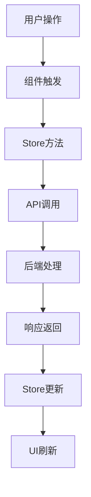
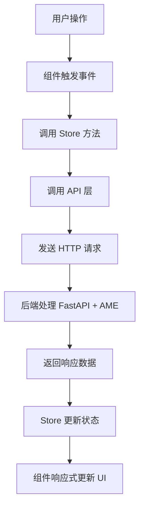

# Another Me 前端优化与问题修复设计文档

**版本**: 1.0.0  
**日期**: 2025-01-15  
**状态**: 设计中

---

## 1. 问题诊断

### 1.1 空白页面根因分析

#### 问题1: 缺失的依赖导入

**位置**: `frontend/src/pages/HomePage.tsx`

代码中使用了以下组件但未导入：
- `Title`, `Paragraph` (来自 antd Typography)
- `Spin`, `Statistic` (来自 antd)
- `FileTextOutlined`, `MessageOutlined`, `DatabaseOutlined` (来自 @ant-design/icons)

**影响**: 导致组件渲染失败，JavaScript 抛出 ReferenceError，页面崩溃为空白

**解决方案**:
``typescript
import { Typography, Spin, Statistic, Card, Row, Col } from 'antd';
import { 
  FileTextOutlined, 
  MessageOutlined, 
  DatabaseOutlined 
} from '@ant-design/icons';

const { Title, Paragraph } = Typography;
```

#### 问题2: Store 实现可能不完整

需要验证所有 Store 文件是否正确实现并导出

#### 问题3: API 客户端重复导出

``typescript
export const apiClient = new APIClient();
export default apiClient;  // 建议统一使用命名导出
```

---

## 2. 架构优化设计

### 2.1 组件层级架构

```
App (Layout)
├─ Pages (HomePage, WorkPage, LifePage...)
├─ Features 
│  ├─ Mode (ModeSelector, MimicPanel, AnalyzePanel)
│  ├─ Work (WeeklyReportGenerator, TodoOrganizer...)
│  ├─ Life (ChatCompanion, MemoryRecall...)
│  ├─ Chat (MessageList, MessageInput, StreamingMessage)
│  ├─ Knowledge (FileUploader, DocumentList, SearchPanel)
│  └─ Memory (MemoryTimeline, MemoryCard...)
├─ Common (ActionCard, StatCard, EmptyState, ErrorCard...)
├─ Stores (modeStore, chatStore, configStore...)
└─ API (apiClient, workAPI, lifeAPI...)
```

### 2.2 场景模式设计

#### 工作模式功能表

| 能力 | 功能 | 图标 | 描述 |
|-----|------|------|------|
| 模仿我 | 周报生成 | 📊 | 自动生成本周工作总结 |
| 模仿我 | 日报生成 | 📝 | 快速生成今日工作日报 |
| 模仿我 | 待办整理 | ✅ | 智能分类待办事项 |
| 模仿我 | 邮件撰写 | 📧 | 用你的风格撰写邮件 |
| 分析我 | 工作分析 | 📈 | 分析工作效率 |
| 分析我 | 时间分布 | ⏰ | 展示时间使用分布 |

#### 生活模式功能表

| 能力 | 功能 | 图标 | 描述 |
|-----|------|------|------|
| 模仿我 | 闲聊陪伴 | 💬 | 随时找我聊天 |
| 模仿我 | 记忆回顾 | 📖 | 回忆过往时光 |
| 模仿我 | 文案生成 | 🎨 | 朋友圈文案生成 |
| 分析我 | 情绪分析 | 😊 | 了解情绪变化趋势 |
| 分析我 | 兴趣图谱 | 🌟 | 展示兴趣演化 |

### 2.3 数据流设计



---

## 3. 核心功能实现

### 3.1 HomePage 修复

**修复导入**:
```typescript
import { Typography, Spin, Statistic } from 'antd';
import { 
  FileTextOutlined, 
  MessageOutlined, 
  DatabaseOutlined 
} from '@ant-design/icons';

const { Title, Paragraph } = Typography;
```

**添加错误处理**:
```typescript
const [error, setError] = useState<string | null>(null);

try {
  // 加载逻辑
} catch (err) {
  setError((err as Error).message);
}
```

### 3.2 周报生成功能

**交互流程**:
```
用户点击"周报生成" 
→ 显示配置Modal (时间/风格/数据)
→ 提交生成 
→ 流式返回内容
→ 可编辑预览
→ 复制/导出
```

**组件设计**:
```typescript
interface WeeklyReportOptions {
  timeRange: 'this_week' | 'last_week';
  tone: 'professional' | 'casual';
  includeStats: boolean;
}

export function WeeklyReportGenerator({ visible, onClose }) {
  const [step, setStep] = useState<'config'|'generating'|'preview'>('config');
  const [report, setReport] = useState('');
  
  const handleGenerate = async () => {
    await workAPI.generateWeeklyReportStream(
      options,
      (chunk) => setReport(prev => prev + chunk),
      () => setStep('preview')
    );
  };
  
  return (
    <Modal open={visible} onCancel={onClose}>
      {step === 'config' && <ConfigPanel />}
      {step === 'generating' && <GeneratingPanel />}
      {step === 'preview' && <PreviewPanel />}
    </Modal>
  );
}
```

### 3.3 待办整理功能

**流程**:
```
输入待办列表 
→ 后端Analyze引擎分析
→ Falkor图谱推理依赖
→ 计算优先级
→ 返回分类结果
```

**组件实现**:
```typescript
export function TodoOrganizer({ visible }) {
  const [rawInput, setRawInput] = useState('');
  const [result, setResult] = useState(null);
  
  const handleOrganize = async () => {
    const todos = rawInput.split('\n').filter(line => line.trim());
    const data = await workAPI.organizeTodos({ todos });
    setResult(data);
  };
  
  return (
    <Modal>
      {!result ? (
        <TextArea placeholder="每行一个任务" />
      ) : (
        <OrganizedList data={result} />
      )}
    </Modal>
  );
}
```

### 3.4 聊天功能优化

**流式对话Hook**:
```typescript
export function useStreamChat() {
  const [messages, setMessages] = useState<ChatMessage[]>([]);
  const [streaming, setStreaming] = useState(false);
  
  const sendMessage = async (content: string) => {
    const userMsg = { role: 'user', content, timestamp: Date.now() };
    setMessages(prev => [...prev, userMsg]);
    
    const aiMsg = { role: 'assistant', content: '', timestamp: Date.now() };
    setMessages(prev => [...prev, aiMsg]);
    
    setStreaming(true);
    let fullContent = '';
    
    await apiClient.chatStream(
      content,
      (chunk) => {
        fullContent += chunk;
        setMessages(prev => prev.map((msg, i) => 
          i === prev.length - 1 ? { ...msg, content: fullContent } : msg
        ));
      },
      () => setStreaming(false)
    );
  };
  
  return { messages, streaming, sendMessage };
}
```

**消息列表组件**:
```typescript
export function MessageList({ messages, streaming }) {
  return (
    <div className="message-list">
      {messages.map(msg => (
        <div key={msg.id} className={`message-${msg.role}`}>
          <div className="avatar">{msg.role === 'user' ? '👤' : '🤖'}</div>
          <ReactMarkdown>{msg.content}</ReactMarkdown>
        </div>
      ))}
      {streaming && <TypingIndicator />}
    </div>
  );
}
```

### 3.5 知识库管理

**文件上传**:
```typescript
export function FileUploader({ onSuccess }) {
  const [fileList, setFileList] = useState([]);
  
  const beforeUpload = (file) => {
    const validTypes = ['text/plain', 'text/markdown', 'application/pdf'];
    if (!validTypes.includes(file.type)) {
      message.error('不支持的文件类型');
      return Upload.LIST_IGNORE;
    }
    return false; // 阻止自动上传
  };
  
  const handleUpload = async () => {
    for (const file of fileList) {
      await apiClient.uploadDocument(file.originFileObj);
    }
    message.success('上传完成');
    onSuccess?.();
  };
  
  return (
    <Upload.Dragger beforeUpload={beforeUpload}>
      <p>支持 TXT, MD, PDF, DOCX</p>
    </Upload.Dragger>
  );
}
```

**检索面板**:
```typescript
export function SearchPanel() {
  const [query, setQuery] = useState('');
  const [results, setResults] = useState([]);
  
  const handleSearch = async () => {
    const data = await apiClient.searchKnowledge(query, 5);
    setResults(data.results);
  };
  
  return (
    <Card title="🔍 知识检索">
      <Search onSearch={handleSearch} />
      <List dataSource={results} renderItem={item => (
        <List.Item>
          <Tag>相似度: {(item.similarity * 100).toFixed(1)}%</Tag>
          {item.content}
        </List.Item>
      )} />
    </Card>
  );
}
```

---

## 4. 状态管理优化

### 4.1 Store 标准模板

```typescript
interface XXXState {
  data: SomeType | null;
  loading: boolean;
  error: string | null;
  
  fetchData: () => Promise<void>;
  updateData: (data: SomeType) => void;
  reset: () => void;
}

export const useXXXStore = create<XXXState>()(
  persist(
    (set) => ({
      data: null,
      loading: false,
      error: null,
      
      fetchData: async () => {
        set({ loading: true, error: null });
        try {
          const data = await apiClient.someMethod();
          set({ data, loading: false });
        } catch (error) {
          set({ error: error.message, loading: false });
        }
      },
      
      updateData: (data) => set({ data }),
      reset: () => set({ data: null, loading: false, error: null }),
    }),
    { name: 'xxx-storage' }
  )
);
```

### 4.2 Mode Store 实现

```typescript
export const useModeStore = create<ModeState>((set, get) => ({
  currentMode: 'work',
  currentCapability: 'mimic',
  
  switchMode: (mode) => set({ currentMode: mode }),
  switchCapability: (cap) => set({ currentCapability: cap }),
  
  autoDetectMode: (input) => {
    const workKeywords = ['周报', '日报', '项目', '工作'];
    const lifeKeywords = ['聊天', '朋友', '心情'];
    
    if (workKeywords.some(k => input.includes(k))) return 'work';
    if (lifeKeywords.some(k => input.includes(k))) return 'life';
    return get().currentMode;
  },
  
  getAvailableActions: () => {
    const { currentMode, currentCapability } = get();
    return actionsByMode[currentMode][currentCapability];
  },
}));
```

---

## 5. 样式与体验优化

### 5.1 响应式设计

```typescript
// 响应式栅格
<Row gutter={[16, 16]}>
  <Col xs={24} sm={12} md={8} lg={6}>
    {/* 超小屏100%, 小屏50%, 中屏33%, 大屏25% */}
  </Col>
</Row>

// 媒体查询Hook
export function useMediaQuery(query: string) {
  const [matches, setMatches] = useState(false);
  
  useEffect(() => {
    const media = window.matchMedia(query);
    setMatches(media.matches);
    
    const listener = () => setMatches(media.matches);
    media.addEventListener('change', listener);
    return () => media.removeEventListener('change', listener);
  }, [query]);
  
  return matches;
}

// 使用
const isMobile = useMediaQuery('(max-width: 768px)');
```

### 5.2 加载状态

```typescript
// 骨架屏
{loading ? <Skeleton active /> : <Content />}

// 按钮加载
<Button loading={submitting} onClick={handleSubmit}>
  提交
</Button>

// 全局加载
<Spin spinning={globalLoading}>
  <App />
</Spin>
```

### 5.3 空状态组件

```typescript
export function EmptyState({ icon = '📭', title, description, action }) {
  return (
    <div className="empty-state">
      <div className="icon">{icon}</div>
      <h3>{title}</h3>
      {description && <p>{description}</p>}
      {action}
    </div>
  );
}

// 使用
<EmptyState
  icon="📚"
  title="知识库为空"
  description="上传文档开始构建"
  action={<Button>上传文档</Button>}
/>
```

---

## 6. 错误处理

### 6.1 错误边界

```typescript
export class ErrorBoundary extends Component {
  state = { hasError: false, error: null };
  
  static getDerivedStateFromError(error) {
    return { hasError: true, error };
  }
  
  render() {
    if (this.state.hasError) {
      return (
        <Result
          status="error"
          title="页面出错"
          subTitle={this.state.error?.message}
          extra={<Button onClick={() => window.location.reload()}>刷新</Button>}
        />
      );
    }
    return this.props.children;
  }
}
```

### 6.2 API 错误处理

```typescript
export function handleAPIError(error: any) {
  if (error.response) {
    const status = error.response.status;
    const errorMap = {
      400: '参数错误',
      401: '请配置 API Key',
      404: '接口不存在',
      500: '服务器错误',
    };
    message.error(errorMap[status] || '请求失败');
  } else if (error.request) {
    message.error('网络错误，请检查后端服务');
  } else {
    message.error(error.message);
  }
}
```

---

## 7. 性能优化

### 7.1 组件懒加载

```typescript
const HomePage = lazy(() => import('./pages/HomePage'));
const WorkPage = lazy(() => import('./pages/WorkPage'));

<Suspense fallback={<Spin size="large" />}>
  <Routes>
    <Route path="/" element={<HomePage />} />
    <Route path="/work" element={<WorkPage />} />
  </Routes>
</Suspense>
```

### 7.2 虚拟列表

```typescript
import VirtualList from 'rc-virtual-list';

<VirtualList
  data={memories}
  height={600}
  itemHeight={80}
  itemKey="id"
>
  {(item) => <MemoryCard memory={item} />}
</VirtualList>
```

### 7.3 请求缓存

``typescript
class APIClient {
  private cache = new Map();
  
  private getCached<T>(key: string, ttl = 60000): T | null {
    const cached = this.cache.get(key);
    if (cached && Date.now() - cached.time < ttl) {
      return cached.data;
    }
    return null;
  }
  
  async getRAGStats() {
    const cached = this.getCached('rag-stats');
    if (cached) return cached;
    
    const data = await this.axios.get('/rag/stats');
    this.cache.set('rag-stats', { data, time: Date.now() });
    return data;
  }
}
```

### 7.4 防抖节流

```typescript
export function debounce(func, delay) {
  let timeout;
  return (...args) => {
    clearTimeout(timeout);
    timeout = setTimeout(() => func(...args), delay);
  };
}

// 使用
const handleSearch = debounce((query) => {
  apiClient.searchKnowledge(query);
}, 500);
```

---

## 8. 实施计划

### Phase 1: 紧急修复 (1-2天)

| 任务 | 文件 | 优先级 |
|------|------|--------|
| 修复 HomePage 导入 | `pages/HomePage.tsx` | P0 |
| 确保 Store 导出 | `store/*.ts` | P0 |
| 添加 ErrorBoundary | `App.tsx` | P0 |
| 修复路径别名 | `vite.config.ts` | P1 |

### Phase 2: 功能完善 (3-5天)

| 模块 | 任务 | 工时 |
|------|------|------|
| 工作模式 | 周报生成 | 4h |
| 工作模式 | 待办整理 | 4h |
| 生活模式 | 聊天陪伴 | 6h |
| 知识库 | 上传优化 | 3h |
| 知识库 | 检索预览 | 3h |

### Phase 3: 体验优化 (2-3天)

- 响应式设计适配
- 组件懒加载
- 虚拟列表优化
- 加载状态优化

### Phase 4: 测试文档 (1-2天)

- 单元测试
- 集成测试
- 更新文档

---

## 9. 技术规范

### 9.1 代码规范

```typescript
// 组件: PascalCase
export function UserProfile() {}

// Hook: use开头
export function useUserData() {}

// 类型: PascalCase
export interface UserProfileProps {}

// 常量: UPPER_SNAKE_CASE
const API_BASE_URL = '/api/v1';
```

### 9.2 Git Commit

```
feat: 新功能
fix: 修复问题
refactor: 重构代码
style: 样式调整
docs: 文档更新

示例:
feat: 实现周报生成功能
fix: 修复 HomePage 空白页面问题
```

---

## 10. 关键修复清单

### 必须修复的问题

**1. HomePage.tsx 缺失导入**
``typescript
import { Typography, Spin, Statistic } from 'antd';
import { FileTextOutlined, MessageOutlined, DatabaseOutlined } from '@ant-design/icons';
const { Title, Paragraph } = Typography;
```

**2. 确保 Store 正确导出**
``typescript
// store/configStore.ts
export const useConfigStore = create<ConfigState>()(...);
```

**3. 统一 API 导出**
``typescript
// api/client.ts
export const apiClient = new APIClient();
// 移除 export default
```

**4. 添加错误边界**
``typescript
// App.tsx
<ErrorBoundary>
  <Routes>...</Routes>
</ErrorBoundary>
```

**5. 路由404处理**
```
<Route path="*" element={<Navigate to="/" replace />} />
│  └─────────────────────────────────────────────────────┘   │
│  ┌─────────────────────────────────────────────────────┐   │
│  │  Life (生活场景)                                     │   │
│  │  ├─ ChatCompanion      聊天陪伴界面                 │   │
│  │  ├─ MemoryRecall       记忆回顾组件                 │   │
│  │  └─ EmotionAnalyzer    情绪分析器                   │   │
│  └─────────────────────────────────────────────────────┘   │
│  ┌─────────────────────────────────────────────────────┐   │
│  │  Chat (对话功能)                                     │   │
│  │  ├─ MessageList        消息列表                     │   │
│  │  ├─ MessageInput       消息输入框                   │   │
│  │  └─ StreamingMessage   流式消息渲染                 │   │
│  └─────────────────────────────────────────────────────┘   │
│  ┌─────────────────────────────────────────────────────┐   │
│  │  Knowledge (知识库)                                  │   │
│  │  ├─ FileUploader       文件上传器                   │   │
│  │  ├─ DocumentList       文档列表                     │   │
│  │  ├─ SearchPanel        检索面板                     │   │
│  │  └─ SearchResultList   检索结果展示                 │   │
│  └─────────────────────────────────────────────────────┘   │
│  ┌─────────────────────────────────────────────────────┐   │
│  │  Memory (记忆管理)                                   │   │
│  │  ├─ MemoryTimeline     记忆时间线                   │   │
│  │  ├─ MemoryCard         记忆卡片                     │   │
│  │  └─ MemoryFilter       记忆筛选器                   │   │
│  └─────────────────────────────────────────────────────┘   │
├─────────────────────────────────────────────────────────────┤
│                    通用组件层 (Common)                        │
│  ActionCard  | StatCard  | DataChart | EmptyState          │
│  LoadingCard | ErrorCard | ConfirmModal | ...              │
├─────────────────────────────────────────────────────────────┤
│                    状态管理层 (Stores)                        │
│  modeStore | chatStore | configStore | knowledgeStore      │
│  memoryStore | uiStore                                      │
├─────────────────────────────────────────────────────────────┤
│                      API 层                                  │
│  apiClient (核心) | workAPI | lifeAPI | ragAPI | memAPI    │
├─────────────────────────────────────────────────────────────┤
│                     工具层 (Utils)                            │
│  errorHandler | format | time | validation                 │
└─────────────────────────────────────────────────────────────┘
```

### 2.2 场景模式交互设计

根据 System Design 的核心概念，实现场景化的用户交互：

#### 工作模式 (Work Mode)

**功能映射表**：

| 能力类型 | 功能 | 图标 | 描述 | API 端点 |
|---------|------|------|------|----------|
| 模仿我 | 周报生成 | 📊 | 自动生成本周工作总结 | `POST /work/weekly-report` |
| 模仿我 | 日报生成 | 📝 | 快速生成今日工作日报 | `POST /work/daily-report` |
| 模仿我 | 待办整理 | ✅ | 智能分类和排序待办事项 | `POST /work/organize-todos` |
| 模仿我 | 邮件撰写 | 📧 | 用你的风格撰写邮件 | `POST /work/email-draft` |
| 模仿我 | 项目总结 | 📋 | 生成项目总结报告 | `POST /work/project-summary` |
| 分析我 | 工作分析 | 📈 | 分析工作效率和时间分配 | `GET /work/analysis` |
| 分析我 | 时间分布 | ⏰ | 展示时间使用分布 | `GET /work/time-distribution` |
| 分析我 | 技能成长 | 💪 | 追踪技能发展轨迹 | `GET /work/skill-growth` |
| 分析我 | 项目洞察 | 🎯 | 深度分析项目数据 | `GET /work/project-insights` |

#### 生活模式 (Life Mode)

**功能映射表**：

| 能力类型 | 功能 | 图标 | 描述 | API 端点 |
|---------|------|------|------|----------|
| 模仿我 | 聊天陪伴 | 💬 | 随时找我聊天 | `POST /life/chat` |
| 模仿我 | 角色扮演 | 🎭 | 如果是我，我会怎么说 | `POST /life/role-play` |
| 模仿我 | 记忆回顾 | 📖 | 回忆过往时光 | `POST /life/memory-recall` |
| 模仿我 | 文案生成 | 🎨 | 朋友圈、祝福语生成 | `POST /life/copywriting` |
| 模仿我 | 日记助手 | 📝 | 帮你记录生活点滴 | `POST /life/diary-helper` |
| 分析我 | 情绪分析 | 😊 | 了解情绪变化趋势 | `GET /life/emotion-analysis` |
| 分析我 | 兴趣图谱 | 🌟 | 展示兴趣演化路径 | `GET /life/interest-graph` |
| 分析我 | 社交网络 | 👥 | 分析社交关系网络 | `GET /life/social-network` |
| 分析我 | 生活统计 | 📊 | 生活数据可视化 | `GET /life/statistics` |

### 2.3 数据流设计

#### 标准数据流



#### 流式数据流（用于对话）

```mermaid
graph TD
    A[用户发送消息] --> B[apiClient.chatStream]
    B --> C[建立 Fetch Stream]
    C --> D[后端流式返回 chunks]
    D --> E[onMessage 回调]
    E --> F[逐步更新 UI]
    D --> G{是否结束?}
    G -->|[DONE]| H[onComplete 回调]
    G -->|继续| D
    G -->|[ERROR]| I[onError 回调]
```

---

## 3. 核心功能实现设计

### 3.1 HomePage 修复与优化

#### 修复方案

**文件**: `frontend/src/pages/HomePage.tsx`

**需要修改的部分**:

1. 添加缺失的导入：
```typescript
import { Typography, Spin, Statistic, Card, Row, Col, Alert, Button, Space } from 'antd';
import { 
  CheckCircleOutlined,
  WarningOutlined,
  RocketOutlined,
  FileTextOutlined,
  MessageOutlined,
  DatabaseOutlined,
} from '@ant-design/icons';

const { Title, Paragraph } = Typography;
```

2. 修复 apiClient 导入：
```typescript
import { apiClient } from '@/api/client';  // 使用命名导入
```

3. 添加错误处理：
```typescript
const [error, setError] = useState<string | null>(null);

try {
  // ... 加载逻辑
} catch (err) {
  setError((err as Error).message);
  console.error('Failed to load stats:', err);
}
```

#### 优化方案

**使用通用组件替代重复代码**:

```typescript
// 原代码（重复的 Card + Statistic）
<Card hoverable>
  <Statistic
    title="RAG 知识库"
    value={stats.documents}
    prefix={<FileTextOutlined />}
    suffix="个文档"
  />
</Card>

// 优化后（使用 StatCard 组件）
<StatCard
  title="RAG 知识库"
  value={stats.documents}
  suffix="个文档"
  icon={<FileTextOutlined />}
  color="#1890ff"
  onClick={() => navigate('/knowledge')}
/>
```

### 3.2 WorkPage/LifePage 功能增强

#### 周报生成完整交互流程

**用户操作流程图**:

```mermaid
graph TD
    A[用户点击 "周报生成"] --> B[显示配置 Modal]
    B --> C{用户配置选项}
    C --> D[时间范围: 本周/上周]
    C --> E[风格: 正式/轻松]
    C --> F[包含数据统计: 是/否]
    D --> G[用户点击 "生成"]
    E --> G
    F --> G
    G --> H[显示 Loading]
    H --> I[调用 workAPI.generateWeeklyReport]
    I --> J[后端 Analyze Engine 收集数据]
    J --> K[后端 Mimic Engine 生成周报]
    K --> L[流式返回周报内容]
    L --> M[前端实时渲染]
    M --> N[显示可编辑预览]
    N --> O{用户操作}
    O -->|编辑| P[Markdown 编辑器]
    O -->|复制| Q[复制到剪贴板]
    O -->|导出| R[下载 MD/PDF]
    O -->|调整| S[重新生成]
    S --> G
```

**组件设计**:

```typescript
// components/work/WeeklyReportGenerator.tsx
interface WeeklyReportOptions {
  timeRange: 'this_week' | 'last_week' | 'custom';
  startDate?: string;
  endDate?: string;
  tone: 'professional' | 'casual';
  includeStats: boolean;
}

interface WeeklyReportGeneratorProps {
  visible: boolean;
  onClose: () => void;
  onGenerated?: (report: string) => void;
}

export function WeeklyReportGenerator({
  visible,
  onClose,
  onGenerated
}: WeeklyReportGeneratorProps) {
  const [step, setStep] = useState<'config' | 'generating' | 'preview'>('config');
  const [options, setOptions] = useState<WeeklyReportOptions>({
    timeRange: 'this_week',
    tone: 'professional',
    includeStats: true,
  });
  const [report, setReport] = useState('');
  const [generating, setGenerating] = useState(false);

  const handleGenerate = async () => {
    setStep('generating');
    setGenerating(true);
    
    try {
      let fullReport = '';
      
      // 流式生成
      await workAPI.generateWeeklyReportStream(
        options,
        (chunk) => {
          fullReport += chunk;
          setReport(fullReport);
        },
        () => {
          setStep('preview');
          setGenerating(false);
          onGenerated?.(fullReport);
        }
      );
    } catch (error) {
      message.error('生成失败');
      setGenerating(false);
      setStep('config');
    }
  };

  return (
    <Modal
      title="📊 生成周报"
      open={visible}
      onCancel={onClose}
      footer={null}
      width={900}
      destroyOnClose
    >
      {step === 'config' && (
        <ConfigPanel 
          options={options}
          onChange={setOptions}
          onGenerate={handleGenerate}
        />
      )}
      
      {step === 'generating' && (
        <GeneratingPanel report={report} />
      )}
      
      {step === 'preview' && (
        <PreviewPanel 
          report={report}
          onEdit={(edited) => setReport(edited)}
          onRegenerate={() => setStep('config')}
        />
      )}
    </Modal>
  );
}
```

**子组件 - 配置面板**:

```typescript
function ConfigPanel({ options, onChange, onGenerate }) {
  return (
    <div className="space-y-4">
      <div>
        <label>时间范围</label>
        <Radio.Group
          value={options.timeRange}
          onChange={(e) => onChange({ ...options, timeRange: e.target.value })}
        >
          <Radio.Button value="this_week">本周</Radio.Button>
          <Radio.Button value="last_week">上周</Radio.Button>
          <Radio.Button value="custom">自定义</Radio.Button>
        </Radio.Group>
        
        {options.timeRange === 'custom' && (
          <RangePicker 
            onChange={(dates) => onChange({
              ...options,
              startDate: dates?.[0]?.format('YYYY-MM-DD'),
              endDate: dates?.[1]?.format('YYYY-MM-DD'),
            })}
          />
        )}
      </div>

      <div>
        <label>语言风格</label>
        <Radio.Group
          value={options.tone}
          onChange={(e) => onChange({ ...options, tone: e.target.value })}
        >
          <Radio.Button value="professional">正式专业</Radio.Button>
          <Radio.Button value="casual">轻松随意</Radio.Button>
        </Radio.Group>
      </div>

      <div>
        <Checkbox
          checked={options.includeStats}
          onChange={(e) => onChange({ ...options, includeStats: e.target.checked })}
        >
          包含数据统计（工作时长、任务完成率等）
        </Checkbox>
      </div>

      <Button 
        type="primary" 
        block 
        size="large"
        icon={<RocketOutlined />}
        onClick={onGenerate}
      >
        开始生成
      </Button>
    </div>
  );
}
```

**子组件 - 生成中面板**:

```typescript
function GeneratingPanel({ report }) {
  return (
    <div className="generating-panel">
      <div className="text-center mb-4">
        <Spin size="large" />
        <p className="mt-2">正在生成周报...</p>
      </div>
      
      {/* 实时展示生成的内容 */}
      <div className="preview-box">
        <ReactMarkdown>{report || '等待生成...'}</ReactMarkdown>
      </div>
    </div>
  );
}
```

**子组件 - 预览面板**:

```typescript
function PreviewPanel({ report, onEdit, onRegenerate }) {
  const [editing, setEditing] = useState(false);
  const [editedReport, setEditedReport] = useState(report);

  const handleCopy = () => {
    navigator.clipboard.writeText(editedReport);
    message.success('已复制到剪贴板');
  };

  const handleExport = (format: 'md' | 'pdf') => {
    if (format === 'md') {
      const blob = new Blob([editedReport], { type: 'text/markdown' });
      const url = URL.createObjectURL(blob);
      const a = document.createElement('a');
      a.href = url;
      a.download = `周报_${new Date().toLocaleDateString()}.md`;
      a.click();
    }
    // PDF 导出需要额外库支持
  };

  return (
    <div>
      <div className="actions mb-4">
        <Space>
          <Button 
            icon={<EditOutlined />}
            onClick={() => setEditing(!editing)}
          >
            {editing ? '预览' : '编辑'}
          </Button>
          <Button 
            icon={<CopyOutlined />}
            onClick={handleCopy}
          >
            复制
          </Button>
          <Button 
            icon={<DownloadOutlined />}
            onClick={() => handleExport('md')}
          >
            导出 MD
          </Button>
          <Button onClick={onRegenerate}>
            重新生成
          </Button>
        </Space>
      </div>

      {editing ? (
        <TextArea
          value={editedReport}
          onChange={(e) => {
            setEditedReport(e.target.value);
            onEdit(e.target.value);
          }}
          rows={20}
          style={{ fontFamily: 'monospace' }}
        />
      ) : (
        <div className="markdown-preview">
          <ReactMarkdown>{editedReport}</ReactMarkdown>
        </div>
      )}
    </div>
  );
}
```

#### 待办整理功能设计

**交互流程**:

```mermaid
graph TD
    A[用户点击 "待办整理"] --> B[显示输入 Modal]
    B --> C[用户输入待办列表]
    C --> D[一行一个任务]
    D --> E[用户点击 "智能整理"]
    E --> F[调用 workAPI.organizeTodos]
    F --> G[后端 Analyze Engine]
    G --> H[Falkor 图谱分析任务依赖]
    G --> I[计算优先级 紧急度+重要性]
    H --> J[Mimic Engine 用户习惯组织]
    I --> J
    J --> K[返回分类结果]
    K --> L[前端渲染分组列表]
    L --> M[高优先级]
    L --> N[中优先级]
    L --> O[低优先级]
```

**组件实现**:

```typescript
// components/work/TodoOrganizer.tsx
interface TodoItem {
  id: string;
  content: string;
  priority: 'high' | 'medium' | 'low';
  urgency?: number;
  importance?: number;
  dependencies?: string[];
  category?: string;
}

interface OrganizedTodos {
  high: TodoItem[];
  medium: TodoItem[];
  low: TodoItem[];
}

export function TodoOrganizer({ visible, onClose }) {
  const [rawInput, setRawInput] = useState('');
  const [organizing, setOrganizing] = useState(false);
  const [result, setResult] = useState<OrganizedTodos | null>(null);

  const handleOrganize = async () => {
    const todos = rawInput
      .split('
')
      .filter(line => line.trim())
      .map(line => line.trim());

    if (todos.length === 0) {
      message.warning('请输入至少一个待办事项');
      return;
    }

    setOrganizing(true);
    try {
      const data = await workAPI.organizeTodos({ todos });
      setResult(data);
    } catch (error) {
      message.error('整理失败');
    } finally {
      setOrganizing(false);
    }
  };

  return (
    <Modal
      title="✅ 智能整理待办"
      open={visible}
      onCancel={onClose}
      footer={null}
      width={800}
    >
      {!result ? (
        <div>
          <p className="mb-2">请输入待办事项（每行一个）：</p>
          <TextArea
            value={rawInput}
            onChange={(e) => setRawInput(e.target.value)}
            placeholder="修复生产环境 Bug&#10;完成架构设计文档&#10;Code Review: 3个PR&#10;学习 Faiss 官方文档&#10;优化日志系统"
            rows={10}
          />
          <Button
            type="primary"
            block
            size="large"
            loading={organizing}
            onClick={handleOrganize}
            style={{ marginTop: 16 }}
          >
            智能整理
          </Button>
        </div>
      ) : (
        <OrganizedTodoList data={result} onReset={() => setResult(null)} />
      )}
    </Modal>
  );
}
```

**整理结果展示**:

```typescript
function OrganizedTodoList({ data, onReset }) {
  const priorityConfig = {
    high: { color: 'red', icon: '🔴', label: '高优先级' },
    medium: { color: 'orange', icon: '🟡', label: '中优先级' },
    low: { color: 'green', icon: '🟢', label: '低优先级' },
  };

  return (
    <div>
      <div className="mb-4">
        <Button onClick={onReset}>重新整理</Button>
        <Button 
          type="link"
          onClick={() => {
            const text = formatTodosAsText(data);
            navigator.clipboard.writeText(text);
            message.success('已复制');
          }}
        >
          复制结果
        </Button>
      </div>

      {(['high', 'medium', 'low'] as const).map(priority => (
        <Card 
          key={priority}
          title={
            <span>
              {priorityConfig[priority].icon} {priorityConfig[priority].label}
            </span>
          }
          style={{ marginBottom: 16 }}
        >
          <List
            dataSource={data[priority]}
            renderItem={(todo, index) => (
              <List.Item>
                <div className="w-full">
                  <div className="flex items-center">
                    <span className="font-medium">{index + 1}. {todo.content}</span>
                    {todo.category && (
                      <Tag color="blue" className="ml-2">{todo.category}</Tag>
                    )}
                  </div>
                  
                  {todo.dependencies && todo.dependencies.length > 0 && (
                    <div className="text-sm text-gray-500 mt-1">
                      依赖: {todo.dependencies.join(', ')}
                    </div>
                  )}
                  
                  <div className="text-xs text-gray-400 mt-1">
                    紧急度: {todo.urgency || 'N/A'} | 重要性: {todo.importance || 'N/A'}
                  </div>
                </div>
              </List.Item>
            )}
          />
        </Card>
      ))}
    </div>
  );
}
```

### 3.3 聊天功能优化

#### 流式对话 Hook 实现

```typescript
// hooks/useStreamChat.ts
interface ChatMessage {
  id: string;
  role: 'user' | 'assistant';
  content: string;
  timestamp: string;
  emotion?: string;  // 情绪标签（生活模式）
  context?: string;  // 上下文来源
}

export function useStreamChat() {
  const [messages, setMessages] = useState<ChatMessage[]>([]);
  const [streaming, setStreaming] = useState(false);
  const messagesEndRef = useRef<HTMLDivElement>(null);

  // 自动滚动到底部
  useEffect(() => {
    messagesEndRef.current?.scrollIntoView({ behavior: 'smooth' });
  }, [messages]);

  const sendMessage = async (content: string) => {
    // 1. 添加用户消息
    const userMsg: ChatMessage = {
      id: `user-${Date.now()}`,
      role: 'user',
      content,
      timestamp: new Date().toISOString(),
    };
    setMessages(prev => [...prev, userMsg]);

    // 2. 创建 AI 消息占位
    const aiMsgId = `ai-${Date.now()}`;
    const aiMsg: ChatMessage = {
      id: aiMsgId,
      role: 'assistant',
      content: '',
      timestamp: new Date().toISOString(),
    };
    setMessages(prev => [...prev, aiMsg]);

    // 3. 流式接收响应
    setStreaming(true);
    let fullContent = '';

    try {
      await apiClient.chatStream(
        content,
        // onMessage: 逐步累积内容
        (chunk) => {
          fullContent += chunk;
          setMessages(prev => prev.map(msg => 
            msg.id === aiMsgId 
              ? { ...msg, content: fullContent }
              : msg
          ));
        },
        // onError
        (error) => {
          message.error('对话失败，请检查后端服务');
          console.error('Chat error:', error);
          setStreaming(false);
          
          // 移除失败的消息
          setMessages(prev => prev.filter(msg => msg.id !== aiMsgId));
        },
        // onComplete
        () => {
          setStreaming(false);
        }
      );
    } catch (error) {
      setStreaming(false);
      setMessages(prev => prev.filter(msg => msg.id !== aiMsgId));
    }
  };

  const clearMessages = () => {
    setMessages([]);
  };

  return {
    messages,
    streaming,
    sendMessage,
    clearMessages,
    messagesEndRef,
  };
}
```

#### 消息列表组件

```typescript
// components/chat/MessageList.tsx
import ReactMarkdown from 'react-markdown';
import { Prism as SyntaxHighlighter } from 'react-syntax-highlighter';
import { atomDark } from 'react-syntax-highlighter/dist/esm/styles/prism';

interface MessageListProps {
  messages: ChatMessage[];
  streaming: boolean;
  messagesEndRef: React.RefObject<HTMLDivElement>;
}

export function MessageList({ messages, streaming, messagesEndRef }: MessageListProps) {
  return (
    <div className="message-list">
      {messages.map((msg) => (
        <div 
          key={msg.id}
          className={`message message-${msg.role}`}
        >
          <div className="message-avatar">
            {msg.role === 'user' ? '👤' : '🤖'}
          </div>
          
          <div className="message-content">
            <ReactMarkdown
              components={{
                code({ node, inline, className, children, ...props }) {
                  const match = /language-(\w+)/.exec(className || '');
                  return !inline && match ? (
                    <SyntaxHighlighter
                      style={atomDark}
                      language={match[1]}
                      PreTag="div"
                      {...props}
                    >
                      {String(children).replace(/
$/, '')}
                    </SyntaxHighlighter>
                  ) : (
                    <code className={className} {...props}>
                      {children}
                    </code>
                  );
                },
              }}
            >
              {msg.content}
            </ReactMarkdown>
            
            <div className="message-meta">
              <span className="timestamp">
                {formatTime(msg.timestamp)}
              </span>
              {msg.emotion && (
                <Tag color="blue">{msg.emotion}</Tag>
              )}
            </div>
          </div>
        </div>
      ))}

      {streaming && (
        <div className="message message-assistant">
          <div className="message-avatar">🤖</div>
          <div className="message-content">
            <div className="typing-indicator">
              <span></span>
              <span></span>
              <span></span>
            </div>
          </div>
        </div>
      )}

      <div ref={messagesEndRef} />
    </div>
  );
}
```

#### 消息输入组件

```typescript
// components/chat/MessageInput.tsx
interface MessageInputProps {
  onSend: (content: string) => void;
  disabled?: boolean;
}

export function MessageInput({ onSend, disabled }: MessageInputProps) {
  const [input, setInput] = useState('');
  const inputRef = useRef<HTMLTextAreaElement>(null);

  const handleSend = () => {
    if (!input.trim() || disabled) return;
    
    onSend(input.trim());
    setInput('');
    inputRef.current?.focus();
  };

  const handleKeyDown = (e: React.KeyboardEvent) => {
    if (e.key === 'Enter' && !e.shiftKey) {
      e.preventDefault();
      handleSend();
    }
  };

  return (
    <div className="message-input">
      <TextArea
        ref={inputRef}
        value={input}
        onChange={(e) => setInput(e.target.value)}
        onKeyDown={handleKeyDown}
        placeholder="输入消息... (Shift+Enter 换行, Enter 发送)"
        autoSize={{ minRows: 1, maxRows: 6 }}
        disabled={disabled}
      />
      <Button
        type="primary"
        icon={<SendOutlined />}
        onClick={handleSend}
        disabled={!input.trim() || disabled}
        loading={disabled}
      >
        发送
      </Button>
    </div>
  );
}
```

#### ChatPage 整合

```typescript
// pages/ChatPage.tsx
export default function ChatPage() {
  const { messages, streaming, sendMessage, clearMessages, messagesEndRef } = useStreamChat();

  return (
    <div className="chat-page">
      <div className="chat-header">
        <h2>💬 MEM 对话</h2>
        <Space>
          <Button 
            onClick={clearMessages}
            disabled={messages.length === 0}
          >
            清空对话
          </Button>
        </Space>
      </div>

      <div className="chat-container">
        <MessageList 
          messages={messages}
          streaming={streaming}
          messagesEndRef={messagesEndRef}
        />
      </div>

      <div className="chat-footer">
        <MessageInput 
          onSend={sendMessage}
          disabled={streaming}
        />
      </div>
    </div>
  );
}
```

### 3.4 知识库管理优化

#### 文件上传组件

```typescript
// components/knowledge/FileUploader.tsx
interface FileUploaderProps {
  onUploadSuccess?: () => void;
}

export function FileUploader({ onUploadSuccess }: FileUploaderProps) {
  const [fileList, setFileList] = useState<UploadFile[]>([]);
  const [uploading, setUploading] = useState(false);

  const beforeUpload = (file: File) => {
    // 文件类型验证
    const validTypes = [
      'text/plain',
      'text/markdown',
      'application/pdf',
      'application/vnd.openxmlformats-officedocument.wordprocessingml.document',
    ];

    if (!validTypes.includes(file.type)) {
      message.error(`${file.name}: 不支持的文件类型`);
      return Upload.LIST_IGNORE;
    }

    // 文件大小限制 10MB
    const isLt10M = file.size / 1024 / 1024 < 10;
    if (!isLt10M) {
      message.error(`${file.name}: 文件大小不能超过 10MB`);
      return Upload.LIST_IGNORE;
    }

    return false; // 阻止自动上传
  };

  const handleUpload = async () => {
    if (fileList.length === 0) {
      message.warning('请先选择文件');
      return;
    }

    setUploading(true);
    let successCount = 0;
    let failCount = 0;

    for (const file of fileList) {
      try {
        file.status = 'uploading';
        setFileList([...fileList]);

        await apiClient.uploadDocument(file.originFileObj as File);
        
        file.status = 'done';
        successCount++;
      } catch (error) {
        file.status = 'error';
        failCount++;
      }
      setFileList([...fileList]);
    }

    setUploading(false);

    if (successCount > 0) {
      message.success(`成功上传 ${successCount} 个文件`);
      onUploadSuccess?.();
      setFileList([]);
    }
    if (failCount > 0) {
      message.error(`${failCount} 个文件上传失败`);
    }
  };

  const uploadProps: UploadProps = {
    multiple: true,
    fileList,
    beforeUpload,
    onChange: ({ fileList }) => setFileList(fileList),
    onRemove: (file) => {
      setFileList(fileList.filter(f => f.uid !== file.uid));
    },
  };

  return (
    <Card title="📤 上传文档">
      <Upload.Dragger {...uploadProps}>
        <p className="ant-upload-drag-icon">
          <InboxOutlined style={{ fontSize: 48, color: '#1890ff' }} />
        </p>
        <p className="ant-upload-text">点击或拖拽文件到此区域上传</p>
        <p className="ant-upload-hint">
          支持 TXT, MD, PDF, DOCX 格式，单个文件不超过 10MB
        </p>
      </Upload.Dragger>

      {fileList.length > 0 && (
        <Button
          type="primary"
          block
          size="large"
          loading={uploading}
          onClick={handleUpload}
          style={{ marginTop: 16 }}
        >
          开始上传 ({fileList.length} 个文件)
        </Button>
      )}
    </Card>
  );
}
```

#### 知识检索面板

```typescript
// components/knowledge/SearchPanel.tsx
interface SearchResult {
  id: string;
  content: string;
  source: string;
  similarity: number;
  metadata?: Record<string, any>;
}

export function SearchPanel() {
  const [query, setQuery] = useState('');
  const [results, setResults] = useState<SearchResult[]>([]);
  const [loading, setLoading] = useState(false);
  const [topK, setTopK] = useState(5);

  const handleSearch = async () => {
    if (!query.trim()) {
      message.warning('请输入检索内容');
      return;
    }

    setLoading(true);
    try {
      const data = await apiClient.searchKnowledge(query, topK);
      setResults(data.results || []);
      
      if (data.results.length === 0) {
        message.info('未找到相关内容');
      }
    } catch (error) {
      message.error('检索失败');
    } finally {
      setLoading(false);
    }
  };

  return (
    <Card title="🔍 知识检索">
      <div className="search-input-group">
        <Search
          placeholder="输入问题或关键词进行检索"
          enterButton="检索"
          size="large"
          value={query}
          onChange={(e) => setQuery(e.target.value)}
          onSearch={handleSearch}
          loading={loading}
        />
        
        <div className="mt-2">
          <span className="mr-2">返回结果数:</span>
          <Radio.Group value={topK} onChange={(e) => setTopK(e.target.value)}>
            <Radio.Button value={3}>3</Radio.Button>
            <Radio.Button value={5}>5</Radio.Button>
            <Radio.Button value={10}>10</Radio.Button>
          </Radio.Group>
        </div>
      </div>

      {results.length > 0 && (
        <List
          style={{ marginTop: 16 }}
          dataSource={results}
          renderItem={(item, index) => (
            <List.Item>
              <List.Item.Meta
                avatar={<Avatar>{index + 1}</Avatar>}
                title={
                  <div className="flex items-center justify-between">
                    <span className="text-base">
                      {item.content.slice(0, 100)}...
                    </span>
                    <Tag color="blue">
                      {(item.similarity * 100).toFixed(1)}%
                    </Tag>
                  </div>
                }
                description={
                  <div>
                    <div className="text-sm">
                      {item.content.slice(100, 300)}
                      {item.content.length > 300 && '...'}
                    </div>
                    <div className="mt-2 text-xs text-gray-500">
                      来源: {item.source}
                    </div>
                  </div>
                }
              />
            </List.Item>
          )}
        />
      )}

      {loading && (
        <div className="text-center py-8">
          <Spin tip="检索中..." />
        </div>
      )}
    </Card>
  );
}
```

#### 文档列表管理

```typescript
// components/knowledge/DocumentList.tsx
interface DocumentListProps {
  onRefresh?: () => void;
}

export function DocumentList({ onRefresh }: DocumentListProps) {
  const [documents, setDocuments] = useState<DocumentInfo[]>([]);
  const [loading, setLoading] = useState(false);

  const loadDocuments = async () => {
    setLoading(true);
    try {
      const docs = await apiClient.getDocuments();
      setDocuments(docs);
    } catch (error) {
      message.error('加载文档列表失败');
    } finally {
      setLoading(false);
    }
  };

  useEffect(() => {
    loadDocuments();
  }, []);

  const handleDelete = async (docId: string) => {
    Modal.confirm({
      title: '确认删除',
      content: '删除后无法恢复，确定要删除这个文档吗？',
      onOk: async () => {
        try {
          await apiClient.deleteDocument(docId);
          message.success('删除成功');
          loadDocuments();
          onRefresh?.();
        } catch (error) {
          message.error('删除失败');
        }
      },
    });
  };

  return (
    <Card 
      title="📚 文档列表"
      extra={
        <Button 
          icon={<ReloadOutlined />}
          onClick={loadDocuments}
          loading={loading}
        >
          刷新
        </Button>
      }
    >
      <List
        loading={loading}
        dataSource={documents}
        locale={{
          emptyText: (
            <EmptyState
              icon="📭"
              title="暂无文档"
              description="上传文档开始构建知识库"
            />
          ),
        }}
        renderItem={(doc) => (
          <List.Item
            actions={[
              <Button 
                type="link" 
                danger
                onClick={() => handleDelete(doc.id)}
              >
                删除
              </Button>,
            ]}
          >
            <List.Item.Meta
              avatar={<FileOutlined style={{ fontSize: 24 }} />}
              title={doc.source || doc.id}
              description={
                <div>
                  <div>{doc.content?.slice(0, 100)}...</div>
                  <div className="text-xs text-gray-500 mt-1">
                    {doc.metadata?.chunks && `分块数: ${doc.metadata.chunks}`}
                  </div>
                </div>
              }
            />
          </List.Item>
        )}
      />
    </Card>
  );
}
```

---

## 4. 状态管理优化

### 4.1 Store 标准化模板

所有 Store 遵循统一的结构和命名规范：

```typescript
// store/xxxStore.ts 标准模板
import { create } from 'zustand';
import { persist, createJSONStorage } from 'zustand/middleware';

// 1. 定义状态接口
interface XXXState {
  // 数据状态
  data: SomeType | null;
  loading: boolean;
  error: string | null;
  
  // 操作方法
  fetchData: () => Promise<void>;
  updateData: (data: SomeType) => void;
  clearError: () => void;
  reset: () => void;
}

// 2. 初始状态
const initialState = {
  data: null,
  loading: false,
  error: null,
};

// 3. 创建 Store
export const useXXXStore = create<XXXState>()(
  persist(
    (set, get) => ({
      ...initialState,

      // 异步数据获取
      fetchData: async () => {
        set({ loading: true, error: null });
        try {
          const data = await apiClient.someMethod();
          set({ data, loading: false });
        } catch (error) {
          set({ 
            error: (error as Error).message, 
            loading: false 
          });
        }
      },

      // 数据更新
      updateData: (data) => {
        set({ data });
      },

      // 清除错误
      clearError: () => {
        set({ error: null });
      },

      // 重置状态
      reset: () => {
        set(initialState);
      },
    }),
    {
      name: 'xxx-storage', // localStorage key
      storage: createJSONStorage(() => localStorage),
      // 选择性持久化
      partialize: (state) => ({ 
        data: state.data, // 只持久化 data，不持久化 loading 和 error
      }),
    }
  )
);
```

### 4.2 Mode Store 完整实现

```typescript
// store/modeStore.ts
import { create } from 'zustand';
import type { SceneMode, CapabilityType, ActionConfig } from '@/types';

interface ModeState {
  currentMode: SceneMode;
  currentCapability: CapabilityType;
  
  switchMode: (mode: SceneMode) => void;
  switchCapability: (capability: CapabilityType) => void;
  autoDetectMode: (input: string) => SceneMode;
  getModeConfig: () => ModeConfigResult;
  getCapabilityConfig: () => CapabilityConfigResult;
  getAvailableActions: () => ActionConfig[];
}

// 模式配置
const modeConfigs = {
  work: {
    label: '工作',
    icon: '💼',
    description: '提升工作效率，智能处理日常任务',
    color: '#1890ff',
  },
  life: {
    label: '生活',
    icon: '🏡',
    description: '陪伴生活点滴，记录美好时光',
    color: '#52c41a',
  },
};

// 能力配置
const capabilityConfigs = {
  mimic: {
    label: '模仿我',
    icon: '🤖',
    description: '学习你的风格，帮你生成内容',
  },
  analyze: {
    label: '分析我',
    icon: '🔍',
    description: '分析你的数据，提供洞察',
  },
};

// 操作配置（按模式和能力分类）
const actionsByMode: Record<SceneMode, Record<CapabilityType, ActionConfig[]>> = {
  work: {
    mimic: [
      {
        key: 'weekly_report',
        label: '周报生成',
        icon: '📊',
        description: '自动生成本周工作总结',
        handler: 'workAPI.generateWeeklyReport',
      },
      {
        key: 'daily_report',
        label: '日报生成',
        icon: '📝',
        description: '快速生成今日工作日报',
        handler: 'workAPI.generateDailyReport',
      },
      {
        key: 'organize_todos',
        label: '待办整理',
        icon: '✅',
        description: '智能分类和排序待办事项',
        handler: 'workAPI.organizeTodos',
      },
      {
        key: 'email_draft',
        label: '邮件撰写',
        icon: '📧',
        description: '用你的风格撰写邮件',
        handler: 'workAPI.generateEmail',
      },
      {
        key: 'project_summary',
        label: '项目总结',
        icon: '📋',
        description: '生成项目总结报告',
        handler: 'workAPI.generateProjectSummary',
      },
    ],
    analyze: [
      {
        key: 'work_analysis',
        label: '工作分析',
        icon: '📈',
        description: '分析工作效率和时间分配',
        handler: 'workAPI.getWorkAnalysis',
      },
      {
        key: 'time_distribution',
        label: '时间分布',
        icon: '⏰',
        description: '展示时间使用分布',
        handler: 'workAPI.getTimeDistribution',
      },
      {
        key: 'skill_growth',
        label: '技能成长',
        icon: '💪',
        description: '追踪技能发展轨迹',
        handler: 'workAPI.getSkillGrowth',
      },
      {
        key: 'project_insights',
        label: '项目洞察',
        icon: '🎯',
        description: '深度分析项目数据',
        handler: 'workAPI.getProjectInsights',
      },
    ],
  },
  life: {
    mimic: [
      {
        key: 'casual_chat',
        label: '闲聊陪伴',
        icon: '💬',
        description: '随时找我聊天',
        handler: 'lifeAPI.chat',
      },
      {
        key: 'role_play',
        label: '角色扮演',
        icon: '🎭',
        description: '如果是我，我会怎么说',
        handler: 'lifeAPI.rolePlay',
      },
      {
        key: 'memory_recall',
        label: '记忆回顾',
        icon: '📖',
        description: '回忆过往时光',
        handler: 'lifeAPI.recallMemory',
      },
      {
        key: 'copywriting',
        label: '文案生成',
        icon: '🎨',
        description: '朋友圈、祝福语生成',
        handler: 'lifeAPI.generateCopywriting',
      },
      {
        key: 'diary_helper',
        label: '日记助手',
        icon: '📝',
        description: '帮你记录生活点滴',
        handler: 'lifeAPI.helpDiary',
      },
    ],
    analyze: [
      {
        key: 'emotion_analysis',
        label: '情绪分析',
        icon: '😊',
        description: '了解情绪变化趋势',
        handler: 'lifeAPI.getEmotionAnalysis',
      },
      {
        key: 'interest_graph',
        label: '兴趣图谱',
        icon: '🌟',
        description: '展示兴趣演化路径',
        handler: 'lifeAPI.getInterestGraph',
      },
      {
        key: 'social_network',
        label: '社交网络',
        icon: '👥',
        description: '分析社交关系网络',
        handler: 'lifeAPI.getSocialNetwork',
      },
      {
        key: 'life_statistics',
        label: '生活统计',
        icon: '📊',
        description: '生活数据可视化',
        handler: 'lifeAPI.getLifeStatistics',
      },
    ],
  },
};

export const useModeStore = create<ModeState>((set, get) => ({
  currentMode: 'work',
  currentCapability: 'mimic',

  switchMode: (mode) => {
    set({ currentMode: mode });
  },

  switchCapability: (capability) => {
    set({ currentCapability: capability });
  },

  autoDetectMode: (input) => {
    const workKeywords = ['周报', '日报', '项目', '任务', '工作', '会议', '代码'];
    const lifeKeywords = ['聊天', '开心', '朋友', '心情', '回忆', '照片', '日记'];
    
    const lowerInput = input.toLowerCase();
    
    if (workKeywords.some(k => lowerInput.includes(k))) {
      return 'work';
    }
    if (lifeKeywords.some(k => lowerInput.includes(k))) {
      return 'life';
    }
    
    // 默认保持当前模式
    return get().currentMode;
  },

  getModeConfig: () => {
    const { currentMode } = get();
    return {
      mode: currentMode,
      ...modeConfigs[currentMode],
    };
  },

  getCapabilityConfig: () => {
    const { currentCapability } = get();
    return {
      type: currentCapability,
      ...capabilityConfigs[currentCapability],
    };
  },

  getAvailableActions: () => {
    const { currentMode, currentCapability } = get();
    return actionsByMode[currentMode]?.[currentCapability] || [];
  },
}));
```

### 4.3 Config Store 实现

```typescript
// store/configStore.ts
import { create } from 'zustand';
import { persist, createJSONStorage } from 'zustand/middleware';
import type { APIConfig } from '@/types';

interface ConfigState {
  config: APIConfig | null;
  loading: boolean;
  error: string | null;
  
  loadConfig: () => Promise<void>;
  saveConfig: (config: APIConfig) => Promise<void>;
  testConfig: (config: APIConfig) => Promise<boolean>;
  clearError: () => void;
  reset: () => void;
}

const initialState = {
  config: null,
  loading: false,
  error: null,
};

export const useConfigStore = create<ConfigState>()(
  persist(
    (set) => ({
      ...initialState,

      loadConfig: async () => {
        set({ loading: true, error: null });
        try {
          const config = await apiClient.loadConfig();
          set({ config, loading: false });
        } catch (error) {
          set({ 
            error: '加载配置失败', 
            loading: false 
          });
        }
      },

      saveConfig: async (config) => {
        set({ loading: true, error: null });
        try {
          await apiClient.saveConfig(config);
          set({ config, loading: false });
          message.success('配置保存成功');
        } catch (error) {
          set({ 
            error: '保存配置失败', 
            loading: false 
          });
          throw error;
        }
      },

      testConfig: async (config) => {
        set({ loading: true, error: null });
        try {
          const result = await apiClient.testConfig(config);
          set({ loading: false });
          
          if (result.success) {
            message.success('配置测试成功');
            return true;
          } else {
            message.error(result.message || '配置测试失败');
            return false;
          }
        } catch (error) {
          set({ 
            error: '配置测试失败', 
            loading: false 
          });
          return false;
        }
      },

      clearError: () => {
        set({ error: null });
      },

      reset: () => {
        set(initialState);
      },
    }),
    {
      name: 'config-storage',
      storage: createJSONStorage(() => localStorage),
      partialize: (state) => ({ 
        config: state.config,
      }),
    }
  )
);
```

### 4.4 Chat Store 实现

```typescript
// store/chatStore.ts
import { create } from 'zustand';
import { persist, createJSONStorage } from 'zustand/middleware';
import type { ChatMessage } from '@/types';

interface ChatState {
  messages: ChatMessage[];
  streaming: boolean;
  
  addMessage: (message: ChatMessage) => void;
  updateMessage: (id: string, content: string) => void;
  clearMessages: () => void;
  setStreaming: (streaming: boolean) => void;
}

export const useChatStore = create<ChatState>()(
  persist(
    (set) => ({
      messages: [],
      streaming: false,

      addMessage: (message) => {
        set((state) => ({
          messages: [...state.messages, message],
        }));
      },

      updateMessage: (id, content) => {
        set((state) => ({
          messages: state.messages.map(msg =>
            msg.id === id ? { ...msg, content } : msg
          ),
        }));
      },

      clearMessages: () => {
        set({ messages: [] });
      },

      setStreaming: (streaming) => {
        set({ streaming });
      },
    }),
    {
      name: 'chat-storage',
      storage: createJSONStorage(() => sessionStorage), // 使用 sessionStorage
      partialize: (state) => ({
        messages: state.messages,
      }),
    }
  )
);
```

---

## 5. 样式与用户体验优化

### 5.1 响应式设计

使用 Tailwind CSS + Ant Design Grid 实现全面的响应式布局：

```typescript
// 响应式栅格
<Row gutter={[16, 16]}>
  <Col xs={24} sm={12} md={8} lg={6} xl={4}>
    {/* 超小屏(手机): 24格 = 100% */}
    {/* 小屏(平板): 12格 = 50% */}
    {/* 中屏(笔记本): 8格 = 33.33% */}
    {/* 大屏(台式机): 6格 = 25% */}
    {/* 超大屏: 4格 = 16.67% */}
  </Col>
</Row>

// 响应式组件切换
import { useMediaQuery } from '@/hooks/useMediaQuery';

function ResponsiveComponent() {
  const isMobile = useMediaQuery('(max-width: 768px)');
  const isTablet = useMediaQuery('(max-width: 1024px)');

  if (isMobile) {
    return <Drawer placement="bottom" {...props} />;
  }
  
  if (isTablet) {
    return <Modal width={600} {...props} />;
  }
  
  return <Modal width={900} {...props} />;
}
```

**useMediaQuery Hook**:

```typescript
// hooks/useMediaQuery.ts
import { useState, useEffect } from 'react';

export function useMediaQuery(query: string): boolean {
  const [matches, setMatches] = useState(false);

  useEffect(() => {
    const media = window.matchMedia(query);
    
    if (media.matches !== matches) {
      setMatches(media.matches);
    }

    const listener = () => setMatches(media.matches);
    media.addEventListener('change', listener);
    
    return () => media.removeEventListener('change', listener);
  }, [matches, query]);

  return matches;
}
```

### 5.2 加载状态优化

#### 骨架屏

```typescript
import { Skeleton, Card } from 'antd';

function LoadingCard() {
  return (
    <Card>
      <Skeleton active paragraph={{ rows: 4 }} />
    </Card>
  );
}

// 使用
{loading ? (
  <LoadingCard />
) : (
  <ContentComponent />
)}
```

#### 全局加载指示器

```typescript
// App.tsx
import { Spin } from 'antd';
import { useUIStore } from '@/store';

function App() {
  const { globalLoading } = useUIStore();

  return (
    <Spin spinning={globalLoading} tip="加载中..." size="large">
      <Routes>
        {/* ... */}
      </Routes>
    </Spin>
  );
}
```

#### 按钮加载状态

```typescript
<Button 
  type="primary"
  loading={submitting}
  onClick={handleSubmit}
>
  {submitting ? '提交中...' : '提交'}
</Button>
```

### 5.3 空状态设计

```typescript
// components/common/EmptyState.tsx
interface EmptyStateProps {
  icon?: string;
  title: string;
  description?: string;
  action?: React.ReactNode;
}

export function EmptyState({ 
  icon = '📭',
  title,
  description,
  action,
}: EmptyStateProps) {
  return (
    <div className="empty-state text-center py-12">
      <div className="text-6xl mb-4">{icon}</div>
      <h3 className="text-lg font-medium text-gray-700 mb-2">
        {title}
      </h3>
      {description && (
        <p className="text-gray-500 mb-4">{description}</p>
      )}
      {action && (
        <div className="mt-4">{action}</div>
      )}
    </div>
  );
}

// 使用示例
<EmptyState
  icon="📚"
  title="知识库为空"
  description="上传文档开始构建你的专属知识库"
  action={
    <Button type="primary" icon={<UploadOutlined />}>
      上传文档
    </Button>
  }
/>
```

### 5.4 动画与过渡

```css
/* styles/globals.css */

/* 消息列表淡入动画 */
.message {
  animation: fadeInUp 0.3s ease-out;
}

@keyframes fadeInUp {
  from {
    opacity: 0;
    transform: translateY(20px);
  }
  to {
    opacity: 1;
    transform: translateY(0);
  }
}

/* 打字指示器动画 */
.typing-indicator span {
  display: inline-block;
  width: 8px;
  height: 8px;
  border-radius: 50%;
  background-color: #1890ff;
  margin: 0 2px;
  animation: typing 1.4s infinite;
}

.typing-indicator span:nth-child(2) {
  animation-delay: 0.2s;
}

.typing-indicator span:nth-child(3) {
  animation-delay: 0.4s;
}

@keyframes typing {
  0%, 60%, 100% {
    transform: translateY(0);
    opacity: 0.5;
  }
  30% {
    transform: translateY(-10px);
    opacity: 1;
  }
}

/* 卡片悬停效果 */
.action-card {
  transition: all 0.3s ease;
  cursor: pointer;
}

.action-card:hover {
  transform: translateY(-4px);
  box-shadow: 0 4px 12px rgba(0, 0, 0, 0.15);
}
```

---

## 6. 错误处理与容错设计

### 6.1 错误边界组件

```typescript
// components/common/ErrorBoundary.tsx
import { Component, ReactNode } from 'react';
import { Result, Button } from 'antd';

interface Props {
  children: ReactNode;
  fallback?: ReactNode;
}

interface State {
  hasError: boolean;
  error: Error | null;
  errorInfo: any;
}

export class ErrorBoundary extends Component<Props, State> {
  constructor(props: Props) {
    super(props);
    this.state = { 
      hasError: false, 
      error: null,
      errorInfo: null,
    };
  }

  static getDerivedStateFromError(error: Error): Partial<State> {
    return { hasError: true, error };
  }

  componentDidCatch(error: Error, errorInfo: any) {
    console.error('ErrorBoundary caught error:', error, errorInfo);
    
    // 发送错误报告到监控服务（可选）
    // reportErrorToService(error, errorInfo);
    
    this.setState({ errorInfo });
  }

  handleReset = () => {
    this.setState({ 
      hasError: false, 
      error: null,
      errorInfo: null,
    });
  };

  render() {
    if (this.state.hasError) {
      if (this.props.fallback) {
        return this.props.fallback;
      }

      return (
        <div className="error-boundary-fallback">
          <Result
            status="error"
            title="页面出错了"
            subTitle={this.state.error?.message || '未知错误'}
            extra={[
              <Button 
                type="primary" 
                onClick={() => window.location.reload()}
              >
                刷新页面
              </Button>,
              <Button onClick={this.handleReset}>
                返回
              </Button>,
            ]}
          >
            {process.env.NODE_ENV === 'development' && (
              <details className="error-details">
                <summary>错误详情</summary>
                <pre>{this.state.errorInfo?.componentStack}</pre>
              </details>
            )}
          </Result>
        </div>
      );
    }

    return this.props.children;
  }
}

// App.tsx 中使用
<ErrorBoundary>
  <Routes>
    {/* ... */}
  </Routes>
</ErrorBoundary>
```

### 6.2 API 错误处理

```typescript
// utils/errorHandler.ts
import { message } from 'antd';

export interface APIError {
  status?: number;
  message: string;
  detail?: any;
}

export function handleAPIError(error: any): void {
  if (error.response) {
    // 服务器返回错误
    const status = error.response.status;
    const detail = error.response.data?.detail || '请求失败';

    const errorMessages: Record<number, string> = {
      400: `参数错误: ${detail}`,
      401: '未授权，请配置 API Key',
      403: '权限不足',
      404: '接口不存在',
      422: '数据验证失败',
      429: '请求过于频繁，请稍后再试',
      500: '服务器内部错误',
      502: '网关错误',
      503: '服务暂时不可用',
    };

    const errorMsg = errorMessages[status] || detail;
    message.error(errorMsg);
    
    console.error('API Error:', {
      status,
      url: error.config?.url,
      method: error.config?.method,
      detail,
    });
  } else if (error.request) {
    // 请求已发出但无响应
    message.error('网络错误，请检查后端服务是否启动');
    console.error('Network Error:', error.message);
  } else {
    // 其他错误
    message.error(error.message || '未知错误');
    console.error('Error:', error);
  }
}

// 使用
try {
  await apiClient.someMethod();
} catch (error) {
  handleAPIError(error);
}
```

### 6.3 表单验证错误

```typescript
// 使用 Ant Design Form 的内置验证
<Form
  onFinish={handleSubmit}
  onFinishFailed={(errorInfo) => {
    message.error('请检查表单输入');
    console.log('Validation failed:', errorInfo);
  }}
>
  <Form.Item
    name="apiKey"
    label="API Key"
    rules={[
      { required: true, message: '请输入 API Key' },
      { 
        pattern: /^sk-[a-zA-Z0-9]{32,}$/, 
        message: 'API Key 格式不正确' 
      },
    ]}
  >
    <Input.Password placeholder="sk-..." />
  </Form.Item>
</Form>
```

---

## 7. 性能优化

### 7.1 组件懒加载

```typescript
// App.tsx
import { lazy, Suspense } from 'react';
import { Spin } from 'antd';

// 懒加载页面组件
const HomePage = lazy(() => import('./pages/HomePage'));
const WorkPage = lazy(() => import('./pages/WorkPage'));
const LifePage = lazy(() => import('./pages/LifePage'));
const ChatPage = lazy(() => import('./pages/ChatPage'));
const KnowledgePage = lazy(() => import('./pages/KnowledgePage'));
const MemoryPage = lazy(() => import('./pages/MemoryPage'));
const ConfigPage = lazy(() => import('./pages/ConfigPage'));

// 加载回退组件
function PageLoading() {
  return (
    <div className="page-loading">
      <Spin size="large" tip="加载中..." />
    </div>
  );
}

// 路由配置
<Suspense fallback={<PageLoading />}>
  <Routes>
    <Route path="/" element={<HomePage />} />
    <Route path="/work" element={<WorkPage />} />
    <Route path="/life" element={<LifePage />} />
    <Route path="/chat" element={<ChatPage />} />
    <Route path="/knowledge" element={<KnowledgePage />} />
    <Route path="/memory" element={<MemoryPage />} />
    <Route path="/config" element={<ConfigPage />} />
  </Routes>
</Suspense>
```

### 7.2 虚拟列表

对于大量数据（如记忆时间线、消息列表），使用虚拟滚动：

```typescript
// components/memory/MemoryTimeline.tsx
import { List } from 'antd';
import VirtualList from 'rc-virtual-list';

interface MemoryTimelineProps {
  memories: Memory[];
}

export function MemoryTimeline({ memories }: MemoryTimelineProps) {
  const containerHeight = 600;
  const itemHeight = 100;

  return (
    <List>
      <VirtualList
        data={memories}
        height={containerHeight}
        itemHeight={itemHeight}
        itemKey="id"
      >
        {(memory) => (
          <List.Item key={memory.id}>
            <MemoryCard memory={memory} />
          </List.Item>
        )}
      </VirtualList>
    </List>
  );
}
```

### 7.3 请求缓存优化

增强 API 客户端的缓存策略：

```typescript
// api/client.ts 中增强缓存
class APIClient {
  private cache: Map<string, CacheEntry> = new Map();
  
  // 不同接口使用不同的 TTL
  private cacheTTL: Record<string, number> = {
    'health': 30 * 1000,        // 30秒
    'rag-stats': 60 * 1000,     // 1分钟
    'documents': 5 * 60 * 1000, // 5分钟
    'config': 10 * 60 * 1000,   // 10分钟
  };

  private getCached<T>(key: string): T | null {
    const cached = this.cache.get(key);
    const ttl = this.cacheTTL[key] || this.DEFAULT_TTL;
    
    if (cached && Date.now() - cached.timestamp < ttl) {
      console.log(`Cache hit: ${key}`);
      return cached.data as T;
    }
    
    // 过期删除
    this.cache.delete(key);
    return null;
  }

  private setCache(key: string, data: any): void {
    this.cache.set(key, {
      data,
      timestamp: Date.now(),
    });
  }

  // 清除特定缓存
  clearCache(pattern?: string): void {
    if (pattern) {
      for (const key of this.cache.keys()) {
        if (key.includes(pattern)) {
          this.cache.delete(key);
        }
      }
    } else {
      this.cache.clear();
    }
  }
}
```

### 7.4 防抖与节流

```typescript
// utils/debounce.ts
export function debounce<T extends (...args: any[]) => any>(
  func: T,
  delay: number
): (...args: Parameters<T>) => void {
  let timeoutId: NodeJS.Timeout;
  
  return function (...args: Parameters<T>) {
    clearTimeout(timeoutId);
    timeoutId = setTimeout(() => func(...args), delay);
  };
}

// utils/throttle.ts
export function throttle<T extends (...args: any[]) => any>(
  func: T,
  limit: number
): (...args: Parameters<T>) => void {
  let inThrottle: boolean;
  
  return function (...args: Parameters<T>) {
    if (!inThrottle) {
      func(...args);
      inThrottle = true;
      setTimeout(() => (inThrottle = false), limit);
    }
  };
}

// 使用示例
const handleSearch = debounce((query: string) => {
  apiClient.searchKnowledge(query);
}, 500);

const handleScroll = throttle(() => {
  console.log('Scrolling...');
}, 200);
```


