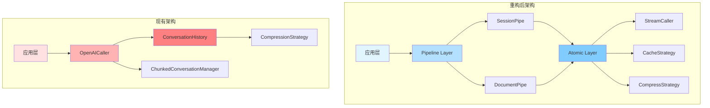
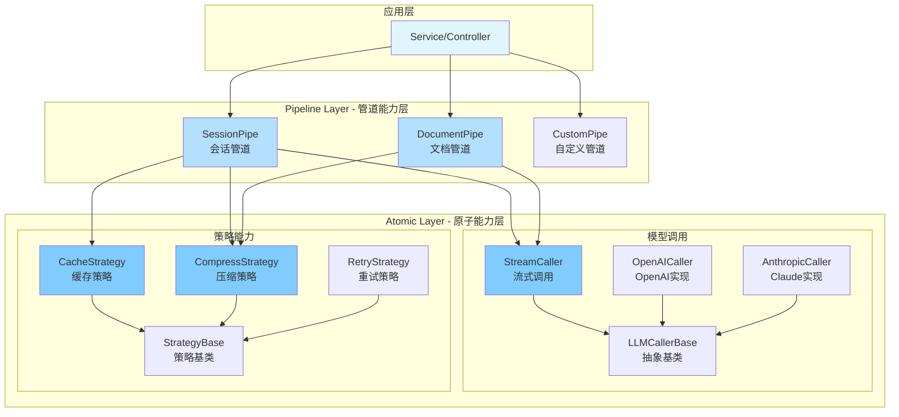
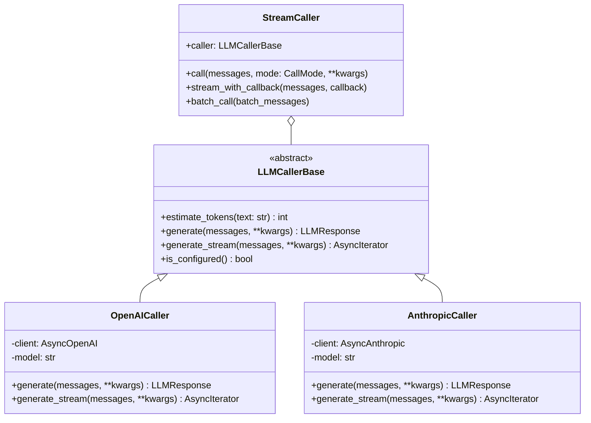
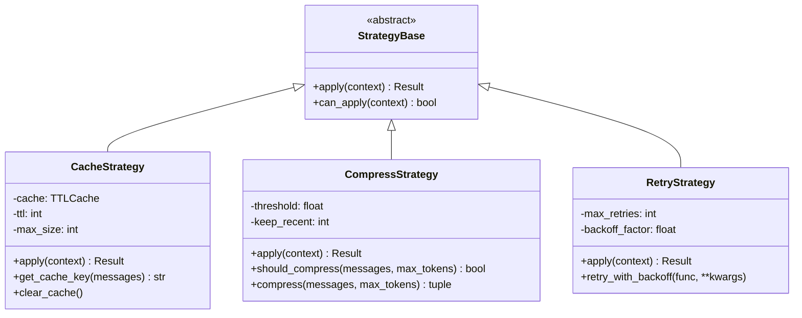
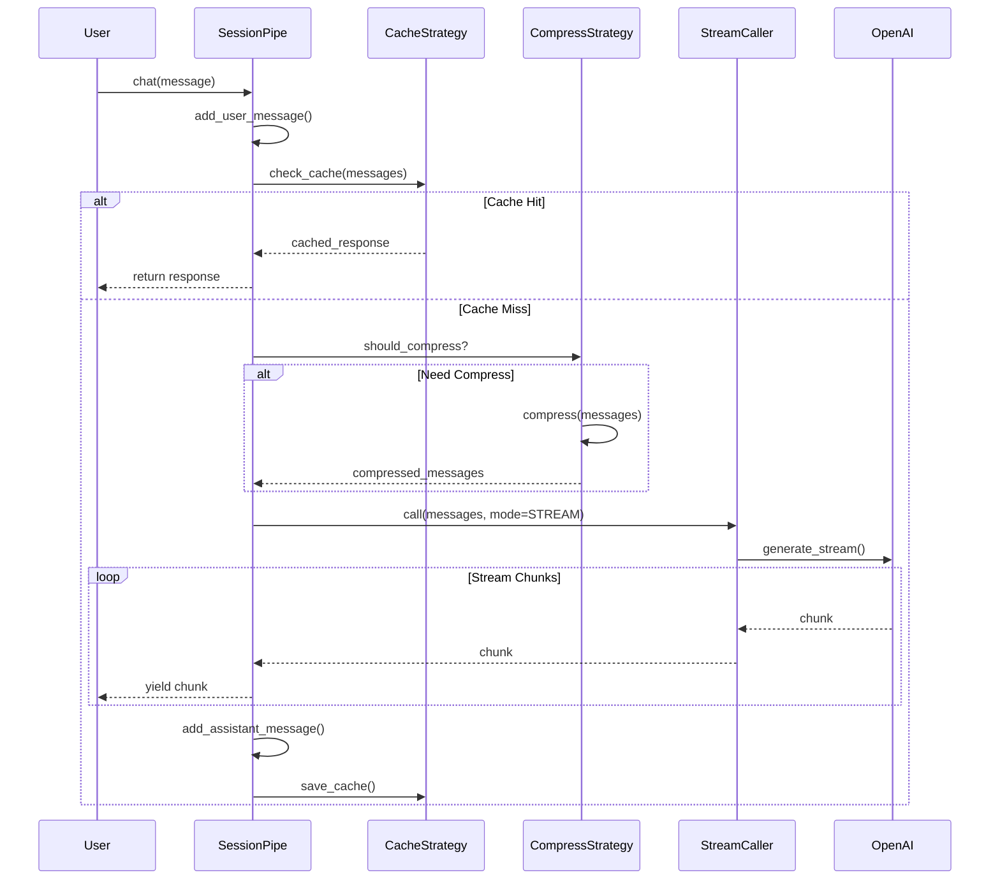
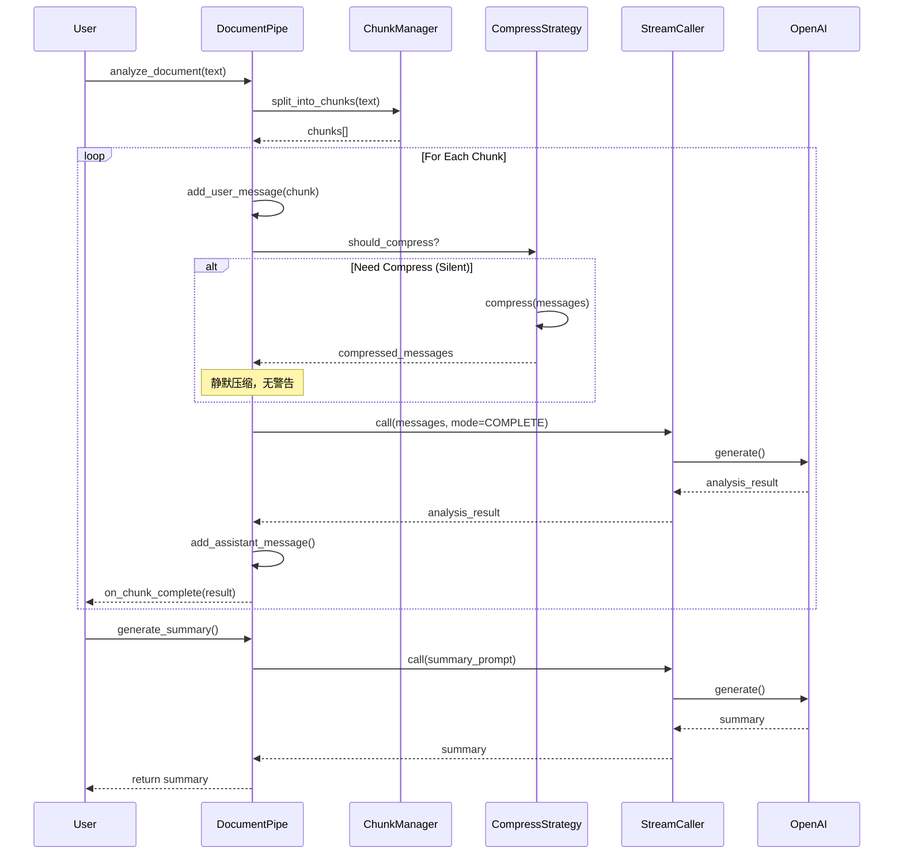

# LLM 模块重构设计：双层架构（原子能力 + 管道能力）

## 1. 概述

### 1.1 重构目标

将现有 LLM 模块重构为清晰的双层架构，提升可扩展性、可维护性和灵活性：

- **原子能力层（Atomic Layer）**：封装基础的、不可再分的能力单元
- **管道能力层（Pipeline Layer）**：组合原子能力，提供场景化解决方案

### 1.2 核心价值

| 维度 | 现有架构 | 重构后架构 | 改进 |
|------|---------|-----------|------|
| **职责分离** | ConversationHistory 混合了压缩、导出等多种职责 | 原子能力独立、管道组合 | 单一职责原则 |
| **扩展性** | 新增策略需要修改多处代码 | 策略插件化、管道可配置 | 开闭原则 |
| **复用性** | 能力耦合在具体实现中 | 原子能力可独立复用 | 代码复用率提升 |
| **测试性** | 集成测试为主 | 原子能力单元测试 + 管道集成测试 | 测试覆盖率提升 |

### 1.3 架构对比



## 2. 架构设计

### 2.1 整体分层架构



### 2.2 层级职责划分

| 层级 | 职责 | 示例组件 |
|------|------|---------|
| **应用层** | 业务逻辑编排 | MimicService, ReportService |
| **Pipeline Layer** | 场景化能力组合 | SessionPipe, DocumentPipe |
| **Atomic Layer** | 基础能力单元 | StreamCaller, CacheStrategy, CompressStrategy |

## 3. 原子能力层（Atomic Layer）

### 3.1 模型调用抽象

#### 3.1.1 调用模式枚举

```python
from enum import Enum

class CallMode(Enum):
    """模型调用模式"""
    STREAM = "stream"          # 流式输出
    COMPLETE = "complete"      # 完整等待
    BATCH = "batch"            # 批量处理
```

#### 3.1.2 基础调用器抽象



#### 3.1.3 核心接口定义

```python
# foundation/llm/atomic/caller.py

from abc import ABC, abstractmethod
from typing import List, Dict, AsyncIterator, Optional
from enum import Enum

class CallMode(Enum):
    """调用模式"""
    STREAM = "stream"
    COMPLETE = "complete"
    BATCH = "batch"

class LLMCallerBase(ABC):
    """LLM调用器抽象基类"""
    
    @abstractmethod
    async def generate(
        self,
        messages: List[Dict[str, str]],
        **kwargs
    ) -> LLMResponse:
        """完整生成（等待全部输出）"""
        pass
    
    @abstractmethod
    async def generate_stream(
        self,
        messages: List[Dict[str, str]],
        **kwargs
    ) -> AsyncIterator[str]:
        """流式生成"""
        pass
    
    @abstractmethod
    def estimate_tokens(self, text: str) -> int:
        """估算token数"""
        pass
    
    @abstractmethod
    def is_configured(self) -> bool:
        """检查是否已配置"""
        pass

class StreamCaller:
    """流式调用封装器（支持多种调用模式）"""
    
    def __init__(self, caller: LLMCallerBase):
        self.caller = caller
    
    async def call(
        self,
        messages: List[Dict[str, str]],
        mode: CallMode = CallMode.COMPLETE,
        **kwargs
    ):
        """统一调用入口"""
        if mode == CallMode.STREAM:
            return self.caller.generate_stream(messages, **kwargs)
        elif mode == CallMode.COMPLETE:
            return await self.caller.generate(messages, **kwargs)
        else:
            raise ValueError(f"不支持的调用模式: {mode}")
    
    async def stream_with_callback(
        self,
        messages: List[Dict[str, str]],
        on_chunk: callable,
        **kwargs
    ) -> str:
        """流式调用 + 回调"""
        full_response = ""
        async for chunk in self.caller.generate_stream(messages, **kwargs):
            full_response += chunk
            await on_chunk(chunk)
        return full_response
```

### 3.2 策略抽象

#### 3.2.1 策略基类



#### 3.2.2 缓存策略

```python
# foundation/llm/atomic/strategy/cache.py

from cachetools import TTLCache
import hashlib
import json
from typing import Optional

class CacheStrategy:
    """缓存策略"""
    
    def __init__(
        self,
        max_size: int = 1000,
        ttl: int = 3600,
        enabled: bool = True
    ):
        self.enabled = enabled
        if enabled:
            self.cache = TTLCache(maxsize=max_size, ttl=ttl)
        else:
            self.cache = None
    
    def get_cache_key(
        self,
        messages: List[Dict],
        model: str,
        temperature: float,
        **kwargs
    ) -> str:
        """生成缓存键"""
        cache_data = {
            "messages": messages,
            "model": model,
            "temperature": temperature,
            **kwargs
        }
        cache_str = json.dumps(cache_data, sort_keys=True)
        return hashlib.md5(cache_str.encode()).hexdigest()
    
    def get(self, cache_key: str) -> Optional[LLMResponse]:
        """获取缓存"""
        if not self.enabled:
            return None
        return self.cache.get(cache_key)
    
    def set(self, cache_key: str, response: LLMResponse):
        """设置缓存"""
        if self.enabled:
            self.cache[cache_key] = response
    
    def clear(self):
        """清空缓存"""
        if self.cache:
            self.cache.clear()
    
    def get_stats(self) -> dict:
        """获取缓存统计"""
        if not self.enabled:
            return {"enabled": False}
        return {
            "enabled": True,
            "size": len(self.cache),
            "max_size": self.cache.maxsize,
            "ttl": self.cache.ttl
        }
```

#### 3.2.3 压缩策略

```python
# foundation/llm/atomic/strategy/compress.py

from abc import ABC, abstractmethod
from typing import List, Tuple, Callable
from dataclasses import dataclass

@dataclass
class CompressContext:
    """压缩上下文"""
    messages: List[ConversationMessage]
    max_tokens: int
    token_estimator: Callable[[str], int]
    current_tokens: int

@dataclass
class CompressResult:
    """压缩结果"""
    kept_messages: List[ConversationMessage]
    removed_messages: List[ConversationMessage]
    tokens_before: int
    tokens_after: int

class CompressStrategy(ABC):
    """压缩策略基类"""
    
    @abstractmethod
    def should_compress(self, context: CompressContext) -> bool:
        """判断是否需要压缩"""
        pass
    
    @abstractmethod
    def compress(self, context: CompressContext) -> CompressResult:
        """执行压缩"""
        pass

class SessionCompressStrategy(CompressStrategy):
    """会话模式压缩策略（保守压缩）"""
    
    def __init__(
        self,
        threshold: float = 0.95,
        keep_recent: int = 5
    ):
        self.threshold = threshold
        self.keep_recent = keep_recent
    
    def should_compress(self, context: CompressContext) -> bool:
        return context.current_tokens >= context.max_tokens * self.threshold
    
    def compress(self, context: CompressContext) -> CompressResult:
        """
        压缩策略：
        1. 保留系统消息
        2. 保留重要消息
        3. 保留最近N轮对话
        4. 移除旧消息
        """
        # 实现与现有 SessionCompressionStrategy 类似
        pass

class DocumentCompressStrategy(CompressStrategy):
    """文档模式压缩策略（激进压缩）"""
    
    def __init__(self, threshold: float = 0.8):
        self.threshold = threshold
    
    def should_compress(self, context: CompressContext) -> bool:
        return context.current_tokens >= context.max_tokens * self.threshold
    
    def compress(self, context: CompressContext) -> CompressResult:
        """
        压缩策略：
        1. 保留系统消息
        2. 保留最新用户输入
        3. 保留最新AI分析
        4. 移除旧分析结果
        """
        pass

class ChunkingCompressStrategy(CompressStrategy):
    """分块压缩策略（处理超长文本）"""
    
    def __init__(self, chunk_size: int = 2000):
        self.chunk_size = chunk_size
    
    def should_compress(self, context: CompressContext) -> bool:
        # 检查是否有单条消息超长
        for msg in context.messages:
            if context.token_estimator(msg.content) > context.max_tokens * 0.7:
                return True
        return False
    
    def compress(self, context: CompressContext) -> CompressResult:
        """将超长消息分块"""
        pass
```

#### 3.2.4 重试策略

```python
# foundation/llm/atomic/strategy/retry.py

import asyncio
from typing import Callable, Optional

class RetryStrategy:
    """重试策略"""
    
    def __init__(
        self,
        max_retries: int = 3,
        backoff_factor: float = 0.5,
        max_backoff: float = 10.0
    ):
        self.max_retries = max_retries
        self.backoff_factor = backoff_factor
        self.max_backoff = max_backoff
    
    async def retry_with_backoff(
        self,
        func: Callable,
        *args,
        **kwargs
    ):
        """带指数退避的重试"""
        last_error = None
        
        for attempt in range(self.max_retries):
            try:
                return await func(*args, **kwargs)
            except Exception as e:
                last_error = e
                
                if attempt < self.max_retries - 1:
                    wait_time = min(
                        (2 ** attempt) * self.backoff_factor,
                        self.max_backoff
                    )
                    await asyncio.sleep(wait_time)
                    continue
        
        raise last_error
```

### 3.3 OpenAI 实现优化

```python
# foundation/llm/atomic/openai_caller.py

from openai import AsyncOpenAI
import tiktoken

class OpenAICaller(LLMCallerBase):
    """OpenAI调用器（优化版）"""
    
    def __init__(
        self,
        api_key: str,
        model: str = "gpt-3.5-turbo",
        base_url: Optional[str] = None,
        timeout: float = 60.0
    ):
        self.api_key = api_key
        self.model = model
        self.base_url = base_url
        self.timeout = timeout
        
        self._client = AsyncOpenAI(
            api_key=api_key,
            base_url=base_url,
            timeout=timeout,
            max_retries=0  # 重试由 RetryStrategy 处理
        )
        
        # 使用 tiktoken 精确估算
        try:
            self._encoding = tiktoken.encoding_for_model(model)
        except:
            self._encoding = tiktoken.get_encoding("cl100k_base")
    
    def estimate_tokens(self, text: str) -> int:
        """使用tiktoken精确估算"""
        return len(self._encoding.encode(text))
    
    async def generate(
        self,
        messages: List[Dict[str, str]],
        temperature: float = 0.7,
        max_tokens: Optional[int] = None,
        **kwargs
    ) -> LLMResponse:
        """完整生成"""
        response = await self._client.chat.completions.create(
            model=self.model,
            messages=messages,
            temperature=temperature,
            max_tokens=max_tokens,
            **kwargs
        )
        
        return LLMResponse(
            content=response.choices[0].message.content or "",
            model=response.model,
            usage={
                "prompt_tokens": response.usage.prompt_tokens,
                "completion_tokens": response.usage.completion_tokens,
                "total_tokens": response.usage.total_tokens
            }
        )
    
    async def generate_stream(
        self,
        messages: List[Dict[str, str]],
        temperature: float = 0.7,
        max_tokens: Optional[int] = None,
        **kwargs
    ) -> AsyncIterator[str]:
        """流式生成"""
        response = await self._client.chat.completions.create(
            model=self.model,
            messages=messages,
            temperature=temperature,
            max_tokens=max_tokens,
            stream=True,
            **kwargs
        )
        
        async for chunk in response:
            if chunk.choices[0].delta.content:
                yield chunk.choices[0].delta.content
    
    def is_configured(self) -> bool:
        return bool(self.api_key and self._client)
```

## 4. 管道能力层（Pipeline Layer）

### 4.1 管道基类

```python
# foundation/llm/pipeline/base.py

from abc import ABC, abstractmethod
from typing import List, Dict, Optional, AsyncIterator

class PipelineBase(ABC):
    """管道基类"""
    
    def __init__(
        self,
        caller: LLMCallerBase,
        strategies: Optional[List] = None
    ):
        self.caller = caller
        self.strategies = strategies or []
    
    @abstractmethod
    async def execute(
        self,
        messages: List[Dict[str, str]],
        **kwargs
    ):
        """执行管道"""
        pass
    
    def add_strategy(self, strategy):
        """添加策略"""
        self.strategies.append(strategy)
    
    def remove_strategy(self, strategy_type):
        """移除策略"""
        self.strategies = [
            s for s in self.strategies 
            if not isinstance(s, strategy_type)
        ]
```

### 4.2 SessionPipe - 会话管道



```python
# foundation/llm/pipeline/session_pipe.py

from typing import Optional, AsyncIterator, List, Dict
from ..atomic.caller import StreamCaller, CallMode
from ..atomic.strategy import CacheStrategy, SessionCompressStrategy
from .base import PipelineBase

class SessionPipe(PipelineBase):
    """
    会话管道
    
    特点：
    1. 保留完整对话历史
    2. 保守压缩策略
    3. 支持缓存（可选）
    4. 优先保留重要消息
    """
    
    def __init__(
        self,
        caller: LLMCallerBase,
        max_context_tokens: int = 4000,
        cache_enabled: bool = False,
        compress_threshold: float = 0.95,
        keep_recent: int = 5
    ):
        super().__init__(caller)
        
        # 消息历史
        self.messages: List[ConversationMessage] = []
        self.max_context_tokens = max_context_tokens
        
        # 策略
        if cache_enabled:
            self.cache_strategy = CacheStrategy(enabled=True)
            self.add_strategy(self.cache_strategy)
        else:
            self.cache_strategy = None
        
        self.compress_strategy = SessionCompressStrategy(
            threshold=compress_threshold,
            keep_recent=keep_recent
        )
        self.add_strategy(self.compress_strategy)
        
        # 流式调用器
        self.stream_caller = StreamCaller(caller)
        
        # 统计
        self._compression_count = 0
    
    def add_system_prompt(self, prompt: str):
        """设置系统提示词"""
        self.messages.append(
            ConversationMessage(role="system", content=prompt)
        )
    
    def add_user_message(self, content: str, important: bool = False):
        """添加用户消息"""
        self.messages.append(
            ConversationMessage(
                role="user",
                content=content,
                metadata={"important": important}
            )
        )
    
    def add_assistant_message(self, content: str):
        """添加助手消息"""
        self.messages.append(
            ConversationMessage(role="assistant", content=content)
        )
    
    async def chat(
        self,
        message: str,
        important: bool = False,
        stream: bool = True,
        **kwargs
    ):
        """
        发送消息并获取回复
        
        Args:
            message: 用户消息
            important: 是否标记为重要
            stream: 是否流式输出
            **kwargs: 其他参数
        """
        # 1. 添加用户消息
        self.add_user_message(message, important=important)
        
        # 2. 检查缓存（如果启用）
        if self.cache_strategy:
            cache_key = self.cache_strategy.get_cache_key(
                messages=[m.to_dict() for m in self.messages],
                model=self.caller.get_model_name(),
                **kwargs
            )
            cached = self.cache_strategy.get(cache_key)
            if cached:
                self.add_assistant_message(cached.content)
                return cached
        
        # 3. 压缩历史（如果需要）
        context = CompressContext(
            messages=self.messages,
            max_tokens=self.max_context_tokens,
            token_estimator=self.caller.estimate_tokens,
            current_tokens=sum(
                self.caller.estimate_tokens(m.content) 
                for m in self.messages
            )
        )
        
        if self.compress_strategy.should_compress(context):
            result = self.compress_strategy.compress(context)
            self.messages = result.kept_messages
            self._compression_count += 1
            
            logger.warning(
                f"⚠️  会话压缩：移除 {len(result.removed_messages)} 条消息，"
                f"{result.tokens_before} → {result.tokens_after} tokens"
            )
        
        # 4. 调用模型
        messages_dict = [m.to_dict() for m in self.messages]
        
        if stream:
            return self._chat_stream(messages_dict, cache_key if self.cache_strategy else None, **kwargs)
        else:
            return await self._chat_complete(messages_dict, cache_key if self.cache_strategy else None, **kwargs)
    
    async def _chat_stream(self, messages: List[Dict], cache_key: Optional[str], **kwargs):
        """流式对话"""
        full_response = ""
        
        async def on_chunk(chunk: str):
            nonlocal full_response
            full_response += chunk
        
        response = await self.stream_caller.stream_with_callback(
            messages=messages,
            on_chunk=on_chunk,
            **kwargs
        )
        
        # 添加助手回复
        self.add_assistant_message(response)
        
        # 保存缓存
        if self.cache_strategy and cache_key:
            llm_response = LLMResponse(
                content=response,
                model=self.caller.get_model_name(),
                usage={}
            )
            self.cache_strategy.set(cache_key, llm_response)
        
        return response
    
    async def _chat_complete(self, messages: List[Dict], cache_key: Optional[str], **kwargs):
        """完整等待对话"""
        response = await self.stream_caller.call(
            messages=messages,
            mode=CallMode.COMPLETE,
            **kwargs
        )
        
        # 添加助手回复
        self.add_assistant_message(response.content)
        
        # 保存缓存
        if self.cache_strategy and cache_key:
            self.cache_strategy.set(cache_key, response)
        
        return response
    
    def export_important(self) -> Dict:
        """导出重要消息和最近对话"""
        important_messages = [
            msg for msg in self.messages
            if msg.metadata.get("important", False)
        ]
        
        recent_messages = self.messages[-5:] if len(self.messages) > 5 else self.messages
        
        # 去重
        seen = set()
        unique_messages = []
        for msg in important_messages + recent_messages:
            msg_key = (msg.role, msg.content)
            if msg_key not in seen:
                seen.add(msg_key)
                unique_messages.append(msg)
        
        return {
            "mode": "session",
            "total_messages": len(self.messages),
            "important_count": len(important_messages),
            "compression_count": self._compression_count,
            "messages": [msg.to_export_dict() for msg in unique_messages]
        }
    
    def clear(self):
        """清空历史"""
        self.messages.clear()
        self._compression_count = 0
```

### 4.3 DocumentPipe - 文档管道



```python
# foundation/llm/pipeline/document_pipe.py

from typing import List, Callable, Optional
from ..atomic.caller import StreamCaller, CallMode
from ..atomic.strategy import DocumentCompressStrategy, ChunkingCompressStrategy
from .base import PipelineBase

class ChunkResult:
    """分块结果"""
    def __init__(
        self,
        chunk_index: int,
        total_chunks: int,
        chunk_content: str,
        analysis_result: str
    ):
        self.chunk_index = chunk_index
        self.total_chunks = total_chunks
        self.chunk_content = chunk_content
        self.analysis_result = analysis_result

class DocumentPipe(PipelineBase):
    """
    文档管道
    
    特点：
    1. 静默压缩（无警告）
    2. 激进压缩策略
    3. 自动分块处理
    4. 保留分析结果
    """
    
    def __init__(
        self,
        caller: LLMCallerBase,
        max_context_tokens: int = 4000,
        chunk_size: int = 2000,
        chunk_overlap: int = 200,
        compress_threshold: float = 0.8
    ):
        super().__init__(caller)
        
        # 消息历史
        self.messages: List[ConversationMessage] = []
        self.max_context_tokens = max_context_tokens
        
        # 分块配置
        self.chunk_size = chunk_size
        self.chunk_overlap = chunk_overlap
        
        # 策略
        self.compress_strategy = DocumentCompressStrategy(
            threshold=compress_threshold
        )
        self.chunking_strategy = ChunkingCompressStrategy(
            chunk_size=chunk_size
        )
        self.add_strategy(self.compress_strategy)
        self.add_strategy(self.chunking_strategy)
        
        # 流式调用器
        self.stream_caller = StreamCaller(caller)
        
        # 分块结果
        self._chunks: List[str] = []
        self._chunk_results: List[ChunkResult] = []
    
    def split_into_chunks(self, content: str) -> List[str]:
        """
        分块文本
        
        策略：
        1. 按段落分块
        2. 保留重叠
        3. 避免语义断裂
        """
        paragraphs = content.split('\n\n')
        chunks = []
        current_chunk = []
        current_tokens = 0
        
        for para in paragraphs:
            para_tokens = self.caller.estimate_tokens(para)
            
            # 段落超长，需要句子级分割
            if para_tokens > self.chunk_size:
                if current_chunk:
                    chunks.append('\n\n'.join(current_chunk))
                    current_chunk = []
                    current_tokens = 0
                
                # 分割长段落
                sentences = self._split_paragraph(para)
                temp_chunk = []
                temp_tokens = 0
                
                for sent in sentences:
                    sent_tokens = self.caller.estimate_tokens(sent)
                    if temp_tokens + sent_tokens <= self.chunk_size:
                        temp_chunk.append(sent)
                        temp_tokens += sent_tokens
                    else:
                        if temp_chunk:
                            chunks.append(' '.join(temp_chunk))
                        temp_chunk = [sent]
                        temp_tokens = sent_tokens
                
                if temp_chunk:
                    chunks.append(' '.join(temp_chunk))
                continue
            
            # 正常段落
            if current_tokens + para_tokens <= self.chunk_size:
                current_chunk.append(para)
                current_tokens += para_tokens
            else:
                chunks.append('\n\n'.join(current_chunk))
                # 保留重叠
                overlap_start = max(0, len(current_chunk) - 1)
                current_chunk = current_chunk[overlap_start:] + [para]
                current_tokens = sum(
                    self.caller.estimate_tokens(p) for p in current_chunk
                )
        
        if current_chunk:
            chunks.append('\n\n'.join(current_chunk))
        
        self._chunks = chunks
        logger.info(f"文档分块完成：{len(chunks)} 块")
        return chunks
    
    def _split_paragraph(self, paragraph: str) -> List[str]:
        """分割长段落为句子"""
        import re
        sentences = re.split(r'([。！？.!?])', paragraph)
        result = []
        for i in range(0, len(sentences) - 1, 2):
            if i + 1 < len(sentences):
                result.append(sentences[i] + sentences[i + 1])
        if len(sentences) % 2 == 1 and sentences[-1].strip():
            result.append(sentences[-1])
        return result
    
    async def analyze_chunk(
        self,
        chunk_index: int,
        analysis_prompt: Optional[str] = None
    ) -> ChunkResult:
        """分析单个块"""
        chunk_content = self._chunks[chunk_index]
        
        # 构建提示词
        if analysis_prompt is None:
            if chunk_index == 0:
                prompt = f"请分析以下文档的第 {chunk_index + 1}/{len(self._chunks)} 部分："
            elif chunk_index == len(self._chunks) - 1:
                prompt = f"这是文档的最后一部分（第 {chunk_index + 1}/{len(self._chunks)} 部分），请分析："
            else:
                prompt = f"请继续分析文档的第 {chunk_index + 1}/{len(self._chunks)} 部分："
        else:
            prompt = analysis_prompt
        
        # 添加用户消息
        user_message = f"{prompt}\n\n{chunk_content}"
        self.messages.append(
            ConversationMessage(role="user", content=user_message)
        )
        
        # 自动压缩（静默）
        context = CompressContext(
            messages=self.messages,
            max_tokens=self.max_context_tokens,
            token_estimator=self.caller.estimate_tokens,
            current_tokens=sum(
                self.caller.estimate_tokens(m.content) 
                for m in self.messages
            )
        )
        
        if self.compress_strategy.should_compress(context):
            result = self.compress_strategy.compress(context)
            self.messages = result.kept_messages
            logger.debug(
                f"[文档模式] 静默压缩：{result.tokens_before} → {result.tokens_after} tokens"
            )
        
        # 调用模型
        messages_dict = [m.to_dict() for m in self.messages]
        response = await self.stream_caller.call(
            messages=messages_dict,
            mode=CallMode.COMPLETE
        )
        
        # 添加助手回复
        self.messages.append(
            ConversationMessage(role="assistant", content=response.content)
        )
        
        # 记录结果
        chunk_result = ChunkResult(
            chunk_index=chunk_index,
            total_chunks=len(self._chunks),
            chunk_content=chunk_content,
            analysis_result=response.content
        )
        self._chunk_results.append(chunk_result)
        
        logger.debug(f"完成第 {chunk_index + 1}/{len(self._chunks)} 块分析")
        
        return chunk_result
    
    async def analyze_document(
        self,
        content: str,
        on_chunk_complete: Optional[Callable] = None
    ) -> List[ChunkResult]:
        """
        分析整个文档
        
        Args:
            content: 文档内容
            on_chunk_complete: 每块完成时的回调
        """
        # 分块
        chunks = self.split_into_chunks(content)
        
        # 逐块分析
        results = []
        for i in range(len(chunks)):
            result = await self.analyze_chunk(i)
            results.append(result)
            
            if on_chunk_complete:
                on_chunk_complete(result)
        
        logger.info(f"文档分析完成：{len(results)} 块")
        return results
    
    async def generate_summary(
        self,
        summary_prompt: Optional[str] = None
    ) -> str:
        """生成最终总结"""
        if not self._chunk_results:
            raise ValueError("没有可用的分析结果")
        
        # 构建总结提示
        if summary_prompt is None:
            summary_prompt = (
                f"你已经分析了一篇文档的 {len(self._chunk_results)} 个部分。"
                f"请基于之前的所有分析，提供一个全面的总结。"
            )
        
        # 添加总结请求
        self.messages.append(
            ConversationMessage(
                role="user",
                content=summary_prompt,
                metadata={"important": True}
            )
        )
        
        # 调用模型
        messages_dict = [m.to_dict() for m in self.messages]
        response = await self.stream_caller.call(
            messages=messages_dict,
            mode=CallMode.COMPLETE
        )
        
        # 添加总结结果
        self.messages.append(
            ConversationMessage(
                role="assistant",
                content=response.content,
                metadata={"important": True}
            )
        )
        
        logger.info("最终总结生成完成")
        return response.content
    
    def export_analysis(self) -> dict:
        """导出分析结果"""
        analysis_results = [
            msg for msg in self.messages
            if msg.role == "assistant"
        ]
        
        return {
            "mode": "document",
            "total_chunks": len(self._chunks),
            "processed_chunks": len(self._chunk_results),
            "chunk_size": self.chunk_size,
            "analysis_count": len(analysis_results),
            "llm_analysis": [
                {
                    "content": msg.content,
                    "timestamp": msg.timestamp.isoformat() if msg.timestamp else None
                }
                for msg in analysis_results
            ]
        }
```

## 5. 使用示例

### 5.1 SessionPipe 使用

```python
from foundation.llm.atomic import OpenAICaller
from foundation.llm.pipeline import SessionPipe

# 创建调用器
caller = OpenAICaller(
    api_key="your-api-key",
    model="gpt-4"
)

# 创建会话管道
session_pipe = SessionPipe(
    caller=caller,
    max_context_tokens=4000,
    cache_enabled=True,        # 启用缓存
    compress_threshold=0.95,   # 95% 才压缩
    keep_recent=5              # 保留最近5轮
)

# 设置系统提示词
session_pipe.add_system_prompt("你是一个友好的助手")

# 多轮对话
response1 = await session_pipe.chat(
    "今天天气怎么样？",
    stream=True
)

response2 = await session_pipe.chat(
    "推荐一些户外活动",
    important=True,  # 标记为重要
    stream=True
)

# 导出重要信息
export_data = session_pipe.export_important()
```

### 5.2 DocumentPipe 使用

```python
from foundation.llm.atomic import OpenAICaller
from foundation.llm.pipeline import DocumentPipe

# 创建调用器
caller = OpenAICaller(
    api_key="your-api-key",
    model="gpt-4"
)

# 创建文档管道
doc_pipe = DocumentPipe(
    caller=caller,
    max_context_tokens=4000,
    chunk_size=2000,
    chunk_overlap=200,
    compress_threshold=0.8  # 80% 就压缩（激进）
)

# 分析长文档
long_document = "..." # 10000+ tokens

def on_chunk_done(result):
    print(f"✅ 完成 {result.chunk_index + 1}/{result.total_chunks}")

results = await doc_pipe.analyze_document(
    long_document,
    on_chunk_complete=on_chunk_done
)

# 生成总结
summary = await doc_pipe.generate_summary()

# 导出分析结果
analysis_data = doc_pipe.export_analysis()
```

### 5.3 自定义管道

```python
from foundation.llm.pipeline import PipelineBase
from foundation.llm.atomic import StreamCaller, CallMode
from foundation.llm.atomic.strategy import CacheStrategy, RetryStrategy

class CustomPipe(PipelineBase):
    """自定义管道：结合缓存 + 重试"""
    
    def __init__(self, caller: LLMCallerBase):
        super().__init__(caller)
        
        # 添加策略
        self.cache_strategy = CacheStrategy(max_size=500, ttl=1800)
        self.retry_strategy = RetryStrategy(max_retries=5)
        self.add_strategy(self.cache_strategy)
        self.add_strategy(self.retry_strategy)
        
        self.stream_caller = StreamCaller(caller)
    
    async def execute(self, messages: List[Dict], **kwargs):
        """执行管道"""
        # 1. 检查缓存
        cache_key = self.cache_strategy.get_cache_key(
            messages=messages,
            model=self.caller.get_model_name(),
            **kwargs
        )
        cached = self.cache_strategy.get(cache_key)
        if cached:
            return cached
        
        # 2. 带重试的调用
        response = await self.retry_strategy.retry_with_backoff(
            self.stream_caller.call,
            messages=messages,
            mode=CallMode.COMPLETE,
            **kwargs
        )
        
        # 3. 保存缓存
        self.cache_strategy.set(cache_key, response)
        
        return response
```

## 6. 测试策略

### 6.1 单元测试（原子能力层）

```python
# tests/test_atomic/test_cache_strategy.py

import pytest
from foundation.llm.atomic.strategy import CacheStrategy

@pytest.mark.asyncio
async def test_cache_strategy():
    strategy = CacheStrategy(max_size=10, ttl=60)
    
    # 测试缓存键生成
    key1 = strategy.get_cache_key(
        messages=[{"role": "user", "content": "hello"}],
        model="gpt-4",
        temperature=0.7
    )
    key2 = strategy.get_cache_key(
        messages=[{"role": "user", "content": "hello"}],
        model="gpt-4",
        temperature=0.7
    )
    assert key1 == key2
    
    # 测试缓存存取
    response = LLMResponse(content="Hi", model="gpt-4", usage={})
    strategy.set(key1, response)
    cached = strategy.get(key1)
    assert cached.content == "Hi"
    
    # 测试缓存统计
    stats = strategy.get_stats()
    assert stats["size"] == 1

# tests/test_atomic/test_compress_strategy.py

import pytest
from foundation.llm.atomic.strategy import SessionCompressStrategy, CompressContext

def test_session_compress_strategy():
    strategy = SessionCompressStrategy(threshold=0.95, keep_recent=5)
    
    # 构建测试消息
    messages = [
        ConversationMessage(role="system", content="You are a helper"),
        ConversationMessage(role="user", content="Hello"),
        ConversationMessage(role="assistant", content="Hi"),
        # ... 更多消息
    ]
    
    context = CompressContext(
        messages=messages,
        max_tokens=1000,
        token_estimator=lambda x: len(x) // 4,
        current_tokens=1200
    )
    
    # 测试压缩判断
    assert strategy.should_compress(context)
    
    # 测试压缩执行
    result = strategy.compress(context)
    assert len(result.kept_messages) < len(messages)
    assert result.tokens_after <= 1000
```

### 6.2 集成测试（管道层）

```python
# tests/test_pipeline/test_session_pipe.py

import pytest
from foundation.llm.atomic import OpenAICaller
from foundation.llm.pipeline import SessionPipe

@pytest.mark.asyncio
async def test_session_pipe():
    caller = OpenAICaller(api_key="test-key", model="gpt-3.5-turbo")
    pipe = SessionPipe(
        caller=caller,
        max_context_tokens=2000,
        cache_enabled=False
    )
    
    # 测试系统提示词
    pipe.add_system_prompt("You are a helper")
    assert len(pipe.messages) == 1
    
    # 测试对话
    response = await pipe.chat("Hello", stream=False)
    assert len(pipe.messages) == 3  # system + user + assistant
    
    # 测试导出
    export_data = pipe.export_important()
    assert export_data["mode"] == "session"
    assert export_data["total_messages"] == 3
```

## 7. 迁移路径

### 7.1 现有代码迁移对照

| 现有组件 | 新架构组件 | 迁移方式 |
|---------|-----------|---------|
| `OpenAICaller` | `atomic/openai_caller.py` | 优化token估算，移除压缩逻辑 |
| `ConversationHistory` | `SessionPipe` | 拆分为pipe层，保留核心逻辑 |
| `ChunkedConversationManager` | `DocumentPipe` | 重构为pipe层 |
| `CompressionStrategy` | `atomic/strategy/compress.py` | 保留策略，优化接口 |
| `cache` in OpenAICaller | `atomic/strategy/cache.py` | 独立为策略 |
| `retry` logic | `atomic/strategy/retry.py` | 提取为策略 |

### 7.2 目录结构对比

```
现有结构:
foundation/llm/
├── base.py                        # ConversationHistory + LLMCallerBase
├── openai_caller.py               # OpenAI实现 + 缓存 + 重试
├── chunked_conversation.py        # 分块管理
├── compression_strategy.py        # 压缩策略
└── utils.py

新结构:
foundation/llm/
├── atomic/                        # 原子能力层
│   ├── caller/
│   │   ├── base.py               # LLMCallerBase
│   │   ├── stream_caller.py      # StreamCaller
│   │   ├── openai_caller.py      # OpenAI实现（优化）
│   │   └── anthropic_caller.py   # Claude实现（扩展）
│   └── strategy/
│       ├── base.py               # StrategyBase
│       ├── cache.py              # 缓存策略
│       ├── compress.py           # 压缩策略（迁移）
│       └── retry.py              # 重试策略
├── pipeline/                      # 管道能力层
│   ├── base.py                   # PipelineBase
│   ├── session_pipe.py           # 会话管道（迁移自ConversationHistory）
│   ├── document_pipe.py          # 文档管道（迁移自ChunkedConversationManager）
│   └── custom_pipe.py            # 自定义管道
└── utils.py                       # 数据类型
```

## 8. 扩展示例

### 8.1 新增模型提供商

```python
# foundation/llm/atomic/caller/anthropic_caller.py

from anthropic import AsyncAnthropic

class AnthropicCaller(LLMCallerBase):
    """Claude调用器"""
    
    def __init__(self, api_key: str, model: str = "claude-3-opus-20240229"):
        self.client = AsyncAnthropic(api_key=api_key)
        self.model = model
    
    async def generate(self, messages, **kwargs) -> LLMResponse:
        response = await self.client.messages.create(
            model=self.model,
            messages=messages,
            **kwargs
        )
        return LLMResponse(
            content=response.content[0].text,
            model=self.model,
            usage={
                "input_tokens": response.usage.input_tokens,
                "output_tokens": response.usage.output_tokens
            }
        )
    
    async def generate_stream(self, messages, **kwargs):
        async with self.client.messages.stream(
            model=self.model,
            messages=messages,
            **kwargs
        ) as stream:
            async for text in stream.text_stream:
                yield text
```

### 8.2 新增策略

```python
# foundation/llm/atomic/strategy/rate_limit.py

from asyncio import Semaphore, sleep

class RateLimitStrategy:
    """速率限制策略"""
    
    def __init__(self, max_requests_per_minute: int = 60):
        self.max_rpm = max_requests_per_minute
        self.semaphore = Semaphore(max_rpm)
        self.interval = 60.0 / max_rpm
    
    async def acquire(self):
        """获取许可"""
        await self.semaphore.acquire()
        await sleep(self.interval)
        self.semaphore.release()
```
