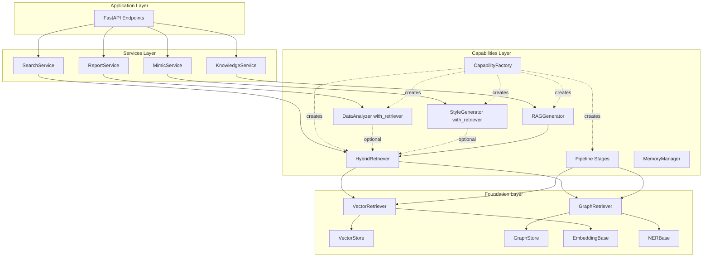
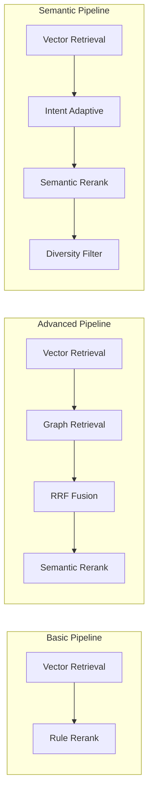

# Retrieval Module Abstraction - 检索模块抽象设计

## 1. Overview

### 1.1 背景

当前 AME 项目存在新旧两套架构：
- **旧架构**（`ame_backup_20251109_183514/retrieval/`）：完整的检索管道系统，包含向量检索、图谱检索、Pipeline 编排、多阶段处理等高级能力
- **新架构**（`ame/`）：四层分层模型（Foundation → Capabilities → Services → Application），但检索能力较为简单

**核心问题**：
1. 旧架构中的高级检索能力（Pipeline、多跳推理、RRF 融合、多样性过滤等）未迁移到新架构
2. 新架构 `capabilities/retrieval/` 仅实现了简单的混合检索，缺少可扩展性
3. 不同 Service 对检索强度需求不同，但当前无法灵活配置
4. CapabilityFactory 未集成检索管道预设配置

### 1.2 设计目标

| 目标 | 说明 |
|------|------|
| **Foundation 层抽象** | 提取基础检索能力（VectorRetriever、GraphRetriever）作为原子组件 |
| **Capabilities 层增强** | 使用 Pipeline 模式组合基础能力，实现高级检索流程 |
| **Factory 统一入口** | 整合 RetrieverFactory 到 CapabilityFactory，提供预设配置 |
| **Service 层适配** | 根据业务场景灵活配置检索强度（basic/advanced/semantic） |
| **能力差异化注入** | 仅为需要检索增强的能力注入 Retriever，避免循环依赖 |

### 1.3 Repository 类型

**Backend Framework**（Python FastAPI + 四层架构）

---

## 2. Architecture

### 2.1 分层架构图



### 2.2 模块职责划分

| 层级 | 模块 | 职责 | 依赖 |
|------|------|------|------|
| **Foundation** | VectorRetriever | 向量相似度检索（原子能力） | VectorStore, EmbeddingBase |
| **Foundation** | GraphRetriever | 图谱实体检索、多跳推理（原子能力） | GraphStore, NERBase |
| **Foundation** | RetrievalResult | 统一检索结果数据结构 | - |
| **Capabilities** | Pipeline Stages | 检索流程各阶段（召回/融合/重排序/多样性） | VectorRetriever, GraphRetriever |
| **Capabilities** | RetrievalPipeline | 检索管道编排器（责任链模式） | Stages |
| **Capabilities** | HybridRetriever | 对外统一接口（封装 Pipeline，由 Factory 注入） | RetrievalPipeline |
| **Capabilities** | CapabilityFactory | 统一能力工厂（集成 Pipeline 构建逻辑） | 所有能力模块 |
| **Services** | SearchService | 文档搜索服务 | HybridRetriever (advanced) |
| **Services** | MimicService | 风格模仿服务 | StyleGenerator (with basic retriever) |
| **Services** | ReportService | 报告生成服务 | DataAnalyzer (with advanced retriever) |

### 2.3 检索能力分级策略



| 预设类型 | 阶段组成 | 适用场景 | 性能 | 复杂度 |
|---------|---------|---------|------|--------|
| **basic** | Vector → Rerank | 简单查询、快速响应 | 高速 | 低 |
| **advanced** | Vector + Graph → Fusion → Rerank | 复杂查询、高召回率 | 中速 | 高 |
| **semantic** | Vector → Intent → Rerank → Diversity | 语义理解、多样性 | 中速 | 中 |

---

## 3. Foundation Layer - 基础检索抽象

### 3.1 目录结构

```
ame/foundation/retrieval/
├── __init__.py
├── base.py                    # 抽象基类 & 数据结构
├── vector_retriever.py        # 向量检索器
└── graph_retriever.py         # 图谱检索器
```

### 3.2 核心数据结构

```python
# ame/foundation/retrieval/base.py

@dataclass
class RetrievalResult:
    """统一检索结果数据结构"""
    content: str                              # 文档内容
    metadata: Dict[str, Any]                  # 元数据（doc_id, timestamp 等）
    score: float                              # 相关性分数（0-1）
    source: str = ""                          # 来源标识（vector/graph/hybrid）
    
    def to_dict(self) -> Dict[str, Any]:
        return {
            "content": self.content,
            "metadata": self.metadata,
            "score": self.score,
            "source": self.source
        }


class RetrieverBase(ABC):
    """检索器抽象基类"""
    
    @abstractmethod
    async def retrieve(
        self,
        query: str,
        top_k: int = 5,
        filters: Optional[Dict[str, Any]] = None,
        **kwargs
    ) -> List[RetrievalResult]:
        """检索文档"""
        pass
    
    @abstractmethod
    def get_name(self) -> str:
        """获取检索器名称"""
        pass
```

### 3.3 VectorRetriever（向量检索器）

**设计原则**：
- 原子化：仅负责向量相似度检索
- 无状态：不包含业务逻辑
- 高性能：直接调用 VectorStore

**迁移来源**：`ame_backup/retrieval/vector_retriever.py`

```python
# ame/foundation/retrieval/vector_retriever.py

class VectorRetriever(RetrieverBase):
    """向量检索器（Foundation 层原子能力）"""
    
    def __init__(self, vector_store: VectorStore, embedding: EmbeddingBase):
        self.vector_store = vector_store
        self.embedding = embedding
    
    async def retrieve(
        self,
        query: str,
        top_k: int = 5,
        filters: Optional[Dict[str, Any]] = None,
        **kwargs
    ) -> List[RetrievalResult]:
        """向量检索"""
        # 1. 生成查询向量
        embedding_result = await self.embedding.embed_text(query)
        
        # 2. Faiss 检索
        vector_results = await self.vector_store.search(
            query=embedding_result.vector,
            top_k=top_k,
            filters=filters
        )
        
        # 3. 转换为统一格式
        return [
            RetrievalResult(
                content="",  # 仅返回 doc_id，内容由上层获取
                metadata={"doc_id": r["doc_id"], **r.get("metadata", {})},
                score=r["score"],
                source="vector"
            )
            for r in vector_results
        ]
    
    def get_name(self) -> str:
        return "VectorRetriever"
```

### 3.4 GraphRetriever（图谱检索器）

**设计原则**：
- 支持多跳推理扩展
- 实体提取由 NER 服务提供
- 关系权重计算

**迁移来源**：`ame_backup/retrieval/graph_retriever.py`

```python
# ame/foundation/retrieval/graph_retriever.py

class GraphRetriever(RetrieverBase):
    """图谱检索器（Foundation 层原子能力）"""
    
    def __init__(
        self,
        graph_store: GraphStore,
        ner: NERBase,
        enable_multi_hop: bool = True,
        max_hops: int = 2
    ):
        self.graph_store = graph_store
        self.ner = ner
        self.enable_multi_hop = enable_multi_hop
        self.max_hops = max_hops
    
    async def retrieve(
        self,
        query: str,
        top_k: int = 5,
        filters: Optional[Dict[str, Any]] = None,
        **kwargs
    ) -> List[RetrievalResult]:
        """图谱检索"""
        # 1. NER 提取实体
        entities = await self.ner.extract(query)
        entity_names = [e.text for e in entities]
        
        if not entity_names:
            return []
        
        # 2. 图谱检索
        graph_results = await self.graph_store.search_by_entities(
            entities=entity_names,
            top_k=top_k * 2
        )
        
        # 3. 多跳推理扩展（可选）
        if self.enable_multi_hop and graph_results:
            graph_results = await self._expand_multi_hop(
                graph_results,
                max_hops=kwargs.get("max_hops", self.max_hops)
            )
        
        # 4. 转换为统一格式
        results = [
            RetrievalResult(
                content="",
                metadata={
                    "doc_id": r["doc_id"],
                    "matched_entities": r.get("matched_entities", []),
                    "hop_distance": r.get("distance", 0)
                },
                score=r["score"],
                source="graph"
            )
            for r in graph_results
        ]
        
        return results[:top_k]
    
    async def _expand_multi_hop(
        self,
        initial_results: List[Dict],
        max_hops: int = 2
    ) -> List[Dict]:
        """多跳推理扩展"""
        expanded = list(initial_results)
        existing_doc_ids = {r["doc_id"] for r in initial_results}
        
        for result in initial_results[:5]:  # 限制扩展源
            related_docs = await self.graph_store.find_related_docs(
                doc_id=result["doc_id"],
                max_hops=max_hops,
                limit=10
            )
            
            for related in related_docs:
                doc_id = related.get("doc_id")
                if doc_id and doc_id not in existing_doc_ids:
                    distance = related.get("distance", 1)
                    decay_factor = 0.7 ** distance  # 距离衰减
                    
                    expanded.append({
                        "doc_id": doc_id,
                        "score": result["score"] * decay_factor,
                        "source": "graph_expanded",
                        "distance": distance
                    })
                    existing_doc_ids.add(doc_id)
        
        return expanded
    
    def get_name(self) -> str:
        return "GraphRetriever"
```

---

## 4. Capabilities Layer - Pipeline 检索增强

### 4.1 目录结构

```
ame/capabilities/retrieval/
├── __init__.py
├── base.py                    # 兼容现有代码的数据结构
├── hybrid_retriever.py        # 对外统一接口（封装 Pipeline）
├── pipeline.py                # 检索管道编排器
└── stages/                    # 检索阶段
    ├── __init__.py
    ├── base.py                # 阶段抽象基类
    ├── vector_stage.py        # 向量召回阶段
    ├── graph_stage.py         # 图谱召回阶段
    ├── fusion_stage.py        # 融合阶段（RRF/加权）
    ├── rerank_stage.py        # 语义重排序阶段
    ├── diversity_stage.py     # 多样性过滤阶段（MMR）
    └── intent_adaptive_stage.py  # 意图自适应阶段
```

**注意**：移除独立的 `factory.py`，检索器创建逻辑统一整合到 `ame/capabilities/factory.py` 中。

### 4.2 Pipeline 核心设计

**设计模式**：责任链模式（Chain of Responsibility）

**迁移来源**：`ame_backup/retrieval/pipeline.py` + `ame_backup/retrieval/stages/`

```python
# ame/capabilities/retrieval/pipeline.py

class RetrievalPipeline:
    """检索管道编排器（责任链模式）"""
    
    def __init__(self, name: str = "default"):
        self.name = name
        self.stages: List[StageBase] = []
    
    def add_stage(self, stage: StageBase) -> 'RetrievalPipeline':
        """添加检索阶段（支持链式调用）"""
        self.stages.append(stage)
        return self
    
    async def execute(
        self,
        query: str,
        top_k: int = 10,
        context: Optional[Dict] = None
    ) -> List[RetrievalResult]:
        """执行检索管道"""
        ctx = context or {}
        ctx.update({"query": query, "top_k": top_k})
        
        results = None
        
        for stage in self.stages:
            results = await stage.process(query, results, ctx)
        
        return results[:top_k] if results else []
```

### 4.3 Stage 抽象基类

```python
# ame/capabilities/retrieval/stages/base.py

class StageBase(ABC):
    """检索阶段抽象基类"""
    
    @abstractmethod
    async def process(
        self,
        query: str,
        previous_results: Optional[List[RetrievalResult]],
        context: Dict[str, Any]
    ) -> List[RetrievalResult]:
        """处理检索阶段"""
        pass
    
    @abstractmethod
    def get_name(self) -> str:
        """阶段名称"""
        pass
```

### 4.4 关键 Stage 实现

#### 4.4.1 VectorRetrievalStage（向量召回）

```python
# ame/capabilities/retrieval/stages/vector_stage.py

class VectorRetrievalStage(StageBase):
    """向量召回阶段"""
    
    def __init__(self, vector_retriever: VectorRetriever, weight: float = 1.0):
        self.retriever = vector_retriever
        self.weight = weight
    
    async def process(
        self,
        query: str,
        previous_results: Optional[List[RetrievalResult]],
        context: Dict[str, Any]
    ) -> List[RetrievalResult]:
        top_k = context.get("top_k", 10)
        recall_k = top_k * 2  # 召回更多用于后续融合
        
        results = await self.retriever.retrieve(query=query, top_k=recall_k)
        
        # 应用权重
        for r in results:
            r.score *= self.weight
            r.metadata["stage"] = self.get_name()
        
        return results
    
    def get_name(self) -> str:
        return "VectorRetrieval"
```

#### 4.4.2 FusionStage（结果融合）

**支持策略**：
- **weighted_sum**：加权求和（按来源权重）
- **rrf**：Reciprocal Rank Fusion（排序融合）

```python
# ame/capabilities/retrieval/stages/fusion_stage.py

class FusionStage(StageBase):
    """融合阶段（RRF / 加权求和）"""
    
    def __init__(self, fusion_method: str = "rrf"):
        self.fusion_method = fusion_method
    
    async def process(
        self,
        query: str,
        previous_results: Optional[List[RetrievalResult]],
        context: Dict[str, Any]
    ) -> List[RetrievalResult]:
        if not previous_results:
            return []
        
        if self.fusion_method == "rrf":
            return self._rrf_fusion(previous_results)
        else:
            return self._weighted_sum_fusion(previous_results)
    
    def _rrf_fusion(self, results: List[RetrievalResult], k: int = 60) -> List[RetrievalResult]:
        """RRF 融合：score = sum(1 / (k + rank))"""
        # 按来源分组
        source_groups = defaultdict(list)
        for r in results:
            source_groups[r.metadata.get("stage", "unknown")].append(r)
        
        # 计算 RRF 分数
        rrf_scores = defaultdict(float)
        doc_map = {}
        
        for source, group in source_groups.items():
            group.sort(key=lambda x: x.score, reverse=True)
            
            for rank, result in enumerate(group):
                doc_id = result.metadata.get("doc_id")
                rrf_scores[doc_id] += 1.0 / (k + rank + 1)
                
                if doc_id not in doc_map:
                    doc_map[doc_id] = result
        
        # 构建融合结果
        fused = []
        for doc_id, score in rrf_scores.items():
            result = doc_map[doc_id]
            result.score = score
            result.metadata["fusion_method"] = "rrf"
            fused.append(result)
        
        fused.sort(key=lambda x: x.score, reverse=True)
        return fused
    
    def get_name(self) -> str:
        return "Fusion"
```

#### 4.4.3 DiversityFilterStage（多样性过滤）

**算法**：MMR（Maximal Marginal Relevance）

```python
# ame/capabilities/retrieval/stages/diversity_stage.py

class DiversityFilterStage(StageBase):
    """多样性过滤阶段（MMR 算法）"""
    
    def __init__(self, lambda_param: float = 0.7):
        """
        Args:
            lambda_param: 相关性权重（0.0-1.0）
                - 1.0: 完全相关性优先
                - 0.0: 完全多样性优先
                - 0.7: 平衡（推荐）
        """
        self.lambda_param = lambda_param
    
    async def process(
        self,
        query: str,
        previous_results: Optional[List[RetrievalResult]],
        context: Dict[str, Any]
    ) -> List[RetrievalResult]:
        if not previous_results or len(previous_results) <= 1:
            return previous_results or []
        
        # MMR 选择
        selected = [previous_results[0]]
        remaining = previous_results[1:]
        
        while remaining and len(selected) < len(previous_results):
            max_mmr = -float('inf')
            max_idx = 0
            
            for i, candidate in enumerate(remaining):
                relevance = candidate.score
                
                # 与已选文档的最大相似度
                max_sim = max(
                    self._similarity(candidate, s) for s in selected
                )
                
                # MMR 分数
                mmr = self.lambda_param * relevance - (1 - self.lambda_param) * max_sim
                
                if mmr > max_mmr:
                    max_mmr = mmr
                    max_idx = i
            
            selected.append(remaining.pop(max_idx))
        
        return selected
    
    def _similarity(self, doc1: RetrievalResult, doc2: RetrievalResult) -> float:
        """计算文档相似度（简化：词重叠）"""
        words1 = set(re.findall(r'\w+', doc1.content.lower()))
        words2 = set(re.findall(r'\w+', doc2.content.lower()))
        
        if not words1 or not words2:
            return 0.0
        
        return len(words1 & words2) / len(words1 | words2)
    
    def get_name(self) -> str:
        return "DiversityFilter"
```

### 4.5 Pipeline 构建逻辑（整合到 CapabilityFactory）

**设计决策**：移除独立的 `RetrieverFactory`，将 Pipeline 预设配置逻辑整合到 `CapabilityFactory` 的私有方法中，避免职责重叠。

**核心原则**：
1. CapabilityFactory 统一管理所有能力的创建（包括检索器）
2. Pipeline 构建逻辑作为 CapabilityFactory 的内部实现细节
3. 对外仅暴露 `create_retriever(preset=...)` 接口

详见下一节 CapabilityFactory 集成方案。

### 4.6 HybridRetriever 简化适配

**设计原则**：保持对外接口不变，内部直接使用 Pipeline 实例（由 CapabilityFactory 注入）

```python
# ame/capabilities/retrieval/hybrid_retriever.py

class HybridRetriever(RetrieverBase):
    """混合检索器（对外统一接口，内部委托 Pipeline）"""
    
    def __init__(self, pipeline: RetrievalPipeline):
        """
        Args:
            pipeline: 检索管道实例（由 CapabilityFactory 构建并注入）
        """
        self.pipeline = pipeline
    
    async def retrieve(
        self,
        query: str,
        top_k: int = 10,
        strategy: RetrievalStrategy = RetrievalStrategy.HYBRID,
        rerank: bool = False,
        filters: Optional[Dict[str, Any]] = None,
    ) -> List[RetrievalResult]:
        """检索文档（委托给 Pipeline）"""
        return await self.pipeline.execute(
            query=query,
            top_k=top_k,
            context=filters
        )
    
    def get_name(self) -> str:
        return f"HybridRetriever({self.pipeline.name})"
```

**关键变更**：
- 移除构造函数中的 Pipeline 构建逻辑
- Pipeline 实例由 CapabilityFactory 创建并注入
- 简化为纯粹的适配器模式

---

## 5. CapabilityFactory 统一集成

### 5.1 完整重构设计

**核心变更**：
1. **移除独立的 RetrieverFactory**：避免与 CapabilityFactory 职责重叠
2. **Pipeline 构建逻辑整合**：作为 CapabilityFactory 的私有方法实现
3. **HybridRetriever 简化**：仅作为 Pipeline 的适配器，由 Factory 注入 Pipeline 实例
4. **统一对外接口**：所有能力创建统一通过 CapabilityFactory

**设计优势**：
- 消除重复代码，单一职责原则
- 统一依赖注入入口
- 简化测试和维护
- 提高代码可读性

**核心变更**：
1. 移除 `ame/capabilities/retrieval/factory.py`
2. Pipeline 构建逻辑整合为 CapabilityFactory 私有方法
3. 统一通过 `create_retriever(preset=...)` 对外暴露

```python
# ame/capabilities/factory.py

from typing import Optional, Dict, Any, List
from enum import Enum

from ame.foundation.storage import VectorStore, GraphStore, DocumentStore
from ame.foundation.llm import LLMCallerBase
from ame.foundation.nlp import NERBase
from ame.foundation.embedding import EmbeddingBase
from ame.foundation.retrieval import VectorRetriever, GraphRetriever

from .retrieval import HybridRetriever, RetrievalPipeline
from .retrieval.stages import (
    VectorRetrievalStage, GraphRetrievalStage,
    FusionStage, SemanticRerankStage,
    DiversityFilterStage, IntentAdaptiveStage
)
from .analysis import DataAnalyzer, InsightGenerator
from .generation import RAGGenerator, StyleGenerator
from .memory import MemoryManager
from .intent import IntentRecognizer


class CapabilityFactory:
    """统一能力工厂（整合检索器创建逻辑）"""
    
    def __init__(
        self,
        vector_store: Optional[VectorStore] = None,
        graph_store: Optional[GraphStore] = None,
        document_store: Optional[DocumentStore] = None,
        llm_caller: Optional[LLMCallerBase] = None,
        ner: Optional[NERBase] = None,
        embedding: Optional[EmbeddingBase] = None,
    ):
        self.vector_store = vector_store
        self.graph_store = graph_store
        self.document_store = document_store
        self.llm = llm_caller
        self.ner = ner
        self.embedding = embedding
        
        self._capabilities_cache: Dict[str, Any] = {}
    
    # ==================== 检索器创建方法（统一入口）====================
    
    def create_retriever(
        self,
        preset: str = "basic",
        use_graph: bool = False,
        cache_key: Optional[str] = None,
        **kwargs
    ) -> HybridRetriever:
        """
        创建混合检索器（支持预设配置）
        
        Args:
            preset: 预设类型
                - "basic": 向量检索 + 规则重排序
                - "advanced": 向量 + 图谱 + RRF融合 + 重排序
                - "semantic": 向量 + 意图自适应 + 多样性过滤
                - "auto": 根据 use_graph 自动选择
            use_graph: 是否使用图谱检索（仅对 advanced 预设生效）
            cache_key: 缓存键（提供后会复用实例）
            **kwargs: 额外参数
                - vector_weight: 向量权重（默认 0.6）
                - graph_weight: 图谱权重（默认 0.4）
                - lambda_param: MMR 多样性参数（默认 0.7）
        
        Returns:
            HybridRetriever 实例
        """
        if cache_key and cache_key in self._capabilities_cache:
            return self._capabilities_cache[cache_key]
        
        # 自动预设选择
        if preset == "auto":
            preset = "advanced" if (use_graph and self.graph_store) else "basic"
        
        # 构建 Pipeline
        if preset == "basic":
            pipeline = self._build_basic_pipeline(**kwargs)
        elif preset == "advanced":
            if use_graph and not self.graph_store:
                raise ValueError("Graph store required for advanced preset with use_graph=True")
            pipeline = self._build_advanced_pipeline(use_graph=use_graph, **kwargs)
        elif preset == "semantic":
            pipeline = self._build_semantic_pipeline(**kwargs)
        else:
            raise ValueError(
                f"Unknown preset: {preset}. "
                f"Available: basic, advanced, semantic, auto"
            )
        
        # 创建 HybridRetriever（注入 Pipeline）
        retriever = HybridRetriever(pipeline=pipeline)
        
        if cache_key:
            self._capabilities_cache[cache_key] = retriever
        
        return retriever
    
    # ==================== Pipeline 构建方法（私有）====================
    
    def _build_basic_pipeline(self, **kwargs) -> RetrievalPipeline:
        """构建基础检索管道：向量检索 + 规则重排序"""
        if not self.vector_store or not self.embedding:
            raise ValueError("VectorStore and Embedding required for basic pipeline")
        
        vector_retriever = VectorRetriever(self.vector_store, self.embedding)
        
        pipeline = RetrievalPipeline(name="basic")
        pipeline\
            .add_stage(VectorRetrievalStage(vector_retriever))\
            .add_stage(SemanticRerankStage(llm_caller=None, use_llm=False))
        
        return pipeline
    
    def _build_advanced_pipeline(self, use_graph: bool = True, **kwargs) -> RetrievalPipeline:
        """构建高级检索管道：向量 + 图谱 + 融合 + 重排序"""
        if not self.vector_store or not self.embedding:
            raise ValueError("VectorStore and Embedding required")
        
        vector_retriever = VectorRetriever(self.vector_store, self.embedding)
        
        vector_weight = kwargs.get("vector_weight", 0.6)
        graph_weight = kwargs.get("graph_weight", 0.4)
        
        pipeline = RetrievalPipeline(name="advanced")
        pipeline.add_stage(VectorRetrievalStage(vector_retriever, weight=vector_weight))
        
        # 添加图谱检索阶段（如果启用）
        if use_graph and self.graph_store and self.ner:
            graph_retriever = GraphRetriever(
                self.graph_store,
                self.ner,
                enable_multi_hop=kwargs.get("enable_multi_hop", True),
                max_hops=kwargs.get("max_hops", 2)
            )
            pipeline.add_stage(GraphRetrievalStage(graph_retriever, weight=graph_weight))
            pipeline.add_stage(FusionStage(fusion_method="rrf"))
        
        # 重排序
        pipeline.add_stage(SemanticRerankStage(llm_caller=self.llm, use_llm=False))
        
        return pipeline
    
    def _build_semantic_pipeline(self, **kwargs) -> RetrievalPipeline:
        """构建语义检索管道：向量 + 意图自适应 + 多样性"""
        if not self.vector_store or not self.embedding:
            raise ValueError("VectorStore and Embedding required")
        
        vector_retriever = VectorRetriever(self.vector_store, self.embedding)
        
        lambda_param = kwargs.get("lambda_param", 0.7)
        
        pipeline = RetrievalPipeline(name="semantic")
        pipeline\
            .add_stage(VectorRetrievalStage(vector_retriever))\
            .add_stage(IntentAdaptiveStage(ner_extractor=self.ner))\
            .add_stage(SemanticRerankStage(llm_caller=self.llm, use_llm=False))\
            .add_stage(DiversityFilterStage(lambda_param=lambda_param))
        
        return pipeline
    
    # ==================== 能力创建方法（增强版）====================
    
    def create_data_analyzer(
        self,
        with_retriever: bool = False,
        retriever_preset: str = "advanced",
        cache_key: Optional[str] = None
    ) -> DataAnalyzer:
        """创建数据分析器（支持检索增强）"""
        if cache_key and cache_key in self._capabilities_cache:
            return self._capabilities_cache[cache_key]
        
        retriever = None
        if with_retriever:
            retriever = self.create_retriever(
                preset=retriever_preset,
                use_graph=True,
                cache_key=f"{cache_key}_retriever" if cache_key else None
            )
        
        analyzer = DataAnalyzer(
            llm_caller=self.llm,
            retriever=retriever
        )
        
        if cache_key:
            self._capabilities_cache[cache_key] = analyzer
        
        return analyzer
    
    def create_style_generator(
        self,
        with_retriever: bool = True,
        retriever_preset: str = "basic",
        cache_key: Optional[str] = None
    ) -> StyleGenerator:
        """创建风格化生成器（默认启用检索）"""
        if cache_key and cache_key in self._capabilities_cache:
            return self._capabilities_cache[cache_key]
        
        retriever = None
        if with_retriever:
            retriever = self.create_retriever(
                preset=retriever_preset,
                use_graph=False,
                cache_key=f"{cache_key}_retriever" if cache_key else None
            )
        
        generator = StyleGenerator(
            llm_caller=self.llm,
            retriever=retriever
        )
        
        if cache_key:
            self._capabilities_cache[cache_key] = generator
        
        return generator
    
    def create_rag_generator(
        self,
        retriever_preset: str = "advanced",
        cache_key: Optional[str] = None
    ) -> RAGGenerator:
        """创建 RAG 生成器（必需检索器）"""
        if cache_key and cache_key in self._capabilities_cache:
            return self._capabilities_cache[cache_key]
        
        retriever = self.create_retriever(
            preset=retriever_preset,
            use_graph=True,
            cache_key=f"{cache_key}_retriever" if cache_key else None
        )
        
        generator = RAGGenerator(
            llm_caller=self.llm,
            retriever=retriever
        )
        
        if cache_key:
            self._capabilities_cache[cache_key] = generator
        
        return generator
    
    # ==================== 预设能力组合（更新）====================
    
    def create_search_capability_bundle(self) -> Dict[str, Any]:
        """创建搜索场景能力包（高级检索）"""
        return {
            "retriever": self.create_retriever(
                preset="advanced",
                use_graph=True,
                cache_key="search_retriever"
            ),
            "memory_manager": self.create_memory_manager(cache_key="search_memory")
        }
    
    def create_conversation_capability_bundle(self) -> Dict[str, Any]:
        """创建对话场景能力包（语义检索）"""
        return {
            "intent_recognizer": self.create_intent_recognizer(cache_key="conv_intent"),
            "memory_manager": self.create_memory_manager(cache_key="conv_memory"),
            "retriever": self.create_retriever(
                preset="semantic",
                use_graph=False,
                cache_key="conv_retriever"
            ),
            "style_generator": self.create_style_generator(
                with_retriever=True,
                retriever_preset="basic",
                cache_key="conv_style"
            )
        }
    
    def create_work_capability_bundle(self) -> Dict[str, Any]:
        """创建工作场景能力包（高级检索+分析）"""
        return {
            "analyzer": self.create_data_analyzer(
                with_retriever=True,
                retriever_preset="advanced",
                cache_key="work_analyzer"
            ),
            "rag_generator": self.create_rag_generator(
                retriever_preset="advanced",
                cache_key="work_rag"
            ),
            "memory_manager": self.create_memory_manager(cache_key="work_memory"),
            "style_generator": self.create_style_generator(
                with_retriever=True,
                retriever_preset="basic",
                cache_key="work_style"
            )
        }
```

    
    def create_memory_manager(
        self,
        cache_key: Optional[str] = None
    ) -> MemoryManager:
        """创建记忆管理器"""
        if cache_key and cache_key in self._capabilities_cache:
            return self._capabilities_cache[cache_key]
        
        memory_manager = MemoryManager(
            document_store=self.document_store,
            vector_store=self.vector_store,
            embedding=self.embedding
        )
        
        if cache_key:
            self._capabilities_cache[cache_key] = memory_manager
        
        return memory_manager
    
    def create_intent_recognizer(
        self,
        cache_key: Optional[str] = None
    ) -> IntentRecognizer:
        """创建意图识别器"""
        if cache_key and cache_key in self._capabilities_cache:
            return self._capabilities_cache[cache_key]
        
        intent_recognizer = IntentRecognizer(
            llm_caller=self.llm,
            embedding=self.embedding
        )
        
        if cache_key:
            self._capabilities_cache[cache_key] = intent_recognizer
        
        return intent_recognizer
    
    def create_data_analyzer(
        self,
        with_retriever: bool = False,
        retriever_preset: str = "advanced",
        cache_key: Optional[str] = None
    ) -> DataAnalyzer:
        """
        创建数据分析器
        
        Args:
            with_retriever: 是否注入检索器（用于增强分析）
            retriever_preset: 检索器预设类型
            cache_key: 缓存键
        """
        if cache_key and cache_key in self._capabilities_cache:
            return self._capabilities_cache[cache_key]
        
        retriever = None
        if with_retriever:
            retriever = self.create_retriever(
                preset=retriever_preset,
                use_graph=True,
                cache_key=f"{cache_key}_retriever" if cache_key else None
            )
        
        analyzer = DataAnalyzer(
            llm_caller=self.llm,
            retriever=retriever
        )
        
        if cache_key:
            self._capabilities_cache[cache_key] = analyzer
        
        return analyzer
    
    def create_insight_generator(
        self,
        cache_key: Optional[str] = None
    ) -> InsightGenerator:
        """创建洞察生成器"""
        if cache_key and cache_key in self._capabilities_cache:
            return self._capabilities_cache[cache_key]
        
        generator = InsightGenerator(
            llm_caller=self.llm
        )
        
        if cache_key:
            self._capabilities_cache[cache_key] = generator
        
        return generator
    
    def create_rag_generator(
        self,
        retriever_preset: str = "advanced",
        cache_key: Optional[str] = None
    ) -> RAGGenerator:
        """创建 RAG 生成器（必需检索器）"""
        if cache_key and cache_key in self._capabilities_cache:
            return self._capabilities_cache[cache_key]
        
        retriever = self.create_retriever(
            preset=retriever_preset,
            use_graph=True,
            cache_key=f"{cache_key}_retriever" if cache_key else None
        )
        
        generator = RAGGenerator(
            llm_caller=self.llm,
            retriever=retriever
        )
        
        if cache_key:
            self._capabilities_cache[cache_key] = generator
        
        return generator
    
    def create_style_generator(
        self,
        with_retriever: bool = True,
        retriever_preset: str = "basic",
        cache_key: Optional[str] = None
    ) -> StyleGenerator:
        """
        创建风格化生成器
        
        Args:
            with_retriever: 是否注入检索器（用于历史风格参考）
            retriever_preset: 检索器预设类型
            cache_key: 缓存键
        """
        if cache_key and cache_key in self._capabilities_cache:
            return self._capabilities_cache[cache_key]
        
        retriever = None
        if with_retriever:
            retriever = self.create_retriever(
                preset=retriever_preset,
                use_graph=False,
                cache_key=f"{cache_key}_retriever" if cache_key else None
            )
        
        generator = StyleGenerator(
            llm_caller=self.llm,
            retriever=retriever
        )
        
        if cache_key:
            self._capabilities_cache[cache_key] = generator
        
        return generator
    
    # ==================== 预设能力组合（更新）====================
    
    def create_search_capability_bundle(self) -> Dict[str, Any]:
        """创建搜索场景能力包（高级检索）"""
        return {
            "retriever": self.create_retriever(
                preset="advanced",
                use_graph=True,
                cache_key="search_retriever"
            ),
            "memory_manager": self.create_memory_manager(cache_key="search_memory")
        }
    
    def create_conversation_capability_bundle(self) -> Dict[str, Any]:
        """创建对话场景能力包（语义检索）"""
        return {
            "intent_recognizer": self.create_intent_recognizer(cache_key="conv_intent"),
            "memory_manager": self.create_memory_manager(cache_key="conv_memory"),
            "retriever": self.create_retriever(
                preset="semantic",
                use_graph=False,
                cache_key="conv_retriever"
            ),
            "style_generator": self.create_style_generator(
                with_retriever=True,
                retriever_preset="basic",
                cache_key="conv_style"
            )
        }
    
    def create_work_capability_bundle(self) -> Dict[str, Any]:
        """创建工作场景能力包（高级检索+分析）"""
        return {
            "analyzer": self.create_data_analyzer(
                with_retriever=True,
                retriever_preset="advanced",
                cache_key="work_analyzer"
            ),
            "rag_generator": self.create_rag_generator(
                retriever_preset="advanced",
                cache_key="work_rag"
            ),
            "memory_manager": self.create_memory_manager(cache_key="work_memory"),
            "style_generator": self.create_style_generator(
                with_retriever=True,
                retriever_preset="basic",
                cache_key="work_style"
            )
        }
    
    def create_knowledge_capability_bundle(self) -> Dict[str, Any]:
        """创建知识场景能力包（高级检索+分析）"""
        return {
            "retriever": self.create_retriever(
                preset="advanced",
                use_graph=True,
                cache_key="knowledge_retriever"
            ),
            "analyzer": self.create_data_analyzer(
                with_retriever=True,
                retriever_preset="advanced",
                cache_key="knowledge_analyzer"
            ),
            "insight_generator": self.create_insight_generator(cache_key="knowledge_insight"),
            "memory_manager": self.create_memory_manager(cache_key="knowledge_memory")
        }
    
    def clear_cache(self):
        """清空能力缓存"""
        self._capabilities_cache.clear()
```

### 5.2 能力检索增强决策表

| 能力模块 | 是否需要检索 | 检索预设 | 理由 |
|---------|-------------|---------|------|
| **MemoryManager** | ❌ | - | 自身即为记忆管理，不需要检索增强 |
| **HybridRetriever** | ❌ | - | 自身即为棈索器，避免循环依赖 |
| **IntentRecognizer** | ❌ | - | 意图识别基于当前文本，不需要历史参考 |
| **DataAnalyzer** | ✅ 可选 | advanced | 分析历史数据时需要检索参考 |
| **InsightGenerator** | ❌ | - | 基于输入数据生成洞察，不需要检索 |
| **RAGGenerator** | ✅ 必需 | advanced | 检索增强生成，核心依赖检索 |
| **StyleGenerator** | ✅ 推荐 | basic | 模仿风格需要历史表达参考 |

### 5.3 与旧架构对比

| 项目 | 旧架构 | 新架构（优化后） |
|------|--------|------------------|
| **检索器工厂** | `ame_backup/retrieval/factory.py` (RetrieverFactory) | 整合到 `ame/capabilities/factory.py` (CapabilityFactory) |
| **Pipeline 构建** | RetrieverFactory.\_create\_xxx\_pipeline() | CapabilityFactory.\_build\_xxx\_pipeline() (私有方法) |
| **对外接口** | RetrieverFactory.create_pipeline(preset=...) | CapabilityFactory.create_retriever(preset=...) |
| **职责边界** | 仅负责检索器创建 | 统一管理所有能力创建（包括检索器） |
| **依赖注入** | 在 HybridRetriever 构造函数中调用 | 在 CapabilityFactory 中构建 Pipeline 并注入 |
| **缓存管理** | 无缓存机制 | 统一缓存（_capabilities_cache） |

**优化收益**：
1. **消除重复**：移除 RetrieverFactory，避免两个工厂类职责重叠
2. **统一入口**：所有能力创建统一通过 CapabilityFactory
3. **简化依赖**：HybridRetriever 不再依赖 RetrieverFactory，由 CapabilityFactory 注入 Pipeline
4. **提高可维护性**：Pipeline 构建逻辑集中管理，易于调试和扩展

---

## 6. Service Layer 适配

### 6.1 SearchService（文档搜索服务）

**变更**：使用 advanced 预设检索器

```python
# ame/services/knowledge/search_service.py

class SearchService:
    """文档检索服务"""
    
    def __init__(
        self,
        document_store: DocumentStore,
        retriever: HybridRetriever  # 由 Factory 注入
    ):
        self.store = document_store
        self.retriever = retriever
    
    async def search(
        self,
        query: str,
        top_k: int = 10,
        filters: Optional[Dict[str, Any]] = None
    ) -> List[SearchResult]:
        """执行文档检索"""
        # 直接使用 retriever（内部已封装 Pipeline）
        retrieval_results = await self.retriever.retrieve(
            query=query,
            top_k=top_k * 2,
            filters=filters
        )
        
        # 获取完整文档内容
        doc_ids = [r.metadata.get("doc_id") for r in retrieval_results]
        docs = await self.store.get_by_ids(doc_ids)
        doc_map = {doc.id: doc for doc in docs}
        
        # 构建结果
        search_results = []
        for r in retrieval_results:
            doc = doc_map.get(r.metadata.get("doc_id"))
            if doc:
                search_results.append(SearchResult(
                    doc_id=doc.id,
                    content=doc.content,
                    score=r.score,
                    source=r.source,
                    metadata=doc.metadata
                ))
        
        return search_results[:top_k]
```

**初始化示例**：

```python
# 在应用启动时
factory = CapabilityFactory(
    vector_store=vector_store,
    graph_store=graph_store,
    document_store=document_store,
    embedding=embedding,
    ner=ner
)

# 创建高级检索器
search_retriever = factory.create_retriever(
    preset="advanced",
    use_graph=True
)

# 注入到 Service
search_service = SearchService(
    document_store=document_store,
    retriever=search_retriever
)
```

### 6.2 MimicService（风格模仿服务）

**变更**：注入 StyleGenerator（内含 basic 检索器）

```python
# ame/services/conversation/mimic_service.py

class MimicService:
    """模仿对话服务"""
    
    def __init__(
        self,
        llm_caller: LLMCallerBase,
        style_generator: StyleGenerator,  # 由 Factory 注入
        conversation_filter: Optional[ConversationFilter] = None
    ):
        self.llm = llm_caller
        self.style_gen = style_generator
        self.filter = conversation_filter
    
    async def generate_response(
        self,
        prompt: str,
        temperature: float = 0.8,
        use_history: bool = True
    ) -> str:
        """生成模仿用户风格的回复"""
        # 委托给 StyleGenerator（内部已包含检索逻辑）
        response = await self.style_gen.generate(
            prompt=prompt,
            style_references=None,  # 自动检索历史风格
            temperature=temperature
        )
        
        return response
```

**初始化示例**：

```python
factory = CapabilityFactory(...)

# 创建风格生成器（默认启用 basic 检索）
style_generator = factory.create_style_generator(
    with_retriever=True,
    retriever_preset="basic"
)

# 注入到 Service
mimic_service = MimicService(
    llm_caller=llm_caller,
    style_generator=style_generator,
    conversation_filter=conversation_filter
)
```

### 6.3 ReportService（报告生成服务）

**变更**：注入带检索增强的 DataAnalyzer

```python
# ame/services/work/report_service.py

class ReportService:
    """工作报告生成服务"""
    
    def __init__(
        self,
        data_analyzer: DataAnalyzer,      # 带检索增强
        rag_generator: RAGGenerator,      # 必需检索
        memory_manager: MemoryManager
    ):
        self.analyzer = data_analyzer
        self.generator = rag_generator
        self.memory = memory_manager
    
    async def generate_weekly_report(
        self,
        user_id: str,
        start_date: datetime,
        end_date: datetime,
        style: str = "professional"
    ) -> WeeklyReport:
        """生成工作周报"""
        # Step 1: 收集数据
        work_logs = await self.memory.retrieve_by_timerange(
            start_time=start_date,
            end_time=end_date,
            filters={"doc_type": "work_log"}
        )
        
        # Step 2: 分析数据（内部会使用检索增强）
        insights = await self.analyzer.analyze(
            documents=work_logs,
            metrics=["key_tasks", "achievements", "challenges"]
        )
        
        # Step 3: 生成报告（使用 RAG）
        report_content = await self.generator.generate(
            query=f"生成 {start_date.date()} 至 {end_date.date()} 的工作周报",
            context={"insights": insights, "style": style}
        )
        
        # Step 4: 结构化输出
        return WeeklyReport(...)
```

**初始化示例**：

```python
factory = CapabilityFactory(...)

# 创建工作场景能力包
work_bundle = factory.create_work_capability_bundle()

# 注入到 Service
report_service = ReportService(
    data_analyzer=work_bundle["analyzer"],     # 带 advanced 检索
    rag_generator=work_bundle["rag_generator"], # 带 advanced 检索
    memory_manager=work_bundle["memory_manager"]
)
```

---

## 7. Testing（单元测试）

### 7.1 Foundation Layer 测试

```python
# tests/foundation/retrieval/test_vector_retriever.py

import pytest
from ame.foundation.retrieval import VectorRetriever, RetrievalResult

@pytest.mark.asyncio
async def test_vector_retriever_basic():
    """测试基础向量检索"""
    # Mock VectorStore
    mock_store = Mock()
    mock_store.search.return_value = [
        {"doc_id": "doc1", "score": 0.9, "metadata": {}},
        {"doc_id": "doc2", "score": 0.8, "metadata": {}}
    ]
    
    # Mock Embedding
    mock_embedding = Mock()
    mock_embedding.embed_text.return_value = Mock(vector=[0.1] * 1536)
    
    retriever = VectorRetriever(mock_store, mock_embedding)
    results = await retriever.retrieve("test query", top_k=2)
    
    assert len(results) == 2
    assert results[0].metadata["doc_id"] == "doc1"
    assert results[0].score == 0.9
    assert results[0].source == "vector"

@pytest.mark.asyncio
async def test_graph_retriever_multi_hop():
    """测试图谱多跳推理"""
    mock_store = Mock()
    mock_store.search_by_entities.return_value = [
        {"doc_id": "doc1", "score": 0.9, "matched_entities": ["Python"]}
    ]
    mock_store.find_related_docs.return_value = [
        {"doc_id": "doc2", "distance": 1, "score": 0.8}
    ]
    
    mock_ner = Mock()
    mock_ner.extract.return_value = [Mock(text="Python")]
    
    retriever = GraphRetriever(mock_store, mock_ner, enable_multi_hop=True)
    results = await retriever.retrieve("Python tutorial", top_k=5)
    
    assert len(results) >= 1
    assert any(r.metadata.get("hop_distance", 0) > 0 for r in results)
```

### 7.2 Pipeline 测试

```python
# tests/capabilities/retrieval/test_pipeline.py

@pytest.mark.asyncio
async def test_retrieval_pipeline_basic():
    """测试基础检索管道"""
    pipeline = RetrieverFactory.create_pipeline(
        preset="basic",
        vector_store=mock_vector_store,
        embedding=mock_embedding
    )
    
    results = await pipeline.execute(query="test", top_k=5)
    
    assert len(results) <= 5
    assert all(isinstance(r, RetrievalResult) for r in results)

@pytest.mark.asyncio
async def test_fusion_stage_rrf():
    """测试 RRF 融合阶段"""
    vector_results = [
        RetrievalResult(content="", metadata={"doc_id": "doc1", "stage": "Vector"}, score=0.9, source="vector"),
        RetrievalResult(content="", metadata={"doc_id": "doc2", "stage": "Vector"}, score=0.8, source="vector")
    ]
    
    graph_results = [
        RetrievalResult(content="", metadata={"doc_id": "doc1", "stage": "Graph"}, score=0.7, source="graph"),
        RetrievalResult(content="", metadata={"doc_id": "doc3", "stage": "Graph"}, score=0.6, source="graph")
    ]
    
    fusion_stage = FusionStage(fusion_method="rrf")
    fused = await fusion_stage.process(
        query="test",
        previous_results=vector_results + graph_results,
        context={}
    )
    
    # doc1 应该排在最前（在两个来源都出现）
    assert fused[0].metadata["doc_id"] == "doc1"
    assert fused[0].metadata["fusion_method"] == "rrf"
```

### 7.3 CapabilityFactory 测试

```python
# tests/capabilities/test_factory.py

import pytest
from unittest.mock import Mock
from ame.capabilities.factory import CapabilityFactory

@pytest.fixture
def factory():
    """ 创建测试用 Factory 实例"""
    return CapabilityFactory(
        vector_store=Mock(),
        graph_store=Mock(),
        document_store=Mock(),
        llm_caller=Mock(),
        ner=Mock(),
        embedding=Mock()
    )

def test_create_retriever_basic(factory):
    """测试创建 basic 预设检索器"""
    retriever = factory.create_retriever(preset="basic")
    assert retriever.pipeline.name == "basic"
    assert len(retriever.pipeline.stages) == 2  # Vector + Rerank

def test_create_retriever_advanced(factory):
    """测试创建 advanced 预设检索器"""
    retriever = factory.create_retriever(preset="advanced", use_graph=True)
    assert retriever.pipeline.name == "advanced"
    assert len(retriever.pipeline.stages) >= 3  # Vector + Graph + Fusion + Rerank

def test_create_retriever_semantic(factory):
    """测试创建 semantic 预设检索器"""
    retriever = factory.create_retriever(preset="semantic")
    assert retriever.pipeline.name == "semantic"
    assert len(retriever.pipeline.stages) == 4  # Vector + Intent + Rerank + Diversity

def test_create_retriever_cache(factory):
    """测试检索器缓存机制"""
    retriever1 = factory.create_retriever(preset="basic", cache_key="test")
    retriever2 = factory.create_retriever(preset="basic", cache_key="test")
    assert retriever1 is retriever2

def test_create_data_analyzer_with_retriever(factory):
    """测试创建带检索增强的数据分析器"""
    analyzer = factory.create_data_analyzer(
        with_retriever=True,
        retriever_preset="advanced"
    )
    assert analyzer.retriever is not None
    assert analyzer.retriever.pipeline.name == "advanced"

def test_create_rag_generator(factory):
    """测试创建 RAG 生成器（必需检索器）"""
    rag_gen = factory.create_rag_generator(retriever_preset="advanced")
    assert rag_gen.retriever is not None

def test_create_work_capability_bundle(factory):
    """测试创建工作场景能力包"""
    bundle = factory.create_work_capability_bundle()
    
    assert "analyzer" in bundle
    assert "rag_generator" in bundle
    assert "memory_manager" in bundle
    assert "style_generator" in bundle
    
    # 验证 analyzer 带有 advanced 检索器
    assert bundle["analyzer"].retriever is not None
    assert bundle["analyzer"].retriever.pipeline.name == "advanced"

def test_create_conversation_capability_bundle(factory):
    """测试创建对话场景能力包"""
    bundle = factory.create_conversation_capability_bundle()
    
    assert "retriever" in bundle
    assert bundle["retriever"].pipeline.name == "semantic"
    
    assert "style_generator" in bundle
    assert bundle["style_generator"].retriever is not None

def test_clear_cache(factory):
    """测试缓存清空"""
    factory.create_retriever(preset="basic", cache_key="test")
    assert len(factory._capabilities_cache) > 0
    
    factory.clear_cache()
    assert len(factory._capabilities_cache) == 0
```

---


