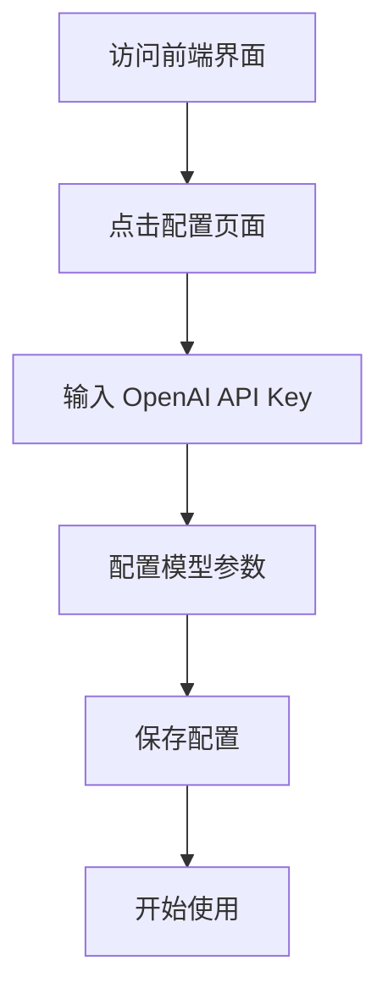
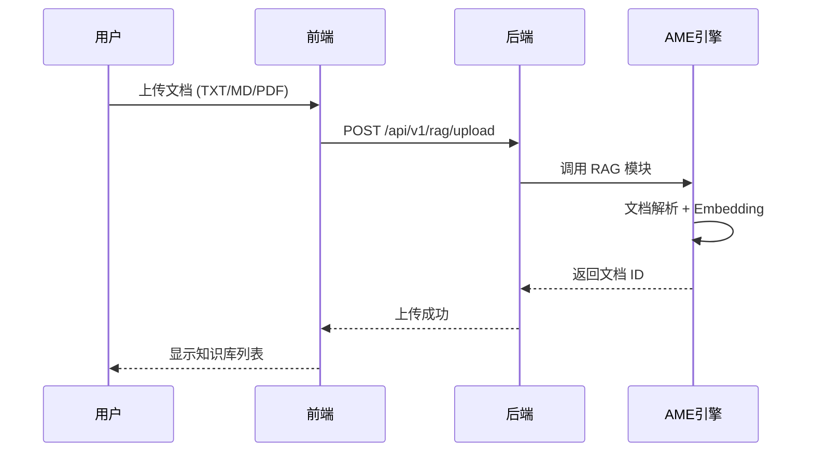
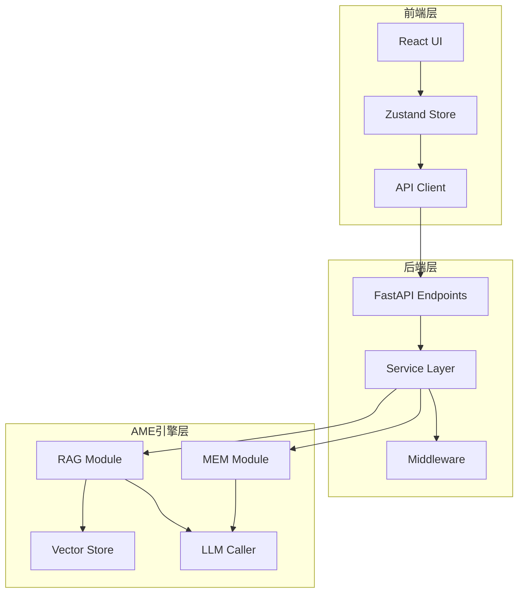
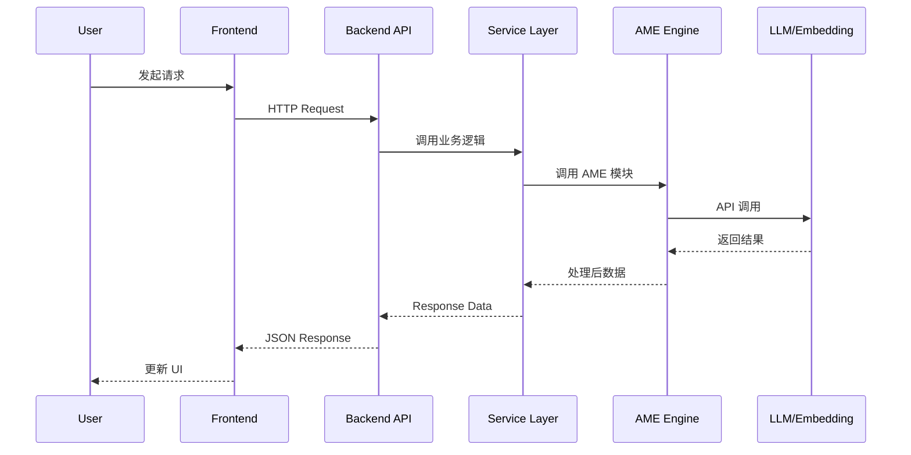

# Another Me 项目运行指南

## 1. 概述

本文档提供 Another Me AI 数字分身系统的完整运行指南，涵盖环境准备、本地开发运行、Docker 部署、以及常见问题处理。

**项目类型**: Full-Stack Application（全栈应用）  
**技术架构**: React 前端 + FastAPI 后端 + AME 引擎（Python 独立模块）

## 2. 环境准备

### 2.1 系统要求

| 组件 | 最低版本 | 推荐版本 |
|------|---------|---------|
| Python | 3.11+ | 3.11.x |
| Node.js | 18.0+ | 18.x/20.x |
| npm | 9.0+ | 最新版本 |
| Docker (可选) | 20.0+ | 最新版本 |
| Docker Compose (可选) | 2.0+ | 最新版本 |

### 2.2 Conda 环境配置

> **重要**: 项目需在 conda 环境 `another` 中运行

```bash
# 创建 conda 环境
conda create -n another python=3.11 -y

# 激活环境
conda activate another

# 验证 Python 版本
python --version  # 应输出 Python 3.11.x
```

### 2.3 必需配置

运行前必须准备：

- **OpenAI API Key**: 用于 Embedding 和 LLM 调用
- **网络连接**: 首次运行需下载依赖和模型

## 3. 本地开发运行（推荐）

### 3.1 快速启动

```bash
# 进入项目目录
cd /Users/kaiiangs/Desktop/another-me

# 激活 conda 环境
conda activate another

# 一键启动（自动检查环境、安装依赖、启动服务）
./start.sh
```

**启动脚本功能**:
- ✅ 自动检查 Python、Node.js 版本
- ✅ 自动创建 Python 虚拟环境（backend/venv）
- ✅ 自动安装后端依赖（backend/requirements.txt）
- ✅ 自动安装 AME 引擎（ame/）
- ✅ 自动安装前端依赖（frontend/node_modules）
- ✅ 后台启动前后端服务
- ✅ 记录日志到根目录（backend.log, frontend.log）

### 3.2 访问地址

启动成功后，可访问以下地址：

| 服务 | URL | 说明 |
|------|-----|------|
| 前端界面 | http://localhost:5173 | React 应用主界面 |
| 后端 API | http://localhost:8000 | FastAPI 服务端点 |
| API 文档 | http://localhost:8000/docs | Swagger UI 交互式文档 |
| 后端日志 | ./backend.log | 后端运行日志文件 |
| 前端日志 | ./frontend.log | 前端运行日志文件 |

### 3.3 停止服务

```bash
# 停止所有服务
./stop.sh

# 可选：清理日志文件
# 脚本执行时会询问是否清理
```

### 3.4 查看运行日志

```bash
# 实时查看后端日志
tail -f backend.log

# 实时查看前端日志
tail -f frontend.log

# 查看最后 100 行日志
tail -n 100 backend.log
```

### 3.5 手动启动（高级用户）

如需单独启动前后端：


**后端手动启动**:
```bash
# 进入后端目录
cd backend

# 创建虚拟环境（首次）
python3 -m venv venv

# 激活虚拟环境
source venv/bin/activate

# 安装依赖
pip install -r requirements.txt

# 安装 AME 引擎
cd ../ame
pip install -e .
cd ../backend

# 启动服务
python -m uvicorn app.main:app --host 0.0.0.0 --port 8000 --reload
```

**前端手动启动**:
```bash
# 进入前端目录
cd frontend

# 安装依赖（首次）
npm install

# 启动开发服务器
npm run dev
```

## 4. Docker 部署

### 4.1 前置检查

```bash
# 检查 Docker
docker --version

# 检查 Docker Compose
docker-compose --version

# 确保 Docker 服务运行中
docker ps
```

### 4.2 一键部署

```bash
# 进入部署目录
cd deployment

# 执行部署脚本
./deploy.sh
```

**部署脚本流程**:
1. 构建 Docker 镜像（backend、frontend、nginx）
2. 启动 Docker Compose 服务
3. 配置 Nginx 反向代理

### 4.3 Docker 服务管理

```bash
# 查看运行状态
docker-compose -f deployment/docker-compose.yml ps

# 查看日志
docker-compose -f deployment/docker-compose.yml logs -f

# 停止服务
docker-compose -f deployment/docker-compose.yml down

# 重启服务
docker-compose -f deployment/docker-compose.yml restart

# 完全清理（包括数据卷）
docker-compose -f deployment/docker-compose.yml down -v
```

### 4.4 访问地址（Docker）

| 服务 | URL | 说明 |
|------|-----|------|
| 前端界面 | http://localhost | Nginx 代理 |
| 后端 API | http://localhost:8000 | 直接访问后端 |
| API 文档 | http://localhost:8000/docs | Swagger UI |

## 5. 首次使用配置

### 5.1 配置流程



### 5.2 必需配置项

| 配置项 | 说明 | 示例值 |
|--------|------|--------|
| OpenAI API Key | 用于 LLM 和 Embedding | sk-... |
| Base URL | API 端点（可选） | https://api.openai.com/v1 |
| Model | 聊天模型 | gpt-3.5-turbo |
| Embedding Model | 向量化模型 | text-embedding-3-small |

### 5.3 配置存储

配置信息本地持久化，存储位置：
- **浏览器 LocalStorage**: 前端配置状态
- **后端数据目录**: 服务端配置文件

## 6. 核心功能验证

### 6.1 RAG 知识库功能测试



**测试步骤**:
1. 进入"知识库"页面
2. 点击上传文档，选择 TXT/MD/PDF/DOCX 文件
3. 等待上传完成
4. 在知识库中查看文档
5. 尝试智能检索功能

### 6.2 MEM 记忆模仿功能测试

**测试步骤**:
1. 进入"记忆"页面
2. 导入聊天记录（JSON 格式）
3. 与 AI 分身对话
4. 观察 AI 是否模仿你的说话风格
5. 查看记忆时间线

### 6.3 流式对话测试

验证实时响应能力：
- 输入问题后，观察逐字输出效果
- 检查响应速度和流畅度
- 测试长对话场景

## 7. 常见问题处理

### 7.1 环境问题

**问题**: Python 版本不符合要求

```bash
# 解决方案
conda create -n another python=3.11 -y
conda activate another
```

**问题**: Node.js 版本过低

```bash
# 使用 nvm 安装（推荐）
nvm install 18
nvm use 18

# 或使用 Homebrew (macOS)
brew install node@18
```

### 7.2 依赖安装问题

**问题**: pip 安装 AME 引擎失败

```bash
# 解决方案
cd ame
pip install --upgrade pip
pip install -e . --verbose
```

**问题**: npm 依赖安装超时

```bash
# 切换国内镜像源
npm config set registry https://registry.npmmirror.com
npm install
```

**问题**: faiss-cpu 安装失败

```bash
# conda 安装（推荐）
conda install -c conda-forge faiss-cpu

# 或使用特定版本
pip install faiss-cpu==1.7.4
```

### 7.3 运行时问题

**问题**: 后端启动失败，提示端口占用

```bash
# 查找占用 8000 端口的进程
lsof -i :8000

# 杀死进程
kill -9 <PID>

# 或更换端口
python -m uvicorn app.main:app --port 8001
```

**问题**: 前端白屏，控制台报错

```bash
# 清理缓存重新安装
cd frontend
rm -rf node_modules package-lock.json
npm install
npm run dev
```

**问题**: OpenAI API 调用失败

- 检查 API Key 是否有效
- 检查网络连接（是否需要代理）
- 检查 Base URL 配置是否正确
- 查看后端日志确认错误详情

### 7.4 数据存储问题

**问题**: 向量数据库切换（Faiss ↔ FalkorDB）

```bash
# 使用迁移脚本
python scripts/migrate_vector_store.py --from faiss --to falkordb

# 或初始化 FalkorDB
python scripts/init_falkor_graph.py
```

**问题**: 数据丢失或损坏

- 检查数据目录权限
- 查看日志文件定位错误
- 恢复备份数据（如有）

## 8. 性能优化建议

### 8.1 本地开发优化

- **使用 SSD 硬盘**: 提升文件读写速度
- **分配足够内存**: 建议至少 8GB RAM
- **关闭不必要的应用**: 避免资源竞争

### 8.2 生产部署优化

- **使用 Nginx 反向代理**: 负载均衡和静态文件缓存
- **配置 Redis 缓存**: 减少重复计算
- **启用 Gzip 压缩**: 降低网络传输开销
- **使用 GPU 版本 Faiss**: 加速向量检索（如硬件支持）

### 8.3 资源监控

```bash
# 查看 Python 进程资源占用
top -p $(cat .backend.pid)

# 查看 Node 进程资源占用
top -p $(cat .frontend.pid)

# 查看 Docker 容器资源
docker stats
```

## 9. 开发调试

### 9.1 后端调试

```bash
# 开启 DEBUG 模式
export LOG_LEVEL=DEBUG
python -m uvicorn app.main:app --reload --log-level debug

# 使用 pdb 断点调试
# 在代码中添加: import pdb; pdb.set_trace()
```

### 9.2 前端调试

```bash
# 开启 Source Map
npm run dev  # Vite 默认开启

# 查看 React DevTools
# Chrome 浏览器安装 React Developer Tools 插件

# 查看 Zustand 状态
# 在浏览器控制台访问: window.__ZUSTAND_DEVTOOLS__
```

### 9.3 测试执行

```bash
# AME 引擎单元测试
cd ame
pytest tests/unit/ -v

# AME 引擎集成测试
pytest tests/integration/ -v

# 后端性能测试
cd backend
python tests/test_performance.py
```

## 10. 项目架构流程

### 10.1 整体数据流



### 10.2 请求处理流程



## 11. 安全注意事项

- **API Key 保护**: 不要将 API Key 提交到代码仓库
- **本地存储**: 数据默认本地存储，确保文件系统权限正确
- **CORS 配置**: 生产环境应限制允许的域名
- **依赖更新**: 定期更新依赖包修复安全漏洞

## 12. 维护与更新

### 12.1 依赖更新

```bash
# 更新后端依赖
cd backend
pip list --outdated
pip install -U <package_name>

# 更新前端依赖
cd frontend
npm outdated
npm update <package_name>
```

### 12.2 版本控制

- 查看当前版本：参考 `README.md` 版本标识
- AME 引擎版本：参考 `ame/requirements.txt` 头部注释

### 12.3 日志管理

```bash
# 定期清理日志文件（防止占用过多空间）
rm -f backend.log frontend.log

# 或使用 logrotate 工具自动管理
```
