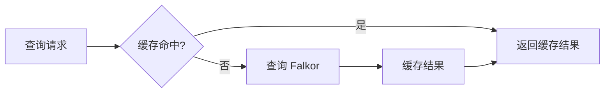

# AME 引擎层系统优化设计

**版本**: v2.0.0  
**日期**: 2025-01-XX  
**状态**: 设计阶段

---

## 1. 概述

### 1.1 优化背景

当前 AME 引擎层存在以下问题：
- **架构混乱**: `MimicEngine` 和 `AnalyzeEngine` 功能重叠，职责不清晰
- **接口不统一**: 各引擎间缺少统一的接口规范
- **功能不完整**: 缺少关键功能实现（如情绪识别、任务优先级算法、项目进度追踪）
- **与 Service 层耦合**: 后端 Service 层调用引擎时需要过多业务逻辑组装

### 1.2 优化目标

- ✅ 建立清晰的引擎分层架构
- ✅ 统一引擎接口规范
- ✅ 完善核心功能实现
- ✅ 优化引擎协同工作模式
- ✅ 支持工作和生活两大场景

### 1.3 设计原则

- **单一职责**: 每个引擎专注核心能力
- **高内聚低耦合**: 引擎间通过标准接口交互
- **可扩展性**: 易于添加新引擎和新功能
- **性能优先**: 充分利用双存储优势

---

## 2. 架构设计

### 2.1 整体架构

```
┌─────────────────────────────────────────────────────────────┐
│                 Backend Service Layer                        │
│  WorkService              LifeService                        │
│    ↓                        ↓                                │
├─────────────────────────────────────────────────────────────┤
│                  AME Engine Layer (核心优化层)                │
│                                                              │
│  ┌────────────────────────────────────────────────────┐    │
│  │  WorkEngine (工作引擎)   │  LifeEngine (生活引擎)  │    │
│  │  - 周报生成              │  - 心情分析             │    │
│  │  - 日报生成              │  - 兴趣追踪             │    │
│  │  - 待办整理              │  - 生活建议             │    │
│  │  - 会议总结              │  - 记忆回顾             │    │
│  │  - 项目追踪              │  - 情绪支持             │    │
│  └────────────────────────────────────────────────────┘    │
│                            ↓                                 │
│  ┌────────────────────────────────────────────────────┐    │
│  │  MimicEngine (模仿引擎)  │  AnalyzeEngine (分析引擎)│   │
│  │  - 风格学习              │  - 数据聚合             │    │
│  │  - 上下文生成            │  - 模式识别             │    │
│  │  - 流式输出              │  - 趋势分析             │    │
│  │  - 个性化表达            │  - 洞察提取             │    │
│  └────────────────────────────────────────────────────┘    │
│                            ↓                                 │
│  ┌────────────────────────────────────────────────────┐    │
│  │         HybridRepository (混合存储仓库)              │    │
│  └────────────────────────────────────────────────────┘    │
└─────────────────────────────────────────────────────────────┘
```

### 2.2 分层职责

#### 2.2.1 场景引擎层（新增）

**WorkEngine - 工作场景引擎**
```python
职责：
- 工作数据的专业化处理
- 周报/日报生成逻辑
- 待办事项智能整理
- 会议内容结构化总结
- 项目进度追踪分析

协同：
- 调用 AnalyzeEngine 进行数据分析
- 调用 MimicEngine 生成用户风格文本
- 直接访问 HybridRepository
```

**LifeEngine - 生活场景引擎**
```python
职责：
- 生活数据的情感化处理
- 心情分析和情绪识别
- 兴趣爱好演化追踪
- 生活建议生成
- 记忆回顾和情感陪伴

协同：
- 调用 AnalyzeEngine 进行趋势分析
- 调用 MimicEngine 生成温暖回应
- 直接访问 HybridRepository
```

#### 2.2.2 核心引擎层（优化）

**MimicEngine - 模仿引擎**
```python
核心能力：
1. 风格学习：从历史对话中学习语言风格
2. 上下文生成：构建符合用户习惯的 Prompt
3. 流式输出：支持 SSE 流式响应
4. 个性化表达：根据场景调整语气（专业/轻松）

优化点：
- 增加语气控制参数（professional/casual/warm）
- 优化风格学习算法
- 支持多模板选择（周报/日报/聊天）
```

**AnalyzeEngine - 分析引擎**
```python
核心能力：
1. 数据聚合：从双存储系统聚合数据
2. 模式识别：识别行为模式、兴趣演化
3. 趋势分析：时间序列分析
4. 洞察提取：提取关键信息和成就

优化点：
- 增加情绪识别功能
- 优化任务优先级算法
- 增加图谱关系分析
- 完善报告生成模板
```

---

## 3. 核心功能设计

### 3.1 WorkEngine 详细设计

#### 3.1.1 周报生成

```python
class WorkEngine:
    async def generate_weekly_report(
        self,
        user_id: str,
        start_date: datetime,
        end_date: datetime,
        style: str = "professional"
    ) -> WeeklyReport:
        """
        生成工作周报
        
        流程：
        1. 数据收集：从 HybridRepository 检索工作记录
        2. 数据分析：使用 AnalyzeEngine 提取关键任务、成果、挑战
        3. 风格生成：使用 MimicEngine 以用户风格撰写周报
        4. 结构化输出
        
        Args:
            user_id: 用户ID
            start_date: 开始日期
            end_date: 结束日期
            style: 语气风格（professional/casual）
        
        Returns:
            WeeklyReport: 结构化周报对象
        """
        # Step 1: 收集数据
        work_logs = await self.repo.search_by_time_range(
            start_date=start_date,
            end_date=end_date,
            doc_type=DocumentType.WORK_LOG,
            limit=100
        )
        
        # Step 2: 分析数据
        insights = await self.analyzer.extract_insights(
            documents=work_logs,
            metrics=[
                "key_tasks",       # 关键任务
                "achievements",    # 成果
                "challenges",      # 挑战
                "time_stats",      # 时间统计
                "collaboration"    # 协作情况
            ]
        )
        
        # Step 3: 生成周报
        report_content = await self.mimic.generate_styled_text(
            template="weekly_report",
            data=insights,
            tone=style,
            context={
                "period": f"{start_date.date()} ~ {end_date.date()}",
                "total_logs": len(work_logs)
            }
        )
        
        # Step 4: 结构化输出
        return WeeklyReport(
            user_id=user_id,
            period=(start_date, end_date),
            content=report_content,
            key_tasks=insights["key_tasks"],
            achievements=insights["achievements"],
            challenges=insights["challenges"],
            statistics=insights["time_stats"],
            generated_at=datetime.now()
        )
```

**数据模型**
```python
class WeeklyReport(BaseModel):
    user_id: str
    period: Tuple[datetime, datetime]
    content: str                    # Markdown 格式的完整周报
    key_tasks: List[TaskSummary]    # 关键任务列表
    achievements: List[Achievement]  # 成就列表
    challenges: List[str]            # 挑战列表
    statistics: Dict[str, Any]       # 统计数据
    generated_at: datetime
```

#### 3.1.2 待办整理

```python
async def organize_todos(
    self,
    raw_todos: List[str],
    context: Optional[Dict] = None
) -> OrganizedTodos:
    """
    智能整理待办事项
    
    流程：
    1. 任务解析：提取任务实体和关键信息
    2. 优先级评估：基于紧急度、重要性、依赖关系
    3. 智能分组：按类别、项目、时间
    4. 去重合并：识别重复或相似任务
    
    算法：
    - 紧急度：关键词识别（紧急、今天、ASAP）
    - 重要性：图谱分析任务关联度
    - 依赖关系：识别"先...再..."模式
    """
    # Step 1: 任务解析（NER + LLM）
    parsed_tasks = []
    for todo in raw_todos:
        task_info = await self._parse_task(todo)
        parsed_tasks.append(task_info)
    
    # Step 2: 优先级评估
    prioritized = await self._prioritize_tasks(parsed_tasks, context)
    
    # Step 3: 智能分组
    grouped = await self._group_tasks(prioritized)
    
    # Step 4: 生成整理后的文本
    organized_text = await self.mimic.generate_styled_text(
        template="todo_list",
        data=grouped,
        tone="casual"
    )
    
    return OrganizedTodos(
        high_priority=grouped["high"],
        medium_priority=grouped["medium"],
        low_priority=grouped["low"],
        formatted_text=organized_text,
        original_count=len(raw_todos),
        organized_count=len(prioritized)
    )

async def _prioritize_tasks(
    self,
    tasks: List[TaskInfo],
    context: Optional[Dict]
) -> List[TaskInfo]:
    """
    任务优先级算法
    
    评分规则：
    1. 紧急度（0-40分）
       - "紧急"/"今天" → 40分
       - "本周" → 25分
       - 截止日期临近 → 动态计分
    
    2. 重要性（0-40分）
       - 图谱关联度高 → 高分
       - 用户历史标注 → 参考评分
       - 关键词匹配 → 基础评分
    
    3. 依赖关系（0-20分）
       - 阻塞其他任务 → 高优先级
       - 依赖未完成任务 → 低优先级
    """
    for task in tasks:
        score = 0
        
        # 1. 紧急度评分
        urgency_keywords = {
            "紧急": 40, "今天": 40, "ASAP": 40,
            "明天": 30, "本周": 25, "近期": 15
        }
        for keyword, points in urgency_keywords.items():
            if keyword in task.content:
                score += points
                break
        
        # 2. 重要性评分（基于图谱）
        if task.entities:
            graph_score = await self._calculate_graph_importance(
                task.entities
            )
            score += graph_score * 40
        
        # 3. 依赖关系评分
        if task.is_blocking_others:
            score += 20
        elif task.has_dependencies:
            score -= 10
        
        task.priority_score = min(score, 100)
    
    # 排序
    return sorted(tasks, key=lambda t: t.priority_score, reverse=True)
```

#### 3.1.3 项目进度追踪

```python
async def track_project_progress(
    self,
    project_name: str,
    user_id: str
) -> ProjectProgress:
    """
    追踪项目进度
    
    流程：
    1. 图谱查询：查找项目相关的任务节点
    2. 状态分析：统计已完成/进行中/未开始
    3. 时间线分析：生成项目时间线
    4. 风险识别：识别延期风险和阻塞点
    """
    # Step 1: 图谱查询（Falkor）
    project_nodes = await self.repo.graph_search(
        query=f"项目:{project_name}",
        top_k=50
    )
    
    # Step 2: 状态统计
    status_stats = await self._analyze_task_status(project_nodes)
    
    # Step 3: 时间线生成
    timeline = await self._generate_project_timeline(project_nodes)
    
    # Step 4: 风险识别
    risks = await self._identify_risks(project_nodes, timeline)
    
    # Step 5: 生成进度报告
    report = await self.mimic.generate_styled_text(
        template="project_progress",
        data={
            "project_name": project_name,
            "status": status_stats,
            "timeline": timeline,
            "risks": risks
        },
        tone="professional"
    )
    
    return ProjectProgress(
        project_name=project_name,
        completion_rate=status_stats["completion_rate"],
        status=status_stats,
        timeline=timeline,
        risks=risks,
        report=report
    )
```

### 3.2 LifeEngine 详细设计

#### 3.2.1 心情分析

```python
class LifeEngine:
    async def analyze_mood(
        self,
        mood_entry: str,
        user_id: str,
        entry_time: datetime
    ) -> MoodAnalysis:
        """
        分析心情日记
        
        流程：
        1. 情绪识别：使用 LLM 识别主要情绪和强度
        2. 触发因素分析：提取导致情绪的关键事件
        3. 历史对比：对比近期情绪趋势
        4. 建议生成：提供情绪管理建议
        """
        # Step 1: 情绪识别
        emotion_result = await self.analyzer.detect_emotion(
            text=mood_entry,
            context={"time": entry_time}
        )
        
        # Step 2: 触发因素分析
        triggers = await self._extract_triggers(mood_entry)
        
        # Step 3: 历史对比
        mood_trend = await self._analyze_mood_trend(
            user_id=user_id,
            current_emotion=emotion_result,
            days=7
        )
        
        # Step 4: 生成建议（使用 MimicEngine 以温暖语气）
        suggestions = await self.mimic.generate_styled_text(
            template="mood_support",
            data={
                "emotion": emotion_result,
                "triggers": triggers,
                "trend": mood_trend
            },
            tone="warm"  # 温暖、关怀的语气
        )
        
        return MoodAnalysis(
            emotion_type=emotion_result["type"],
            emotion_intensity=emotion_result["intensity"],
            triggers=triggers,
            trend=mood_trend,
            suggestions=suggestions,
            analysis_time=datetime.now()
        )

async def _analyze_mood_trend(
    self,
    user_id: str,
    current_emotion: Dict,
    days: int = 7
) -> MoodTrend:
    """
    分析情绪趋势
    
    对比最近 N 天的情绪变化，识别：
    - 情绪波动模式
    - 积极/消极趋势
    - 异常情绪警报
    """
    # 检索近期心情记录
    start_date = datetime.now() - timedelta(days=days)
    mood_docs = await self.repo.search_by_time_range(
        start_date=start_date,
        end_date=datetime.now(),
        doc_type=DocumentType.LIFE_RECORD,
        filters={"category": "mood"}
    )
    
    # 提取历史情绪
    historical_emotions = []
    for doc in mood_docs:
        emotion = doc.metadata.get("emotion")
        if emotion:
            historical_emotions.append({
                "type": emotion["type"],
                "intensity": emotion["intensity"],
                "date": doc.timestamp
            })
    
    # 趋势分析
    trend = self._calculate_mood_trend(
        historical_emotions,
        current_emotion
    )
    
    return MoodTrend(
        current_emotion=current_emotion["type"],
        average_intensity=trend["avg_intensity"],
        trend_direction=trend["direction"],  # improving/declining/stable
        alert=trend["alert"]  # 是否需要关注
    )
```

#### 3.2.2 兴趣追踪

```python
async def track_interests(
    self,
    user_id: str,
    period_days: int = 30
) -> InterestReport:
    """
    追踪兴趣爱好演化
    
    流程：
    1. 数据收集：检索生活记录
    2. 实体提取：提取主题实体（使用 NER）
    3. 频率分析：统计主题出现频率
    4. 演化分析：对比不同时间窗口
    5. 推荐生成：推荐相关内容
    """
    end_date = datetime.now()
    start_date = end_date - timedelta(days=period_days)
    
    # Step 1: 收集数据
    life_records = await self.repo.search_by_time_range(
        start_date=start_date,
        end_date=end_date,
        doc_type=DocumentType.LIFE_RECORD
    )
    
    # Step 2: 实体聚合
    all_entities = []
    for doc in life_records:
        all_entities.extend(doc.entities)
    
    # Step 3: 频率统计
    from collections import Counter
    entity_freq = Counter(all_entities)
    top_interests = entity_freq.most_common(10)
    
    # Step 4: 演化分析（对比不同时期）
    evolution = await self._analyze_interest_evolution(
        user_id=user_id,
        time_windows=[
            timedelta(days=7),
            timedelta(days=30),
            timedelta(days=90)
        ]
    )
    
    # Step 5: 生成报告
    report = await self.mimic.generate_styled_text(
        template="interest_report",
        data={
            "top_interests": top_interests,
            "evolution": evolution,
            "period": period_days
        },
        tone="casual"
    )
    
    return InterestReport(
        top_interests=top_interests,
        evolution=evolution,
        recommendations=await self._generate_interest_recommendations(
            top_interests
        ),
        report=report
    )
```

#### 3.2.3 记忆回顾

```python
async def recall_memory(
    self,
    query: str,
    user_id: str
) -> MemoryRecall:
    """
    记忆回顾（例如："去年今天我在做什么？"）
    
    流程：
    1. 时间解析：解析查询中的时间意图
    2. 混合检索：Faiss（语义）+ Falkor（时间）
    3. 记忆筛选：过滤重要记忆
    4. 温馨呈现：以温暖的方式呈现记忆
    """
    # Step 1: 时间解析
    time_range = await self.analyzer.parse_time_query(query)
    
    # Step 2: 混合检索
    memories = await self.repo.hybrid_search(
        query=query,
        filters={
            "after": time_range["start"],
            "before": time_range["end"],
            "doc_type": DocumentType.LIFE_RECORD
        },
        top_k=10
    )
    
    # Step 3: 筛选重要记忆（importance > 0.5）
    important_memories = [
        m for m in memories
        if m.metadata.get("importance", 0) > 0.5
    ]
    
    # Step 4: 温馨呈现
    presentation = await self.mimic.generate_styled_text(
        template="memory_recall",
        data={
            "query": query,
            "time_range": time_range,
            "memories": important_memories
        },
        tone="warm"
    )
    
    return MemoryRecall(
        query=query,
        time_range=time_range,
        memories=important_memories,
        presentation=presentation,
        count=len(important_memories)
    )
```

### 3.3 MimicEngine 优化

#### 3.3.1 多模板支持

```python
class MimicEngine:
    TEMPLATES = {
        "weekly_report": """你是用户的工作助手，请基于以下数据生成专业的周报：

关键任务：{key_tasks}
成果：{achievements}
挑战：{challenges}
时间统计：{time_stats}

请用用户的语言风格撰写，保持专业但不失个性。""",

        "todo_list": """请帮我整理待办事项：

原始待办：{raw_todos}

按照我的习惯分组：
- 高优先级：紧急且重要
- 中优先级：重要但不紧急
- 低优先级：可以稍后处理

记得用我习惯的表达方式。""",

        "mood_support": """我最近的心情是：{emotion}

触发因素：{triggers}
趋势：{trend}

请以温暖、关怀的方式给我建议，就像我对自己说话一样。""",

        "memory_recall": """回顾记忆：{query}

那段时间：{time_range}

记忆片段：{memories}

请用温馨的方式呈现这些记忆。"""
    }
    
    async def generate_styled_text(
        self,
        template: str,
        data: Dict[str, Any],
        tone: str = "professional",
        context: Optional[Dict] = None
    ) -> str:
        """
        生成风格化文本
        
        Args:
            template: 模板名称
            data: 数据
            tone: 语气（professional/casual/warm）
            context: 额外上下文
        """
        # 1. 获取模板
        template_text = self.TEMPLATES.get(template, "")
        
        # 2. 构建系统提示词
        system_prompt = self._build_system_prompt(tone)
        
        # 3. 填充模板
        user_prompt = template_text.format(**data)
        
        # 4. 检索相关历史（学习用户风格）
        history = await self._retrieve_style_examples(tone, limit=5)
        
        # 5. 生成
        messages = [
            {"role": "system", "content": system_prompt},
            {"role": "user", "content": f"参考风格：\n{history}\n\n{user_prompt}"}
        ]
        
        response = await self.llm_caller.generate(
            messages=messages,
            temperature=self._get_temperature(tone)
        )
        
        return response.content
    
    def _build_system_prompt(self, tone: str) -> str:
        """构建系统提示词"""
        base = "你是用户的 AI 分身，用用户的方式说话。"
        
        tone_guides = {
            "professional": "保持专业、清晰、结构化的表达，适合工作场景。",
            "casual": "保持轻松、自然、口语化的表达，适合日常交流。",
            "warm": "保持温暖、关怀、充满情感的表达，适合情感支持。"
        }
        
        return f"{base}\n{tone_guides.get(tone, '')}"
    
    def _get_temperature(self, tone: str) -> float:
        """根据语气返回温度参数"""
        return {
            "professional": 0.3,
            "casual": 0.7,
            "warm": 0.8
        }.get(tone, 0.5)
```

### 3.4 AnalyzeEngine 优化

#### 3.4.1 情绪识别

```python
class AnalyzeEngine:
    async def detect_emotion(
        self,
        text: str,
        context: Optional[Dict] = None
    ) -> EmotionResult:
        """
        情绪识别
        
        使用 LLM 识别文本中的情绪类型和强度
        
        返回：
        - type: 情绪类型（happy/sad/angry/anxious/neutral）
        - intensity: 强度（1-10）
        - keywords: 关键情绪词
        """
        prompt = f"""请分析以下文本的情绪：

文本：{text}

请以 JSON 格式返回：
{{
    "type": "情绪类型（happy/sad/angry/anxious/neutral/excited）",
    "intensity": 1-10的情绪强度,
    "keywords": ["关键情绪词1", "关键情绪词2"],
    "explanation": "简短解释"
}}"""
        
        response = await self.llm.generate(
            messages=[{"role": "user", "content": prompt}],
            temperature=0.1
        )
        
        # 解析 JSON
        import json
        result = json.loads(response.content)
        
        return EmotionResult(
            type=result["type"],
            intensity=result["intensity"],
            keywords=result["keywords"],
            explanation=result["explanation"]
        )
```

#### 3.4.2 时间意图解析

```python
async def parse_time_query(self, query: str) -> TimeRange:
    """
    解析时间意图
    
    示例：
    - "去年今天" → 去年的同一天
    - "上个月" → 上个月1号到最后一天
    - "三个月前" → 从三个月前到今天
    """
    prompt = f"""解析时间查询：{query}

请返回 JSON 格式：
{{
    "start": "开始日期 YYYY-MM-DD",
    "end": "结束日期 YYYY-MM-DD",
    "description": "时间范围描述"
}}"""
    
    response = await self.llm.generate(
        messages=[{"role": "user", "content": prompt}],
        temperature=0.1
    )
    
    import json
    result = json.loads(response.content)
    
    from datetime import datetime
    return TimeRange(
        start=datetime.fromisoformat(result["start"]),
        end=datetime.fromisoformat(result["end"]),
        description=result["description"]
    )
```

#### 3.4.3 图谱重要性计算

```python
async def calculate_graph_importance(
    self,
    entities: List[str]
) -> float:
    """
    基于图谱计算实体重要性
    
    算法：
    1. 度中心性：实体的连接数
    2. PageRank：实体的权重
    3. 时间衰减：最近出现的权重更高
    """
    if not entities:
        return 0.0
    
    scores = []
    for entity in entities:
        # 查询图谱中的实体节点
        node_info = await self.repo.graph.get_entity_info(entity)
        
        if node_info:
            # 度中心性（归一化）
            degree = node_info.get("degree", 0) / 100
            
            # PageRank
            pagerank = node_info.get("pagerank", 0.5)
            
            # 时间衰减
            last_mention = node_info.get("last_mention_time")
            time_decay = self._calculate_time_decay(last_mention)
            
            # 综合评分
            score = (degree * 0.3 + pagerank * 0.5 + time_decay * 0.2)
            scores.append(score)
    
    return sum(scores) / len(scores) if scores else 0.0
```

---

## 4. 数据模型

### 4.1 报告模型

```python
class WeeklyReport(BaseModel):
    """周报"""
    user_id: str
    period: Tuple[datetime, datetime]
    content: str                    # Markdown 格式
    key_tasks: List[TaskSummary]
    achievements: List[Achievement]
    challenges: List[str]
    statistics: Dict[str, Any]
    generated_at: datetime

class DailyReport(BaseModel):
    """日报"""
    user_id: str
    date: datetime
    content: str
    tasks: List[TaskSummary]
    time_spent: Dict[str, float]
    generated_at: datetime

class ProjectProgress(BaseModel):
    """项目进度"""
    project_name: str
    completion_rate: float          # 完成率
    status: Dict[str, int]          # 各状态任务数
    timeline: List[TimelineEvent]
    risks: List[RiskAlert]
    report: str
```

### 4.2 生活模型

```python
class MoodAnalysis(BaseModel):
    """心情分析"""
    emotion_type: str
    emotion_intensity: int
    triggers: List[str]
    trend: MoodTrend
    suggestions: str
    analysis_time: datetime

class MoodTrend(BaseModel):
    """情绪趋势"""
    current_emotion: str
    average_intensity: float
    trend_direction: str            # improving/declining/stable
    alert: bool

class InterestReport(BaseModel):
    """兴趣报告"""
    top_interests: List[Tuple[str, int]]
    evolution: Dict[str, Any]
    recommendations: List[str]
    report: str

class MemoryRecall(BaseModel):
    """记忆回顾"""
    query: str
    time_range: TimeRange
    memories: List[SearchResult]
    presentation: str
    count: int
```

### 4.3 任务模型

```python
class TaskInfo(BaseModel):
    """任务信息"""
    content: str
    entities: List[str]
    priority_score: float
    urgency: int
    importance: int
    is_blocking_others: bool
    has_dependencies: bool
    estimated_time: Optional[float]
    due_date: Optional[datetime]

class OrganizedTodos(BaseModel):
    """整理后的待办"""
    high_priority: List[TaskInfo]
    medium_priority: List[TaskInfo]
    low_priority: List[TaskInfo]
    formatted_text: str
    original_count: int
    organized_count: int
```

---

## 5. 实施计划

### Phase 1: 场景引擎层开发（1-2周）

**任务列表**:
1. 创建 `WorkEngine` 类
   - 周报生成功能
   - 日报生成功能
   - 待办整理功能
   - 项目进度追踪

2. 创建 `LifeEngine` 类
   - 心情分析功能
   - 兴趣追踪功能
   - 记忆回顾功能
   - 生活建议生成

**新建文件**:
- `ame/work/work_engine.py`
- `ame/life/life_engine.py`

### Phase 2: 核心引擎优化（1周）

**任务列表**:
1. `MimicEngine` 优化
   - 添加多模板支持
   - 优化语气控制
   - 增强风格学习

2. `AnalyzeEngine` 优化
   - 实现情绪识别
   - 实现时间意图解析
   - 优化优先级算法
   - 增加图谱重要性计算

**修改文件**:
- `ame/mem/mimic_engine.py`
- `ame/mem/analyze_engine.py`

### Phase 3: Service 层集成（3-5天）

**任务列表**:
1. 重构 `WorkService`
   - 使用 `WorkEngine` 替代直接调用
   - 简化业务逻辑

2. 重构 `LifeService`
   - 使用 `LifeEngine` 替代直接调用
   - 简化业务逻辑

**修改文件**:
- `backend/app/services/work_service.py`
- `backend/app/services/life_service.py`

### Phase 4: 测试与优化（1周）

**任务列表**:
1. 单元测试
   - WorkEngine 测试
   - LifeEngine 测试
   - MimicEngine 测试
   - AnalyzeEngine 测试

2. 集成测试
   - 端到端场景测试
   - 性能测试

3. 文档完善
   - API 文档
   - 使用示例

---

## 6. 技术细节

### 6.1 引擎初始化

```python
# backend/app/services/work_service.py
class WorkService:
    def __init__(self):
        # 初始化存储
        self.repository = HybridRepository(...)
        
        # 初始化 LLM
        self.llm_caller = LLMCaller(...)
        
        # 初始化核心引擎
        self.mimic_engine = MimicEngine(
            llm_caller=self.llm_caller,
            vector_store=self.repository.faiss
        )
        
        self.analyze_engine = AnalyzeEngine(
            repository=self.repository,
            llm_caller=self.llm_caller
        )
        
        # 初始化场景引擎
        self.work_engine = WorkEngine(
            repository=self.repository,
            mimic=self.mimic_engine,
            analyzer=self.analyze_engine
        )
```

### 6.2 引擎协同示例

```python
# 周报生成协同流程
async def generate_weekly_report(user_id, start, end):
    # 1. WorkEngine 收集数据
    work_logs = await work_engine.repo.search_by_time_range(...)
    
    # 2. AnalyzeEngine 分析数据
    insights = await work_engine.analyzer.extract_insights(work_logs)
    
    # 3. MimicEngine 生成文本
    report = await work_engine.mimic.generate_styled_text(
        template="weekly_report",
        data=insights,
        tone="professional"
    )
    
    return report
```

### 6.3 缓存策略

```python
# 对频繁调用的分析结果进行缓存
from functools import lru_cache

class AnalyzeEngine:
    @lru_cache(maxsize=100)
    async def calculate_graph_importance(self, entities_tuple):
        # entities_tuple: 元组（可哈希）
        ...
```

---

## 7. 性能优化

### 7.1 并行处理

```python
# 并行执行多个分析任务
import asyncio

async def generate_weekly_report(...):
    # 并行执行
    results = await asyncio.gather(
        self.analyzer.extract_insights(work_logs, ["key_tasks"]),
        self.analyzer.extract_insights(work_logs, ["achievements"]),
        self.analyzer.extract_insights(work_logs, ["challenges"]),
        self.analyzer.extract_insights(work_logs, ["time_stats"])
    )
    
    insights = {
        "key_tasks": results[0],
        "achievements": results[1],
        "challenges": results[2],
        "time_stats": results[3]
    }
```

### 7.2 批量向量化

```python
# 批量生成 embedding，减少 API 调用
async def batch_vectorize(texts: List[str]):
    embeddings = await self.llm_caller.embed_batch(texts)
    return embeddings
```

### 7.3 图谱查询优化



---

## 8. 关键接口

### 8.1 WorkEngine 接口

```python
class WorkEngine:
    async def generate_weekly_report(...) -> WeeklyReport
    async def generate_daily_report(...) -> DailyReport
    async def organize_todos(...) -> OrganizedTodos
    async def summarize_meeting(...) -> MeetingSummary
    async def track_project_progress(...) -> ProjectProgress
```

### 8.2 LifeEngine 接口

```python
class LifeEngine:
    async def analyze_mood(...) -> MoodAnalysis
    async def track_interests(...) -> InterestReport
    async def recall_memory(...) -> MemoryRecall
    async def generate_life_summary(...) -> LifeSummary
    async def get_life_suggestions(...) -> List[Suggestion]
```

### 8.3 MimicEngine 接口

```python
class MimicEngine:
    async def generate_styled_text(...) -> str
    async def generate_response_stream(...) -> AsyncIterator[str]
    async def learn_from_conversation(...) -> None
```

### 8.4 AnalyzeEngine 接口

```python
class AnalyzeEngine:
    async def extract_insights(...) -> Dict[str, Any]
    async def detect_emotion(...) -> EmotionResult
    async def parse_time_query(...) -> TimeRange
    async def calculate_graph_importance(...) -> float
    async def generate_report(...) -> str
```

